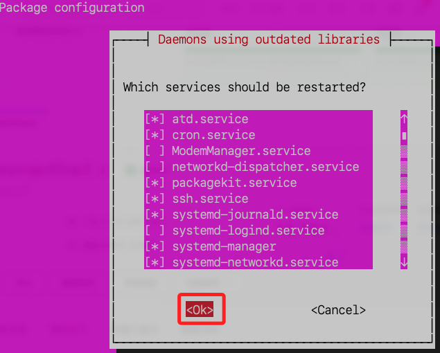

# 安裝並配置 OpenVPN

## 基本建置

1. 更新。

```bash
sudo apt update && sudo apt upgrade -y
```

2. 安裝。

```bash
sudo apt install -y openvpn
```

3. 出現 `Daemons using outdated libraries` 提示，這是因為系統發現某些運行中的服務使用了舊版本的庫，需要重新啟動才能生效，點擊 `OK`。



4. 安裝。

```bash
sudo apt update
sudo apt install --only-upgrade cloud-init
sudo apt install -y easy-rsa
```

5. 確認 easy-rsa 安裝路徑。

```bash
ls /usr/share/easy-rsa/
ls /usr/share/doc/easy-rsa/
```

6. 安裝

```bash
sudo apt install openvpn -y
```

## 建立 OpenVPN 伺服器

1. 建立 OpenVPN 目錄。

```bash
mkdir -p ~/openvpn-ca && cd ~/openvpn-ca
```

2. 複製。

```bash
cp -r /usr/share/easy-rsa/* ~/openvpn-ca/
```

3. 初始化 CA。

```bash
./easyrsa init-pki
```


4. 建立 CA，出現提示時直接按 Enter 即可。

```bash
./easyrsa build-ca nopass
```

## 生成伺服器證書和私鑰

1. 生成伺服器請求文件，這會建立 server.key 和 server.req，提示輸入名稱時點擊 `ENTER` 即可。

```bash
./easyrsa gen-req server nopass
```

2. 簽署伺服器證書

```bash
./easyrsa sign-req server server
```

3. 提示 `Type the word 'yes' to continue` 時輸入 `yes` 即可。


4. 生成 `DH` 密鑰

```bash
./easyrsa gen-dh
```

5. 生成 `TLS` 金鑰

```bash
openvpn --genkey secret ta.key
```

6. 重新複製所有憑證與密鑰到 /etc/openvpn/

```bash
sudo cp ~/openvpn-ca/pki/ca.crt /etc/openvpn/
sudo cp ~/openvpn-ca/pki/issued/server.crt /etc/openvpn/
sudo cp ~/openvpn-ca/pki/private/server.key /etc/openvpn/
sudo cp ~/openvpn-ca/pki/dh.pem /etc/openvpn/
sudo cp ~/openvpn-ca/ta.key /etc/openvpn/
```

7. 確認

```bash
ls -l /etc/openvpn/
```

## 配置 OpenVPN

1. 建立伺服器配置

```bash
sudo nano /etc/openvpn/server.conf
```

2. 檢查。

```bash
ls /etc/openvpn/
```

3. 貼上以下內容，儲存並退出。

```ini
port 1194
proto udp
dev tun
ca /etc/openvpn/ca.crt
cert /etc/openvpn/server.crt
key /etc/openvpn/server.key
dh /etc/openvpn/dh.pem
tls-crypt /etc/openvpn/ta.key
server 10.8.0.0 255.255.255.0
topology subnet
push "redirect-gateway def1 bypass-dhcp"
push "dhcp-option DNS 8.8.8.8"
push "dhcp-option DNS 8.8.4.4"
keepalive 10 120
cipher AES-256-CBC
auth SHA256
user nobody
group nogroup
persist-key
persist-tun
status /var/log/openvpn/status.log
log /var/log/openvpn/openvpn.log
verb 3
explicit-exit-notify 1
```

4. 啟用 OpenVPN

```bash
sudo systemctl enable openvpn@server
sudo systemctl start openvpn@server
sudo systemctl status openvpn@server
```

5. 查看日誌。

```bash
sudo journalctl -u openvpn@server --no-pager -n 50
```

6. 檢查 OpenVPN 設定檔是否有錯誤

```bash
sudo openvpn --config /etc/openvpn/server.conf --verb 4
```

7. 重新啟動 OpenVPN

```bash
sudo systemctl restart openvpn@server
sudo systemctl status openvpn@server
```

8. 確保 OpenVPN 監聽 1194 端口

```bash
sudo netstat -tulnp | grep openvpn
```


## 設定防火牆與 NAT

1. 開啟 1194 UDP 端口

```bash
sudo ufw allow 1194/udp
```

2. 啟用 IP 轉發

```bash
sudo nano /etc/sysctl.conf
```

3. 添加

```bash
net.ipv4.ip_forward=1
```

4. 儲存並退出，然後執行

```bash
sudo sysctl -p
```

5. 設定 NAT，輸入 `y`

```bash
sudo iptables -t nat -A POSTROUTING -s 10.8.0.0/24 -o eth0 -j MASQUERADE
sudo ufw allow OpenSSH
sudo ufw enable
sudo systemctl restart openvpn@server
```


## 建立用戶證書

1. 生成客戶端憑證

```bash
cd ~/openvpn-ca
./easyrsa gen-req client1 nopass
```

2. 輸入 yes 來確認簽署。

```bash
./easyrsa sign-req client client1
```

## 建立 OpenVPN 客戶端配置

1. 查詢

```bash
cat /root/openvpn-ca/pki/ca.crt
cat /root/openvpn-ca/pki/issued/client1.crt
cat /root/openvpn-ca/pki/private/client1.key
cat /root/openvpn-ca/ta.key
```

2. 編輯

```bash
sudo nano ~/openvpn-ca/client1.ovpn
```

3. 貼上以下內容

```bash
client
dev tun
proto udp
remote 118.31.77.245 1194
resolv-retry infinite
nobind
persist-key
persist-tun
remote-cert-tls server
auth SHA256
data-ciphers AES-256-GCM:AES-128-GCM:AES-256-CBC
data-ciphers-fallback AES-256-CBC
tls-crypt ta.key
verb 3
<ca>
# 這裡貼上 `ca.crt` 內容
</ca>
<cert>
# 這裡貼上 `client1.crt` 內容
</cert>
<key>
# 這裡貼上 `client1.key` 內容
</key>
<tls-crypt>
# 這裡貼上 `ta.key` 內容
</tls-crypt>
```

## 下載客戶端配置

1. 在本地下載 OpenVPN 設定

```bash
scp ali:~/openvpn-ca/client1.ovpn ~/Downloads/
```


## 修正遠端

1. 編輯

```bash
sudo nano /etc/openvpn/server.conf
```

2. 內容

```bash
port 1194
proto udp
dev tun

ca /etc/openvpn/ca.crt
cert /etc/openvpn/server.crt
key /etc/openvpn/server.key
dh /etc/openvpn/dh.pem
tls-crypt /etc/openvpn/ta.key

server 10.8.0.0 255.255.255.0
topology subnet
ifconfig-pool-persist /var/log/openvpn/ipp.txt

push "redirect-gateway def1 bypass-dhcp"
push "dhcp-option DNS 8.8.8.8"
push "dhcp-option DNS 8.8.4.4"

keepalive 10 120
user nobody
group nogroup
persist-key
persist-tun

status /var/log/openvpn/status.log
log /var/log/openvpn/openvpn.log
verb 3
explicit-exit-notify 1

# 適用於 OpenVPN 2.5+
data-ciphers AES-256-GCM:AES-128-GCM:AES-256-CBC
data-ciphers-fallback AES-256-CBC
```


3. 套用更改並重啟 OpenVPN

```bash
sudo systemctl restart openvpn@server
sudo systemctl status openvpn@server
```

4. 修正 iptables FORWARD 設定，執行以下指令來允許 VPN 轉發

```bash
sudo iptables -A FORWARD -s 10.8.0.0/24 -j ACCEPT
sudo iptables -A FORWARD -d 10.8.0.0/24 -j ACCEPT
```

5. 確認主要外部網卡名稱

```bash
ip route | grep default
```

6. 然後執行 NAT 規則，將 `eth0` 更改為網卡名稱

```bash
sudo iptables -t nat -A POSTROUTING -s 10.8.0.0/24 -o eth0 -j MASQUERADE
```

7. 確保 NAT 規則永久生效

```bash
sudo iptables-save | sudo tee /etc/iptables/rules.v4
```

8. 重啟 OpenVPN 與 防火牆

```bash
sudo systemctl restart openvpn@server
sudo systemctl restart ufw
```

9. 執行以下指令來允許 OpenVPN 轉發，輸入 `y`

```bash
sudo ufw allow 1194/udp
sudo ufw allow OpenSSH
sudo ufw allow in on tun0
sudo ufw allow out on tun0
sudo ufw enable
```

10. 編輯 ufw 預設規則 來允許轉發

```bash
sudo nano /etc/default/ufw
```

11. 將預設的 `DROP` 改為 `ACCEPT` 

```bash
DEFAULT_FORWARD_POLICY="ACCEPT"
```

12. 重啟防火牆

```bash
sudo systemctl restart ufw
```

13. 確認 iptables -L FORWARD -v -n 是否有封包流量

```bash
sudo iptables -L FORWARD -v -n
```

## 本地電腦連接 OpenVPN


### 🚀 最終測試
1. 測試 VPN 是否成功翻牆
   ```bash
   curl ifconfig.me
   ```
   這個應該返回 阿里云 ECS 公網 IP，證明所有流量通過 VPN。

2. 測試能否正常訪問 Google
   - 打開瀏覽器，嘗試訪問 Google
   - 如果能打開，則翻牆成功！


## 🎯 總結
1. 安裝 OpenVPN
2. 建立伺服器與客戶端證書
3. 配置 OpenVPN 伺服器
4. 設定 NAT 轉發與防火牆
5. 生成客戶端配置並下載
6. 本地導入 OpenVPN 配置，成功翻牆！

這樣，你的 Ubuntu ECS 伺服器 現在就是 一台可用的 OpenVPN 翻牆伺服器 了！🎉

請測試並回報結果！🚀