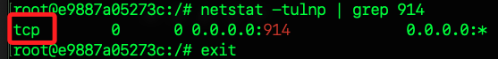

# 設置到路由器

_在路由器中啟用 Client 端，並將 `.ovpn` 寫入路由器；特別注意，不同的 `.ovpn` 設定寫入方式皆有不同_

<br>

## 設定頁面

1. `Start OpenVPN Client` 選擇 `Enable`。

<br>

## 基本設置

1. Server IP/Name 設置為 `8.136.110.37`。

<br>

2. `Port` 設定為 `914`。

<br>

3. Tunnel Device `TUN` 

<br>

4. Tunnel Protocol 部分配合前面設定，這裡設置為 `TCP`。

    ```bash
    netstat -tulnp | grep 914
    ```

    

<br>

5. Encryption Cipher  `AES-256-CBC`。

<br>

6. Hash Algorithm  `SHA1`。

<br>

7. User Pass Authentication  `Disable`。

<br>

## 進階設置

_Advanced Options_

<br>

1. TLS Cipher 設置為 `None` 

<br>

2. Compression 設置為 `Disable`，這是為了預防漏洞設置的。

<br>

3. NAT 設置為 `Enable`，確保路由器可以轉發 VPN 流量。

<br>

4. Inbound Firewall on TUN  ✅ 勾選。

<br>

5. `IP Address/Subnet Mask` 留空，由 VPN 伺服器分配。

<br>

## 與之前不同的部分

1. `Tunnel MTU setting` 設置為 `1420`；若有問題再改為 `1500` 測試。

<br>

2. Tunnel UDP MSS-Fix  `Enable`。

<br>

3. TLS Key choice 設置為 `TLS Crypt`

<br>

## 證書與密鑰

1. TLS Key 複製 `<tls-crypt-v2>...</tls-crypt-v2>`

<br>

2. CA Cert 複製 `<ca>...</ca>` 內的內容。

<br>

3. Public Client Cert 複製 `<cert>...</cert>` 內的內容。

<br>

4. Private Key 複製 `<key>...</key>` 內的內容。

<br>

5. Static Key 空白。

<br>

6. PKCS12 Key 空白。

<br>

## 自訂 OpenVPN 參數

_這部分我先保留_

<br>

1. 在 `Additional Config` 欄位添加以下內容。

```
client
dev tun
nobind
remote-cert-tls server
tls-version-min 1.2
reneg-sec 604800
push-peer-info
verb 3
```

## 重新啟動 VPN

1. Administratoration 中的 Management，滾動到下方點擊 `Reboot Router`。

## 驗證 VPN 是否成功連線

## 以下測試

在 ECS (宿主機) 設定 iptables 轉發

