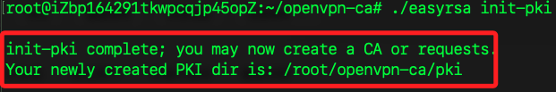

# 直裝服務器

_不使用 Docker，直裝 OpenVPN 服務器_

<br>

## 基本建置

1. 更新。

   ```bash
   sudo apt update && sudo apt upgrade -y
   ```

<br>

2. 安裝。

   ```bash
   sudo apt install -y openvpn
   ```

<br>

3. 出現 `Daemons using outdated libraries` 提示，這是因為系統發現某些運行中的服務使用了舊版本的庫，需要重新啟動才能生效，點擊 `OK`。

   

<br>

4. 安裝。

   ```bash
   sudo apt update
   sudo apt install --only-upgrade cloud-init
   sudo apt install -y easy-rsa
   ```

<br>

5. 確認 easy-rsa 安裝路徑。

   ```bash
   ls /usr/share/easy-rsa/
   ls /usr/share/doc/easy-rsa/
   ```

<br>

6. 安裝。

   ```bash
   sudo apt install openvpn -y
   ```

<br>

## 建立 OpenVPN 伺服器

1. 建立 OpenVPN 目錄。

   ```bash
   mkdir -p ~/openvpn-ca && cd ~/openvpn-ca
   ```

<br>

2. 複製。

   ```bash
   cp -r /usr/share/easy-rsa/* ~/openvpn-ca/
   ```

<br>

3. 初始化 CA。

   ```bash
   ./easyrsa init-pki
   ```

   

<br>

4. 建立 CA，出現提示時直接按 Enter 即可。

   ```bash
   ./easyrsa build-ca nopass
   ```

<br>

## 生成伺服器證書和私鑰

1. 生成伺服器請求文件，這會建立 server.key 和 server.req，提示輸入名稱時點擊 `ENTER` 即可。

   ```bash
   ./easyrsa gen-req server nopass
   ```

<br>

2. 簽署伺服器證書。

   ```bash
   ./easyrsa sign-req server server
   ```

<br>

3. 提示 `Type the word 'yes' to continue` 時輸入 `yes` 即可。

<br>

4. 生成 `DH` 密鑰。

   ```bash
   ./easyrsa gen-dh
   ```

<br>

5. 生成 `TLS` 金鑰。

   ```bash
   openvpn --genkey secret ta.key
   ```

<br>

6. 重新複製所有憑證與密鑰到 /etc/openvpn/。

   ```bash
   sudo cp ~/openvpn-ca/pki/ca.crt /etc/openvpn/
   sudo cp ~/openvpn-ca/pki/issued/server.crt /etc/openvpn/
   sudo cp ~/openvpn-ca/pki/private/server.key /etc/openvpn/
   sudo cp ~/openvpn-ca/pki/dh.pem /etc/openvpn/
   sudo cp ~/openvpn-ca/ta.key /etc/openvpn/
   ```

<br>

7. 確認。

   ```bash
   ls -l /etc/openvpn/
   ```

<br>

## 配置 OpenVPN

1. 建立伺服器配置。

   ```bash
   sudo nano /etc/openvpn/server.conf
   ```

<br>

2. 檢查。

   ```bash
   ls /etc/openvpn/
   ```

<br>

3. 貼上以下內容，儲存並退出。

   ```ini
   port 1194
   proto udp
   dev tun
   ca /etc/openvpn/ca.crt
   cert /etc/openvpn/server.crt
   key /etc/openvpn/server.key
   dh /etc/openvpn/dh.pem
   tls-crypt /etc/openvpn/ta.key
   server 10.8.0.0 255.255.255.0
   topology subnet
   push "redirect-gateway def1 bypass-dhcp"
   push "dhcp-option DNS 8.8.8.8"
   push "dhcp-option DNS 8.8.4.4"
   keepalive 10 120
   cipher AES-256-CBC
   auth SHA256
   user nobody
   group nogroup
   persist-key
   persist-tun
   status /var/log/openvpn/status.log
   log /var/log/openvpn/openvpn.log
   verb 3
   explicit-exit-notify 1
   ```

<br>

4. 啟用 OpenVPN。

   ```bash
   sudo systemctl enable openvpn@server
   sudo systemctl start openvpn@server
   sudo systemctl status openvpn@server
   ```

<br>

5. 查看日誌。

   ```bash
   sudo journalctl -u openvpn@server --no-pager -n 50
   ```

<br>

6. 檢查 OpenVPN 設定檔是否有錯誤。

   ```bash
   sudo openvpn --config /etc/openvpn/server.conf --verb 4
   ```

<br>

7. 重新啟動 OpenVPN。

   ```bash
   sudo systemctl restart openvpn@server
   sudo systemctl status openvpn@server
   ```

<br>

8. 確保 OpenVPN 監聽 1194 端口。

   ```bash
   sudo netstat -tulnp | grep openvpn
   ```

<br>

## 設定防火牆與 NAT

1. 開啟 1194 UDP 端口。

   ```bash
   sudo ufw allow 1194/udp
   ```

<br>

2. 啟用 IP 轉發。

   ```bash
   sudo nano /etc/sysctl.conf
   ```

<br>

3. 添加。

   ```bash
   net.ipv4.ip_forward=1
   ```

<br>

4. 儲存並退出，然後執行。

   ```bash
   sudo sysctl -p
   ```

<br>

5. 設定 NAT，輸入 `y`。

   ```bash
   sudo iptables -t nat -A POSTROUTING -s 10.8.0.0/24 -o eth0 -j MASQUERADE
   sudo ufw allow OpenSSH
   sudo ufw enable
   sudo systemctl restart openvpn@server
   ```

<br>

## 建立用戶證書

1. 生成客戶端憑證。

   ```bash
   cd ~/openvpn-ca
   ./easyrsa gen-req client1 nopass
   ```

<br>

2. 輸入 yes 來確認簽署。

   ```bash
   ./easyrsa sign-req client client1
   ```

<br>

## 建立 OpenVPN 客戶端配置

1. 查詢。

   ```bash
   cat /root/openvpn-ca/pki/ca.crt
   cat /root/openvpn-ca/pki/issued/client1.crt
   cat /root/openvpn-ca/pki/private/client1.key
   cat /root/openvpn-ca/ta.key
   ```

<br>

2. 編輯。

   ```bash
   sudo nano ~/openvpn-ca/client1.ovpn
   ```

<br>

3. 貼上以下內容。

   ```bash
   client
   dev tun
   proto udp
   remote 118.31.77.245 1194
   resolv-retry infinite
   nobind
   persist-key
   persist-tun
   remote-cert-tls server
   auth SHA256
   data-ciphers AES-256-GCM:AES-128-GCM:AES-256-CBC
   data-ciphers-fallback AES-256-CBC
   tls-crypt ta.key
   verb 3
   <ca>
   # 這裡貼上 `ca.crt` 內容
   </ca>
   <cert>
   # 這裡貼上 `client1.crt` 內容
   </cert>
   <key>
   # 這裡貼上 `client1.key` 內容
   </key>
   <tls-crypt>
   # 這裡貼上 `ta.key` 內容
   </tls-crypt>
   ```

<br>

## 下載客戶端配置

1. 在本地下載 OpenVPN 設定。

   ```bash
   scp ali:~/openvpn-ca/client1.ovpn ~/Downloads/
   ```

<br>

## 修正遠端

1. 編輯。

   ```bash
   sudo nano /etc/openvpn/server.conf
   ```

<br>

2. 內容。

   ```bash
   port 1194
   proto udp
   dev tun

   ca /etc/openvpn/ca.crt
   cert /etc/openvpn/server.crt
   key /etc/openvpn/server.key
   dh /etc/openvpn/dh.pem
   tls-crypt /etc/openvpn/ta.key

   server 10.8.0.0 255.255.255.0
   topology subnet
   ifconfig-pool-persist /var/log/openvpn/ipp.txt

   push "redirect-gateway def1 bypass-dhcp"
   push "dhcp-option DNS 8.8.8.8"
   push "dhcp-option DNS 8.8.4.4"

   keepalive 10 120
   user nobody
   group nogroup
   persist-key
   persist-tun

   status /var/log/openvpn/status.log
   log /var/log/openvpn/openvpn.log
   verb 3
   explicit-exit-notify 1

   # 適用於 OpenVPN 2.5+
   data-ciphers AES-256-GCM:AES-128-GCM:AES-256-CBC
   data-ciphers-fallback AES-256-CBC
   ```

<br>

3. 套用更改並重啟 OpenVPN。

   ```bash
   sudo systemctl restart openvpn@server
   sudo systemctl status openvpn@server
   ```

<br>

4. 修正 iptables FORWARD 設定，執行以下指令來允許 VPN 轉發。

   ```bash
   sudo iptables -A FORWARD -s 10.8.0.0/24 -j ACCEPT
   sudo iptables -A FORWARD -d 10.8.0.0/24 -j ACCEPT
   ```

<br>

5. 確認主要外部網卡名稱。

   ```bash
   ip route | grep default
   ```

<br>

6. 然後執行 NAT 規則，將 `eth0` 更改為網卡名稱。

   ```bash
   sudo iptables -t nat -A POSTROUTING -s 10.8.0.0/24 -o eth0 -j MASQUERADE
   ```

<br>

7. 確保 NAT 規則永久生效。

   ```bash
   sudo iptables-save | sudo tee /etc/iptables/rules.v4
   ```

<br>

8. 重啟 OpenVPN 與 防火牆。

   ```bash
   sudo systemctl restart openvpn@server
   sudo systemctl restart ufw
   ```

<br>

9. 執行以下指令來允許 OpenVPN 轉發，輸入 `y`。

   ```bash
   sudo ufw allow 1194/udp
   sudo ufw allow OpenSSH
   sudo ufw allow in on tun0
   sudo ufw allow out on tun0
   sudo ufw enable
   ```

<br>

10. 編輯 ufw 預設規則 來允許轉發。

   ```bash
   sudo nano /etc/default/ufw
   ```

<br>

11. 將預設的 `DROP` 改為 `ACCEPT`。

   ```bash
   DEFAULT_FORWARD_POLICY="ACCEPT"
   ```

<br>

12. 重啟防火牆。

   ```bash
   sudo systemctl restart ufw
   ```

<br>

13. 確認 iptables -L FORWARD -v -n 是否有封包流量。

   ```bash
   sudo iptables -L FORWARD -v -n
   ```

<br>

## 本地電腦連接 OpenVPN

_最終測試_

<br>

1. 測試 VPN 是否成功翻牆，這個應該返回 阿里云 ECS 公網 IP，證明所有流量通過 VPN。

   ```bash
   curl ifconfig.me
   ```

<br>

2. 測試能否正常訪問 Google。

<br>

___

_END_