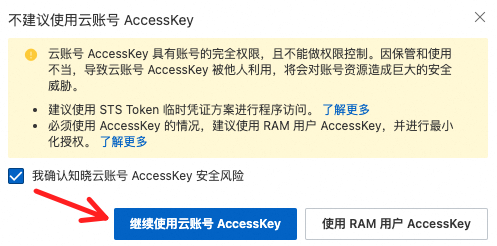
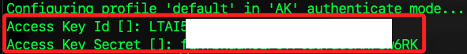
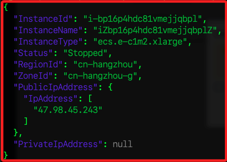

# CLI

<br>

## 步驟 

1. [官方載點](https://www.alibabacloud.com/help/en/cli/install-cli-on-macos?spm=a2c63.p38356.0.i0#32865bfe14am6:~:text=Download%20links%3A-,Official%20website,-%3A%20You%20can%20download)

<br>

2. 解壓縮。

    ```bash
    tar xzvf ~/Downloads/aliyun-cli-macosx-latest-universal.tgz
    ```

<br>

3. 複製到指定路徑。

    ```bash
    sudo cp ~/Downliads/aliyun /usr/local/bin
    ```

<br>

4. 測試。

    ```bash
    aliyun version
    ```

<br>

## 取得 AccessKey

1. 顯示。

    

<br>

2. 創建。

    

<br>

3. 再次確認，然後要進行驗證。

    

<br>

4. 完成後，先下載。

    

<br>

5. 點擊 `確定` 關閉視窗。

    

<br>

## 設定

1. 設定憑證。

    ```bash
    aliyun configure
    ```

<br>

2. 其中預設區域設定為 `華東1`，ID 為 `cn-hangzhou`。

    

<br>

3. 預設語言繁體中文，代碼為 `zh-Hant`。

    

<br>

4. 完成。

    

<br>

## 查詢

1. 查詢並列出指定欄位。

    ```bash
    aliyun ecs DescribeInstances | jq -r '.Instances.Instance[] | {InstanceId, InstanceName, InstanceType, Status, RegionId, ZoneId, PublicIpAddress, PrivateIpAddress}'
    ```

    


<br>

___

_持續補充_