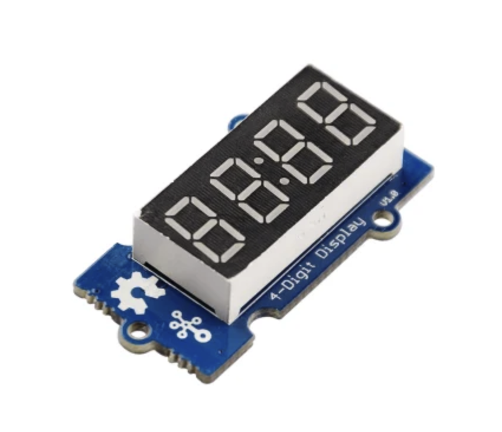

# Seeed Studio 4位數字+字母 LED 顯示器（型號：104030003）操作指引



這款 Seeed Studio 4-Digit Alphanumeric LED Display 使用的是 Grove-TM1637 驅動，使用 `雙線通訊（CLK + DIO）`；特別注意，這與 `I2C (SDA/SCL)` 版本是不同的。

## 連接方式

1. CLK #18
2. DIO #17
3. VCC #5V


## Python 基本程式（使用 TM1637）


```bash
pip install raspberrypi-tm1637

```


```python
import time
import tm1637

# 定義 CLK 和 DIO 引腳
CLK = 18  # GPIO 18
DIO = 17  # GPIO 17

# 初始化 TM1637
display = tm1637.TM1637(clk=CLK, dio=DIO)

# 設置顯示亮度（範圍為 0 到 7）
display.brightness(7)

# 清空顯示
display.write([0, 0, 0, 0])

# 計數器範例
counter = 0
while True:
    # 將計數器值格式化為四位數字串
    display.show(f"{counter:04d}")
    counter += 1
    time.sleep(1)
```

