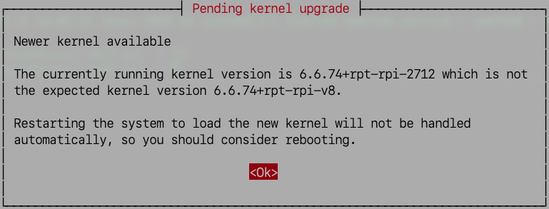

# 架設 OpenHAB 伺服器

_基於 Bookworm 64 位元版本_

<br>

## 準備樹莓派環境

1. 更新系統。

    ```bash
    sudo apt update && sudo apt upgrade -y && sudo apt autoremove -y
    ```

<br>

2. 安裝必要的工具；可用於發送 HTTP 請求、使用 `wget` 下載檔案、檢測網路連線等。

    ```bash
    sudo apt install curl -y
    ```

<br>

3. 通知當前運行的核心版本較舊，可重啟系統套用新的核心，不重啟也無妨。

    

<br>

## 安裝 OpenJDK 17

1. 執行以下命令安裝 Java 17。

    ```bash
    sudo apt update && sudo apt install openjdk-17-jdk -y
    ```

<br>

2. 檢查 Java 版本。

    ```bash
    java -version
    ```

<br>

## 手動安裝 OpenHAB

1. 新增 OpenHAB 套件庫。

    ```bash
    wget -qO - https://openhab.jfrog.io/artifactory/api/gpg/key/public | sudo apt-key add -
    echo 'deb https://openhab.jfrog.io/artifactory/openhab-linuxpkg stable main' | sudo tee /etc/apt/sources.list.d/openhab.list
    ```

<br>

2. 再次更新系統並安裝 OpenHAB；特別注意，apt update 會更新系統的套件列表，使得新加入的 OpenHAB 套件庫被系統識別。

    ```bash
    sudo apt update && sudo apt install openhab -y
    ```

<br>

3. 啟用和啟動 OpenHAB 服務。

    ```bash
    sudo systemctl enable openhab.service
    sudo systemctl start openhab.service
    ```

<br>

4. 確認服務狀態。

    ```bash
    sudo systemctl status openhab.service
    ```

<br>

## 設定端口

1. 編輯配置檔。

    ```bash
    sudo nano /etc/default/openhab
    ```

<br>

2. 取消預設的註解。

    ```bash
    OPENHAB_HTTP_PORT=8080
    OPENHAB_HTTPS_PORT=8443
    ```

<br>

3. 重啟服務。

    ```bash
    sudo systemctl restart openhab.service
    ```

<br>

4. 檢查 8080 埠的具體程序。

    ```bash
    sudo lsof -i :8080
    ```

<br>

___

_END_
