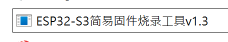
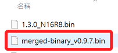
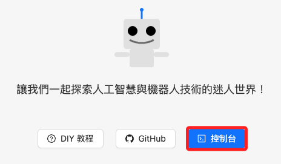
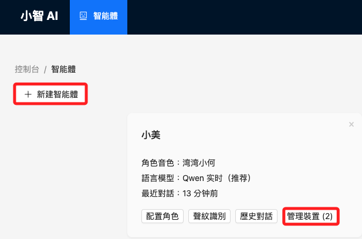
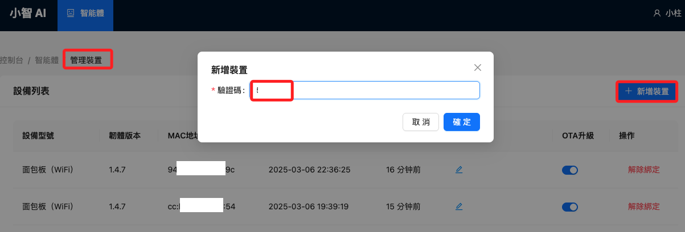

# 設置說明

 

## 步驟紀錄

1. 開始之前先確認 LCD 已經正確連接，因為後續步驟訊息會顯示在 LCD 中。

 

2. 先使用官方提供的軟件進行燒錄。

    

 

3. 韌體使用。

    

 

4. 使用手機連線 ESP32 連線進行配網，訪問 `http://192.168.4.1`，連線之後選取 SSID，再手動輸入密碼，完成連線後會閃爍綠燈，同時自動下載文件，查看 LCD 等待 `100%` 完成；接著會重新啟動並連線 WIFI，完成後燈號熄滅。

 

## 官方主控台

1. 登入 [主控台](https://xiaozhi.me/)。

    

 

2. 進入後，可 `新建智能體`，或是在現有智能體內管理裝置。

    

 

3. 若在現有智能體新增裝置，點擊 `BOOT`，喇叭會輸出驗證碼，接著輸入。

    

 

___

_持續補充_