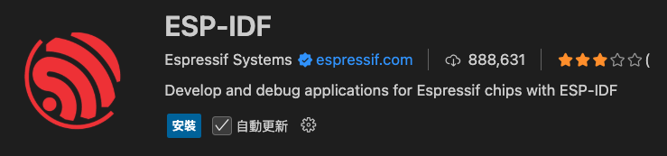
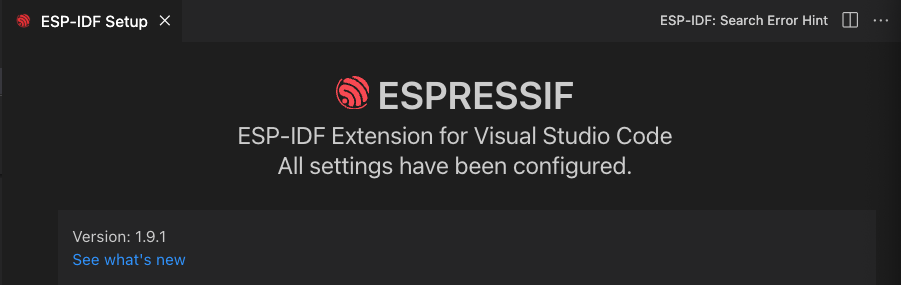

# VSCode 插件

_開發中會使用到的插件_

<br>

## 列表

1. ESP-IDF。

    

<br>

2. 安裝所需工具。

    ```bash
    brew install ninja
    ```

<br>

3. 先手動刪除舊的 ninja。

    ```bash
    rm '/opt/homebrew/bin/ninja'
    ```

<br>

4. 完成時沒有自動建立系統連結，這樣 ESP-IDF 會找不到 ninja設定；把 ninja 加入系統路徑讓 ESP-IDF 可找到。

    ```bash
    brew link ninja
    ```

<br>

5. 測試。

    ```bash
    ninja --version
    ```

<br>

6. 啟動之後需要進行設定，相關內容依據實際值填入即可。

    

<br>

___

_持續補充中_