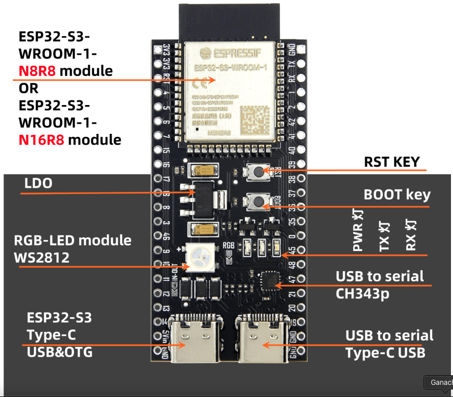
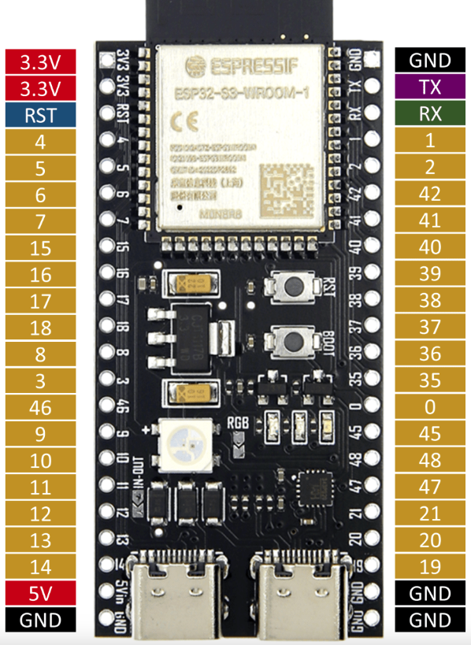
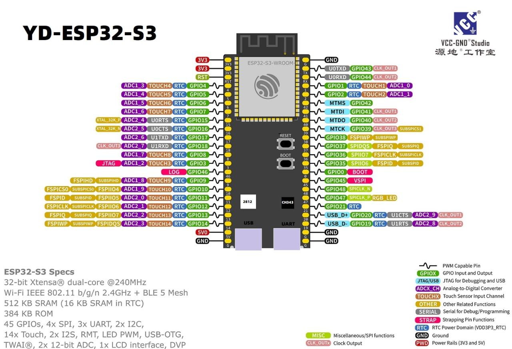

# 開發板介紹

_[說明文件](https://www.taiwansensor.com.tw/product/esp32-s3-devkitc-1-%E9%96%8B%E7%99%BC%E6%9D%BF-%E6%A8%82%E9%91%AB-wroom-1-n16r8-%E5%B7%B2%E7%84%8A%E6%8E%A5%E9%87%9D%E8%85%B3/)_

 

## 介紹

1. 晶片。

    

 

2. 板子。

    

 

3. Pin 編號。

    

 

___

_END_