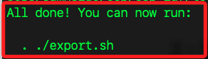
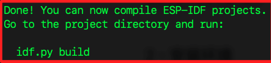
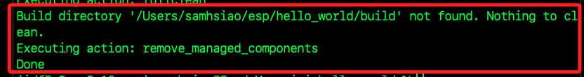
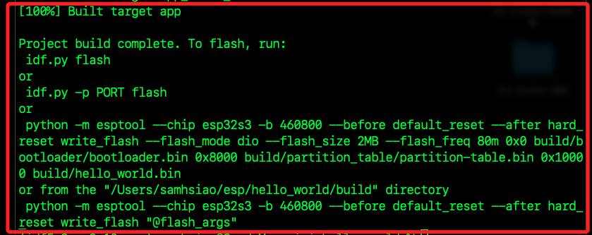
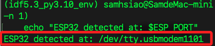
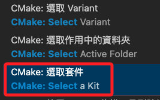
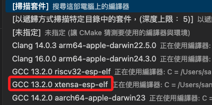
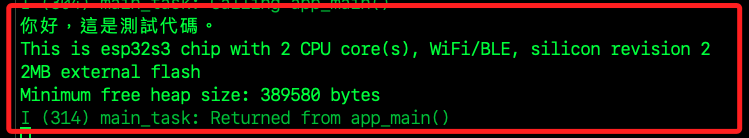

# 開發環境

_查看 [參考一](https://icnynnzcwou8.feishu.cn/wiki/JEYDwTTALi5s2zkGlFGcDiRknXf) 官方說明或 [參考二](https://rcnv1t9vps13.feishu.cn/wiki/UwaJwcJQwiuZVtk5QCfcrkS2nmf)，在 MacOS 建立開發環境。_


<br>

## 安裝 Homebrew

<br>

1. 如果尚未安裝 `Homebrew`，如已安裝可略過該步驟。

    ```bash
    /bin/bash -c "$(curl -fsSL https://raw.githubusercontent.com/Homebrew/install/HEAD/install.sh)"
    ```

<br>

2. 安裝 CMake、Ninja、ccache 和 dfu-util。

    ```bash
    brew install cmake ninja ccache dfu-util
    ```

<br>

## 設置 ESP-IDF

_Espressif IoT Development Framework，是 Espressif Systems 為 ESP32 系列晶片開發的官方開發框架。_

<br>

1. 退出當前虛擬環境，否則過程中會報錯；另外，也可先將 `~/.zshrc` 中啟動的虛擬環境註解。

    ```bash
    deactivate
    ```

<br>

2. 將 `ESP-IDF` 的原始碼拉取到 `~/esp/esp-idf` 目錄，並透過參數 `-b v5.3.2` 指定下載版本，若不指定版本可能在後續運行 `./install.sh` 時出錯。

    ```bash
    git clone -b v5.3.2 --recursive https://github.com/espressif/esp-idf.git ~/esp/esp-idf
    ```

<br>

3. 切換到指定目錄 `~/esp/esp-idf`。

    ```bash
    cd ~/esp/esp-idf
    ```

<br>

4. 運行腳本安裝 `ESP-IDF` 所需的工具；完成時會提示運行指令。

    ```bash
    ./install.sh
    ```

    

<br>

5. 運行指令會自動臨性時寫入環境變數，同時提示可卸載的工具有哪些；完成時同樣會提示後續步驟的指令。

    ```bash
    . ./export.sh
    ```

    

<br>

6. 這裡先跳過運行這個指令，這是作為編譯代碼使用。

    ```bash
    idf.py build
    ```

<br>

## 設置環境參數

_依據前面步驟的提示，將指令寫入環境變數中_

<br>

1. 編輯文件 `.zshrc`。

    ```bash
    code ~/.zshrc
    ```

<br>

2. 添加以下內容載入 `ESP-IDF` 的環境變數，確保在開發時可以正常使用 `idf.py` 等 `ESP-IDF` 相關工具。

    ```bash
    . $HOME/esp/esp-idf/export.sh
    ```

<br>

3. 重啟終端便可以看到自動載入。

    

<br>

## 相關查詢

1. 查詢版本。

    ```bash
    idf.py --version
    ```

<br>

## 設置虛擬環境

1. 啟動虛擬環境，也可將命令寫入 `.zshrc` 中。

    ```bash
    source ~/.espressif/python_env/idf5.3_py3.10_env/bin/activate
    ```

<br>

## 使用範例代碼

_透過範例代碼確認環境設置_

<br>

1. 複製並進入範例目錄。

    ```bash
    cd ~/esp
    cp -r $IDF_PATH/examples/get-started/hello_world .
    cd hello_world
    ```

<br>

2. 假如已經編譯過，可先清除先前的編譯結果；若並沒有相關數據也會顯示。

    ```bash
    idf.py fullclean
    ```

    

<br>

3. 設定晶片目標為 `ESP32-S3`。

    ```bash
    idf.py set-target esp32s3
    ```

<br>

4. 編譯。

    ```bash
    idf.py build
    ```

    

<br>

5. 使用預設串口進行燒錄。

    ```bash
    idf.py flash
    ```

<br>

6. 啟動監視。

    ```bash
    idf.py monitor
    ```

<br>

## 其他指令

1. 結束監督。

    ```bash
    control + ]
    ```

2. 查詢並記錄開發板連接的串口號。

    ```bash
    ESP_PORT=$(ls /dev/tty.usb* | head -n 1)
    echo "ESP32 detected at: $ESP_PORT"
    ```

    

<br>

3. 若要指定串口進行燒錄，可加入參數 `-p` 後使用儲存在變數中的串口號。

    ```bash
    idf.py -p $ESP_PORT flash monitor
    ```

<br>

## 設置 VSCode

_因為要用 GCC 編譯 ESP32 韌體，需設置 xtensa-esp-elf 工具鏈_

<br>

1. 在 Command Palette 中搜尋 `CMake: Select a Kit`。

    

<br>

2. 選擇適合 ESP32-S3 的工具鏈，例如 `GCC 13.2.0 xtensa-esp-elf`，這會在 .vscode/settings.json 設定，讓 VSCode 下次開啟專案時不再詢問。

    

<br>

## 嘗試修改範例

1. 在 VSCode 中開啟 `main` 中的 `hello_world_main.c`。

    ```bash
    code ~/esp/hello_world/main/hello_world_main.c
    ````

<br>

2. 完整修改如下，其中 `esp_restart();` 會導致 ESP32-S3 自動重啟。

    ```c
    #include <stdio.h>
    #include <inttypes.h>
    #include "sdkconfig.h"
    #include "freertos/FreeRTOS.h"
    #include "freertos/task.h"
    #include "esp_chip_info.h"
    #include "esp_flash.h"
    #include "esp_system.h"
    #include <inttypes.h>

    void app_main(void)
    {
        printf("H你好，這是測試代碼。\n");

        /* Print chip information */
        esp_chip_info_t chip_info;
        esp_chip_info(&chip_info);
        printf(
            "This is %s chip with %d CPU core(s), WiFi%s%s, ",
            CONFIG_IDF_TARGET,
            chip_info.cores,
            (chip_info.features & CHIP_FEATURE_BT) ? "/BT" : "",
            (chip_info.features & CHIP_FEATURE_BLE) ? "/BLE" : ""
        );
        printf("silicon revision %d\n", chip_info.revision);

        uint32_t flash_size;
        if (esp_flash_get_size(NULL, &flash_size) == ESP_OK) {
            printf(
                "%" PRIu32 "MB %s flash\n", flash_size / (1024 * 1024),
                (chip_info.features & CHIP_FEATURE_EMB_FLASH) ? "embedded" : "external");
        } else {
            printf("Failed to get flash size\n");
        }

        // 修正 printf 格式錯誤
        printf("Minimum free heap size: %" PRIu32 " bytes\n", esp_get_minimum_free_heap_size());
    }
    ```

<br>

3. 重新編譯並燒錄。

    ```bash
    cd ~/esp/hello_world
    idf.py build flash monitor
    ```

    

<br>

___

_END_