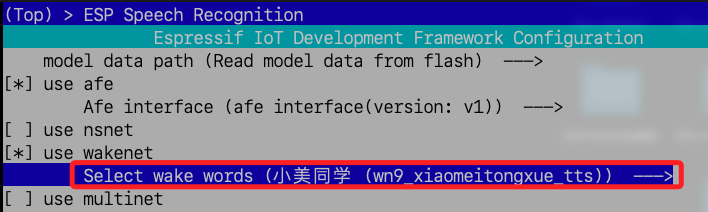

# 官方專案

<br>

## 直接下載

1. 下載，若要存入指定路徑，添加路徑名稱作為參數即可。

    ```bash
    git clone https://github.com/78/xiaozhi-esp32.git ~/esp/xiaozhi-esp32
    ```

<br>

2. 進入指定路徑。

    ```bash
    cd ~/esp/xiaozhi-esp32
    ```

<br>

## 手動下載

1. 下載並在當前目錄解壓縮專案；特別注意，不建議點擊解壓縮。

    ```bash
    cd ~/esp
    wget https://github.com/78/xiaozhi-esp32/archive/refs/tags/v1.4.6.zip -O xiaozhi-esp32-1.4.6.zip
    unzip xiaozhi-esp32-1.4.6.zip
    ```

<br>

2. 更名目錄名稱後進入專案。

    ```bash
    mv xiaozhi-esp32-1.4.6 xiaozhi-esp32
    cd ~/esp/xiaozhi-esp32
    ```

<br>

## 配置專案

_指定開發板、手動編輯設定文件_

<br>

1. 手動指定開發板 `ESP32-S3`；預設就是 `ESP32-S3`，所以可不用運行。

    ```bash
    idf.py set-target esp32s3
    ```

<br>

2. 編輯 `config.h` 文件。

    ```bash
    code ~/esp/xiaozhi-esp32/main/boards/bread-compact-wifi/config.h
    ```

<br>

3. 舉例來說，若改用 `0.96` 吋 `SSD1306 OLED` 屏幕，則將設定文件修改如下。

    ```c
    #define DISPLAY_HEIGHT  64
    ```

<br>

## 解析設定文件

_解析 `config.h`，其中定義了 `音頻`、`按鍵`、`LED`、`顯示屏` 等外設的 GPIO 接腳配置。_

<br>

1. 文件開頭，這是 C 的頭文件保護（Include Guard），確保這個文件不會被重複包含，避免編譯錯誤。

    ```c
    #ifndef _BOARD_CONFIG_H_
    #define _BOARD_CONFIG_H_
    ```

<br>

2. 引入 GPIO 驅動函式庫，用來控制 ESP32-S3 的 GPIO（通用輸入輸出）。

    ```c
    #include <driver/gpio.h>
    ```

<br>

3. 設定音頻的採樣率（Sample Rate），輸入音頻（麥克風）採樣率設為 16kHz，輸出音頻（喇叭）採樣率設為 24kHz。

    ```c
    #define AUDIO_INPUT_SAMPLE_RATE  16000
    #define AUDIO_OUTPUT_SAMPLE_RATE 24000
    ```

<br>

4. I2S 音頻接口，這是 ESP32 的音頻傳輸介面，預設開啟 SIMPLEX 模式（單向模式），如果使用 `雙向全雙工 Duplex I2S 模式`，則需註解掉這一行。

    ```c
    #define AUDIO_I2S_METHOD_SIMPLEX
    ```

<br>

5. SIMPLEX 單向模式。

    ```c
    #ifdef AUDIO_I2S_METHOD_SIMPLEX
    // 麥克風（MIC）
    // Word Select 信號
    #define AUDIO_I2S_MIC_GPIO_WS   GPIO_NUM_4
    // 時鐘信號
    #define AUDIO_I2S_MIC_GPIO_SCK  GPIO_NUM_5
    // 數據輸入
    #define AUDIO_I2S_MIC_GPIO_DIN  GPIO_NUM_6
    // 喇叭（Speaker）
    // 數據輸出
    #define AUDIO_I2S_SPK_GPIO_DOUT GPIO_NUM_7
    // 時鐘信號
    #define AUDIO_I2S_SPK_GPIO_BCLK GPIO_NUM_15
    // 左右聲道選擇
    #define AUDIO_I2S_SPK_GPIO_LRCK GPIO_NUM_16

    #else
    ```

<br>

6. Duplex 雙向模式，這一段是如果 `SIMPLEX` 模式沒有啟用，則使用 DUPLEX 模式，這裡的 GPIO 設定方式與 SIMPLEX 不同，適用於 全雙工音頻（同時讀寫音頻數據）。

    ```c
    #define AUDIO_I2S_GPIO_WS GPIO_NUM_4
    #define AUDIO_I2S_GPIO_BCLK GPIO_NUM_5
    #define AUDIO_I2S_GPIO_DIN  GPIO_NUM_6
    #define AUDIO_I2S_GPIO_DOUT GPIO_NUM_7
    #endif
    ```

<br>

7. LED 和按鍵設定。

    ```c
    // 內建 LED
    #define BUILTIN_LED_GPIO        GPIO_NUM_48
    // 啟動按鈕
    #define BOOT_BUTTON_GPIO        GPIO_NUM_0
    // 觸控按鈕
    #define TOUCH_BUTTON_GPIO       GPIO_NUM_47
    // 音量增加
    #define VOLUME_UP_BUTTON_GPIO   GPIO_NUM_40
    // 音量減少
    #define VOLUME_DOWN_BUTTON_GPIO GPIO_NUM_39
    ```

<br>

8. I2C OLED 顯示屏設定。

    ```c
    // I2C 資料線 SDA
    #define DISPLAY_SDA_PIN GPIO_NUM_41
    // I2C 時鐘線 SCL
    #define DISPLAY_SCL_PIN GPIO_NUM_42
    // 128 像素寬度
    #define DISPLAY_WIDTH   128
    ```

<br>

9. 確認 OLED 屏幕的解析度，如果兩者都沒設定，則報錯（`#error`）。

    ```c
    // 選擇 128x32
    #if CONFIG_OLED_SSD1306_128X32
    #define DISPLAY_HEIGHT  32
    // 選擇 128x64
    #elif CONFIG_OLED_SSD1306_128X64
    #define DISPLAY_HEIGHT  64
    #else
    #error "未选择 OLED 屏幕类型"
    #endif
    ```

<br>

10. 顯示屏翻轉設定，螢幕鏡像模式，如果畫面顛倒，可以改為 `false` 來調整方向。

    ```c
    // 水平鏡像（左右翻轉）
    #define DISPLAY_MIRROR_X true
    // 垂直鏡像（上下翻轉）
    #define DISPLAY_MIRROR_Y true
    ```

<br>

11. 文件結束使用 `#ifndef` 確保這個設定文件不會被重複加載。

    ```c
    #endif
    ```

<br>

## 介面設定

_細節會在下一章節 `進階設置` 說明_

<br>

1. 進入 `menuconfig` 設定介面。

    ```bash
    idf.py menuconfig
    ```

<br>

2. 更改預設的 `妳好小智` 為 `小美同學`。

    

## 重置編譯環境

_若進行任何新的設置必須重新編譯，讓這些變更生效；特別注意，插孔插在左側孔位。_

<br>

1. 完全清除編譯產物與 CMake 配置，包括 build/ 目錄；適用於需要乾淨編譯、變更 ESP-IDF 版本、解決編譯錯誤等。

    ```bash
    idf.py fullclean
    ```

<br>

2. 僅刪除 build/ 目錄，移除所有編譯產物，這不影響 CMake 設定檔，下次編譯會自動重新生成 CMake 設定；適用於清除舊的編譯結果，但不影響 CMake 配置。

    ```bash
    rm -rf build
    ```

<br>

3. 重新生成 CMake 配置，但不刪除 build/，這不會清除編譯產物，但會更新 CMakeCache；
適用於修改 `CMakeLists.txt` 或 `sdkconfig` 之後，確保配置更新。

    ```bash
    idf.py reconfigure
    ```

<br>

## 編譯

1. 編譯。

    ```bash
    idf.py build
    ```

<br>

2. 燒錄；第一次進行到此會聽到 `進入配網模式`。

    ```bash
    idf.py flash
    ```

<br>

3. 啟動監視。

    ```bash
    idf.py monitor
    ```

<br>

4. 結束監聽。

    ```bash
    Ctrl + ]
    ```

<br>

## 指定串口燒錄

1. 取得串口號。

    ```bash
    ESP_PORT=$(ls /dev/tty.usb* | head -n 1)
    ```

<br>

2. 燒錄至開發板並啟動監視。

    ```bash
    idf.py -p $ESP_PORT flash monitor
    ```

<br>

___

_END_

