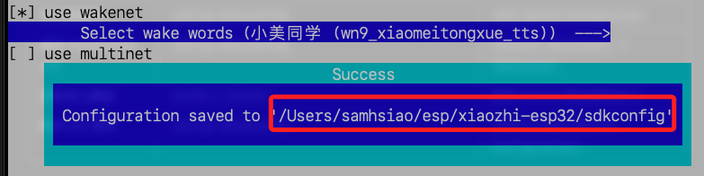
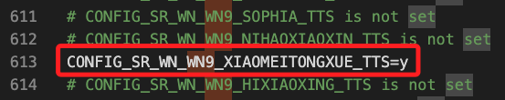

# 進階設置

_這與前一個步驟所述大致是相同的，之後可以刪減並彙整_

<br>

## 指定開發板

1. 設置 ESP32-S3 為目標晶片。

    ```bash
    idf.py set-target esp32s3
    ```

<br>

## 進入設置

1. 透過終端機指令進入設置頁面。

    ```bash
    idf.py menuconfig
    ```

<br>

2. 進入小智助理選單 `Xiaozhi Assistant`。

<br>

## 設定喚醒詞

1. 進入 `ESP Speech Recognition` 選項。

<br>

2. 選擇 `Select wake works` 設定喚醒詞，可自選喚醒詞如 `小美同學`。

<br>

3. 按 `S` 鍵儲存，然後按 `Esc` 退出；畫面中會顯示路徑在 `~/esp/xiaozhi-esp32/sdkconfig`。

    

<br>

## 查看設定文件

1. 在終端機可查看這個設定文件。

    ```bash
    code ~/esp/xiaozhi-esp32/sdkconfig
    ```

<br>

2. 以下代碼就是前面步驟設定的 `小美同學`，可看出就是漢語拼音並設置為 `y`，其餘可用設置已備備註。

    ```bash
    CONFIG_SR_WN_WN9_XIAOMEITONGXUE_TTS=y
    ```

    

<br>

## 重新編譯

_修改過設定後一定要重新編譯_

<br>

1. 開始編譯。

    ```bash
    idf.py build
    ```

<br>

2. 燒錄與監督。

    ```bash
    idf.py flash monitor
    ```

<br>

___

_END_