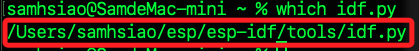

# 使用 Python 編程

_`idf.py` 的路徑通常位於 ESP-IDF 安裝目錄的 `tools` 資料夾內。預設情況下，若已經正確安裝 ESP-IDF，`idf.py` 會在環境變數 `PATH` 中，因此可直接執行_

<br>

## 說明

1. 查詢。

   ```bash
   which idf.py
   ```

   

<br>

2. 或使用 `command` 指令查詢。

   ```bash
   command -v idf.py
   ```

<br>

3. 已知 ESP-IDF 安裝在 `~/esp/esp-idf/`，以下是腳本的完整路徑。

   ```bash
   ~/esp/esp-idf/tools/idf.py
   ```

<br>

4. 若尚未載入環境變數，查詢前可能需要先手動載入。

   ```bash
   source ~/esp/esp-idf/export.sh
   ```

<br>

___

_END_
