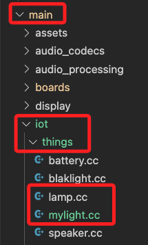

# 加入新設備

_可查看 [參考影片](https://www.douyin.com/video/7474602306873478454)；以下操作以複製原有腳本進行修改的方式進行。_

<br>

## 實作

1. 進入資料夾 `main/iot/things`，複製現有的 `lamp.cc`，並更名為 `mylight.cc` 或任意名稱。

    

<br>

2. 編輯 `mylight.cc`，將其中 `Lamp` 改為 `MyLight`，Pin 腳部分 `GPIO_NUM_18` 改為 `GPIO_NUM_12`，同時插入一個 LED 燈，長腳插在 `GPIO12`，短腳插在 GND。

    ```cpp
    #include "iot/thing.h"
    #include "board.h"
    #include "audio_codec.h"
    #include <driver/gpio.h>
    #include <esp_log.h>
    // 添加三個標頭
    #include <esp_http_client.h>
    #include <cstring>
    #include "esp_crt_bundle.h"

    // 改為 "MyLight"
    #define TAG "MyLight"

    namespace iot {

    // 定義 MyLight 屬性與方法，不包含實作
    class MyLight : public Thing {
    private:
        // 定義設備的 PIN 腳號，改用 12
        gpio_num_t gpio_num_ = GPIO_NUM_12;
        bool power_ = false;

        void InitializeGpio() {
            gpio_config_t config = {
                .pin_bit_mask = (1ULL << gpio_num_),
                .mode = GPIO_MODE_OUTPUT,
                .pull_up_en = GPIO_PULLUP_DISABLE,
                .pull_down_en = GPIO_PULLDOWN_DISABLE,
                .intr_type = GPIO_INTR_DISABLE,
            };
            ESP_ERROR_CHECK(gpio_config(&config));
            gpio_set_level(gpio_num_, 0);
        }

        // 添加函數
        void SendLineNotify(const char* message) {
            esp_http_client_config_t config = {
                .url = "https://notify-api.line.me/api/notify",
                .method = HTTP_METHOD_POST,
                // 跳過憑證名稱檢查
                .skip_cert_common_name_check = true,
                .crt_bundle_attach = esp_crt_bundle_attach,
            };

            esp_http_client_handle_t client = esp_http_client_init(&config);
            if (client == NULL) {
                ESP_LOGE(TAG, "Failed to initialize HTTP client");
                return;
            }

            // 設置 HTTP Header
            esp_http_client_set_header(
                client, "Authorization", 
                // 更改為自己的權杖
                "Bearer <更改為自己的權杖>"
            );
            esp_http_client_set_header(
                client,
                "Content-Type",
                "application/x-www-form-urlencoded"
            );

            // 設定 POST 內容
            char post_data[100];
            snprintf(
                post_data,
                sizeof(post_data),
                "message=%s",
                message
            );
            esp_http_client_set_post_field(
                client,
                post_data,
                strlen(post_data)
            );

            // 執行請求
            esp_err_t err = esp_http_client_perform(client);
            if (err == ESP_OK) {
                ESP_LOGI(TAG, "LINE Notify sent successfully");
            } else {
                ESP_LOGE(
                    TAG,
                    "Failed to send LINE Notify: %s",
                    esp_err_to_name(err)
                );
            }

            esp_http_client_cleanup(client);
        }

    public:
        // 改為 "MyLight"，同時加入描述 "測試使用的開關"
        MyLight() : Thing("MyLight", "測試使用的開關"), power_(false) {
            InitializeGpio();

            // 定義設備屬性
            properties_.AddBooleanProperty(
                "power",
                "測試開關的狀態", 
                [this]() -> bool {
                    return power_;
                }
            );

            // 定義設備遠程執行的指令
            // 指令：開啟
            methods_.AddMethod(
                "TurnOn", "打開測試開關", 
                ParameterList(), [this](const ParameterList& parameters) {
                    power_ = true;
                    gpio_set_level(gpio_num_, 1);
                    // 發送 LINE 通知
                    SendLineNotify("測試開關已打開！");
                }
            );
            // 指令：關閉
            methods_.AddMethod(
                "TurnOff", "關閉測試開關", 
                ParameterList(), [this](const ParameterList& parameters) {
                    power_ = false;
                    gpio_set_level(gpio_num_, 0);
                    // 發送 LINE 通知
                    SendLineNotify("測試開關已打開！");
                }
            );
        }
    };

    } // namespace iot

    DECLARE_THING(MyLight);
    ```

<br>

3. 進入資料夾 `main/boards/bread-compact-wifi`，編輯其中的 `compact_wifi_board.cc` 腳本，修改其中的函數 `InitializeIot()`，添加如下。

    ```cpp
    // 物聯網初始化，添加新設備
    void InitializeIot() {
        auto& thing_manager = iot::ThingManager::GetInstance();
        thing_manager.AddThing(iot::CreateThing("Speaker"));
        thing_manager.AddThing(iot::CreateThing("Lamp"));
        // 加入新設備
        thing_manager.AddThing(iot::CreateThing("MyLight"));
    }
    ```

<br>

## 重新燒錄

1. 編譯、燒錄、啟動監視。

    ```bash
    idf.py build flash monitor
    ```

<br>

2. 對小智 AI 下達語音指令 `打開測試開關`、`關閉測試開關`。

<br>

___

_END_
