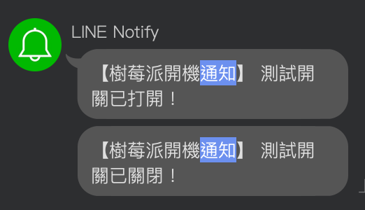

# 發送 Line 通知

_雖然 Line 通知即將於 2025/03/31 後終止服務，這裡主要目的是展示如何添加額外功能_

<br>

## 修改 `MyLight.cc`

1. 添加三個標頭檔。

    ```cpp
    #include <esp_http_client.h>
    #include <cstring>
    #include "esp_crt_bundle.h"
    ```

<br>

2. 在類 `MyLight` 中，修改 `private:`，添加以下函數 `SendLineNotify()`。

    ```cpp
    // 添加函數
    void SendLineNotify(const char* message) {
        esp_http_client_config_t config = {
            .url = "https://notify-api.line.me/api/notify",
            .method = HTTP_METHOD_POST,
            // 跳過憑證名稱檢查
            .skip_cert_common_name_check = true,
            .crt_bundle_attach = esp_crt_bundle_attach,
        };

        esp_http_client_handle_t client = esp_http_client_init(&config);
        if (client == NULL) {
            ESP_LOGE(TAG, "Failed to initialize HTTP client");
            return;
        }

        // 設置 HTTP Header
        esp_http_client_set_header(
            client, "Authorization", 
            // 更改為自己的權杖
            "Bearer WemrA5mtsqcBcvTEG59tXmVGVTDj8wifXH51GzjWXx8"
        );
        esp_http_client_set_header(client, "Content-Type", "application/x-www-form-urlencoded");

        // 設定 POST 內容
        char post_data[100];
        snprintf(post_data, sizeof(post_data), "message=%s", message);
        esp_http_client_set_post_field(client, post_data, strlen(post_data));

        // 執行請求
        esp_err_t err = esp_http_client_perform(client);
        if (err == ESP_OK) {
            ESP_LOGI(TAG, "LINE Notify sent successfully");
        } else {
            ESP_LOGE(TAG, "Failed to send LINE Notify: %s", esp_err_to_name(err));
        }

        esp_http_client_cleanup(client);
    }
    ```

<br>

3. 修改 `public:` 中的 `methods_.AddMethod("TurnOn", "打開測試開關" ...)`，在最後調用前面的自訂函數 `SendLineNotify()`。

    ```cpp
    methods_.AddMethod(
        "TurnOn", "打開測試開關", 
        ParameterList(), 
        [this](const ParameterList& parameters) {
                power_ = true;
                gpio_set_level(gpio_num_, 1);
                // 發送 LINE 通知
                SendLineNotify("測試開關已打開！");
        }
    );
    ```

<br>

4. 重新編譯、燒錄並監督。

    ```bash
    idf.py build flash monitor
    ```

<br>

5. 語音控制設備時，同時會收到通知。

    

<br>

## 完整腳本

1. 完整的 `MyLight.cc`。

    ```cpp
    #include "iot/thing.h"
    #include "board.h"
    #include "audio_codec.h"
    #include <driver/gpio.h>
    #include <esp_log.h>
    // 添加三個標頭
    #include <esp_http_client.h>
    #include <cstring>
    #include "esp_crt_bundle.h"

    #define TAG "MyLight"

    namespace iot {
    // 定義 MyLight 的屬性和方法
    class MyLight : public Thing {
    private:
        gpio_num_t gpio_num_ = GPIO_NUM_12;
        bool power_ = false;

        void InitializeGpio() {
            gpio_config_t config = {
                .pin_bit_mask = (1ULL << gpio_num_),
                .mode = GPIO_MODE_OUTPUT,
                .pull_up_en = GPIO_PULLUP_DISABLE,
                .pull_down_en = GPIO_PULLDOWN_DISABLE,
                .intr_type = GPIO_INTR_DISABLE,
            };
            ESP_ERROR_CHECK(gpio_config(&config));
            gpio_set_level(gpio_num_, 0);
        }
        // 添加函數
        void SendLineNotify(const char* message) {
            esp_http_client_config_t config = {
                .url = "https://notify-api.line.me/api/notify",
                .method = HTTP_METHOD_POST,
                // 跳過憑證名稱檢查
                .skip_cert_common_name_check = true,
                .crt_bundle_attach = esp_crt_bundle_attach,
            };

            esp_http_client_handle_t client = esp_http_client_init(&config);
            if (client == NULL) {
                ESP_LOGE(TAG, "Failed to initialize HTTP client");
                return;
            }

            // 設置 HTTP Header
            esp_http_client_set_header(
                client, "Authorization", 
                // 更改為自己的權杖
                "Bearer <輸入憑證>"
            );
            esp_http_client_set_header(client, "Content-Type", "application/x-www-form-urlencoded");

            // 設定 POST 內容
            char post_data[100];
            snprintf(post_data, sizeof(post_data), "message=%s", message);
            esp_http_client_set_post_field(client, post_data, strlen(post_data));

            // 執行請求
            esp_err_t err = esp_http_client_perform(client);
            if (err == ESP_OK) {
                ESP_LOGI(TAG, "LINE Notify sent successfully");
            } else {
                ESP_LOGE(TAG, "Failed to send LINE Notify: %s", esp_err_to_name(err));
            }

            esp_http_client_cleanup(client);
        }

    public:
        MyLight() : Thing("MyLight", "測試使用的開關"), power_(false) {
            InitializeGpio();

            // 定義設備的屬性
            properties_.AddBooleanProperty("power", "測試開關的狀態", [this]() -> bool {
                return power_;
            });

            // 定義設備的指令
            methods_.AddMethod("TurnOn", "打開測試開關", ParameterList(), [this](const ParameterList& parameters) {
                power_ = true;
                gpio_set_level(gpio_num_, 1);
                // 發送 LINE 通知
                SendLineNotify("測試開關已打開！");
            });

            methods_.AddMethod("TurnOff", "關閉測試開關", ParameterList(), [this](const ParameterList& parameters) {
                power_ = false;
                gpio_set_level(gpio_num_, 0);
                // 發送 LINE 通知
                SendLineNotify("測試開關已關閉！");
            });
        }
    };

    } // namespace iot

    DECLARE_THING(MyLight);
    ```

<br>

___

_END_