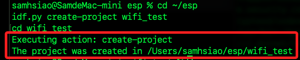
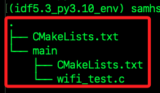
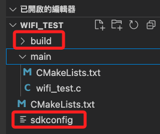
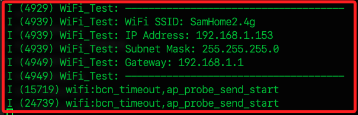

# 說明

_在 ESP-IDF 開發環境測試 ESP32-S3 (N16R8) 的 WiFi 是否正常運作_

<br>

## 準備工作

_如果尚未寫入設定文件_

<br>

1. 將 ESP-IDF 環境變數載入，或每次都手動啟動。

    ```bash
    . $HOME/esp/esp-idf/export.sh
    ```

<br>

## 建立專案

1. 進入目錄；這裡示範在 `~/esp` 中建立。

    ```bash
    cd ~/esp
    ```

<br>

2. 建立 ESP-IDF 專案並進入資料夾。

    ```bash
    idf.py create-project wifi_test
    cd wifi_test
    ```

    

<br>

3. 查看結構。

    

<br>

4. 使用 VSCode 開啟，因為插件關係，會自動進行編譯生成 `build 目錄`，以及一個 `sdkconfig` 文件。

    ```bash
    code .
    ```

    

<br>

## CMakeLists.txt

_兩個 CMakeLists.txt 在專案中的用途不同，分別負責專案的 `整體構建` 及 `組件（Component）` 註冊。_

<br>

1. 根目錄下的是 ESP-IDF 專案級 `CMakeLists.txt` 負責整體專案的構建，也就是 `ESP-IDF` 的入口，負責載入整個專案，並讓 `CMake` 知道這是一個 `ESP-IDF` 專案。

    ```bash
    # 指定 CMake 最低版本
    cmake_minimum_required(VERSION 3.16)

    # 引入 ESP-IDF 的 CMake 配置
    include($ENV{IDF_PATH}/tools/cmake/project.cmake)

    # 設定專案名稱
    project(wifi_test)
    ```

<br>

2. main 目錄下的是 main 組件（component）的 CMake 設定檔，負責 註冊 main 為 ESP-IDF 的一個組件。

    ```bash
    idf_component_register(
        # 指定此組件的主要 C 語言檔案
        # 即 wifi_test.c 會被編譯進專案
        SRCS "wifi_test.c"
        # 指定 包含標頭檔的目錄
        # `.` 代表當前目錄 `main/`
        INCLUDE_DIRS "."
    )
    ```

<br>

## 專案架構

## 編輯專案

1. ，編輯 `main/wifi_test.c`，加入以下測試 WiFi 連線的程式碼，其中 _帳號與密碼要記得更改_；特別注意，`ESP32-S3` 不支援 `5GHz`，確保使用的是 `2.4GHz` 頻段。

    ```c
    #include <stdio.h>
    #include "freertos/FreeRTOS.h"
    #include "freertos/task.h"
    #include "esp_system.h"
    #include "esp_wifi.h"
    #include "esp_event.h"
    #include "esp_log.h"
    #include "nvs_flash.h"
    #include "lwip/err.h"
    #include "lwip/sys.h"

    #define WIFI_SSID "<輸入-SSID-名稱>"
    #define WIFI_PASS "<輸入-SSID-密碼>"
    #define MAX_RETRY 5

    static const char *TAG = "WiFi_Test";
    static int retry_count = 0;

    static void event_handler(void *arg, esp_event_base_t event_base, int32_t event_id, void *event_data) {
        if (event_base == WIFI_EVENT && event_id == WIFI_EVENT_STA_START) {
            esp_wifi_connect();
        } else if (event_base == WIFI_EVENT && event_id == WIFI_EVENT_STA_DISCONNECTED) {
            if (retry_count < MAX_RETRY) {
                esp_wifi_connect();
                retry_count++;
                ESP_LOGI(TAG, "Retrying to connect to WiFi...");
            } else {
                ESP_LOGE(TAG, "Failed to connect to WiFi.");
            }
        } else if (event_base == IP_EVENT && event_id == IP_EVENT_STA_GOT_IP) {
            ip_event_got_ip_t *event = (ip_event_got_ip_t *) event_data;
            ESP_LOGI(TAG, "Connected! IP Address: " IPSTR, IP2STR(&event->ip_info.ip));
            retry_count = 0;
        }
    }

    void wifi_init(void) {
        ESP_ERROR_CHECK(nvs_flash_init());
        ESP_ERROR_CHECK(esp_netif_init());
        ESP_ERROR_CHECK(esp_event_loop_create_default());
        
        esp_netif_t *sta_netif = esp_netif_create_default_wifi_sta();
        wifi_init_config_t cfg = WIFI_INIT_CONFIG_DEFAULT();
        ESP_ERROR_CHECK(esp_wifi_init(&cfg));

        esp_event_handler_instance_t instance_any_id;
        esp_event_handler_instance_t instance_got_ip;

        ESP_ERROR_CHECK(esp_event_handler_instance_register(WIFI_EVENT, ESP_EVENT_ANY_ID, &event_handler, NULL, &instance_any_id));
        ESP_ERROR_CHECK(esp_event_handler_instance_register(IP_EVENT, IP_EVENT_STA_GOT_IP, &event_handler, NULL, &instance_got_ip));

        wifi_config_t wifi_config = {
            .sta = {
                .ssid = WIFI_SSID,
                .password = WIFI_PASS,
            },
        };

        ESP_ERROR_CHECK(esp_wifi_set_mode(WIFI_MODE_STA));
        ESP_ERROR_CHECK(esp_wifi_set_config(WIFI_IF_STA, &wifi_config));
        ESP_ERROR_CHECK(esp_wifi_start());

        ESP_LOGI(TAG, "WiFi initialization completed.");
    }

    void app_main(void) {
        wifi_init();
    }
    ```

<br>

5. 查看 `main` 目錄內的 `CMakeLists.txt`，預設已經加入 `wifi_test.c`；特別注意，不需要逗號或分號，因為 CMake 解析時自動將換行視為分隔符。

    ```cmake
    idf_component_register(
        SRCS "wifi_test.c"
        INCLUDE_DIRS "."
    )
    ```

<br>

6. 設定目標板。

    ```bash
    idf.py set-target esp32s3
    ```

<br>

7. 編譯、燒錄並監控序列埠輸出；特別注意，在執行 idf.py build flash monitor 時，ESP-IDF 通常會自動偵測開發板的串列埠。

    ```bash
    idf.py build flash monitor
    ```

<br>

8. 若有變更重新編譯。

    ```bash
    idf.py fullclean
    idf.py reconfigure
    idf.py build flash monitor
    ```

<br>

## 優化代碼

1. 前面範例已可取得 IP，但 `督輸出 (monitor)` 沒有顯示；以下修改 `event_handler()` 來清楚顯示 IP 位址。

    ```cpp
    #include <stdio.h>
    #include "freertos/FreeRTOS.h"
    #include "freertos/task.h"
    #include "esp_system.h"
    #include "esp_wifi.h"
    #include "esp_event.h"
    #include "esp_log.h"
    #include "nvs_flash.h"
    #include "lwip/err.h"
    #include "lwip/sys.h"

    #define WIFI_SSID "SamHome2.4g"
    #define WIFI_PASS "sam112233"
    #define MAX_RETRY 5

    static const char *TAG = "WiFi_Test";
    static int retry_count = 0;

    static void event_handler(void *arg, esp_event_base_t event_base, int32_t event_id, void *event_data) {
        if (event_base == WIFI_EVENT && event_id == WIFI_EVENT_STA_START) {
            esp_wifi_connect();
            ESP_LOGI(TAG, "連線 WiFi...");
        } else if (event_base == WIFI_EVENT && event_id == WIFI_EVENT_STA_DISCONNECTED) {
            if (retry_count < MAX_RETRY) {
                esp_wifi_connect();
                retry_count++;
                ESP_LOGI(TAG, "第 %d/%d 次嘗試重新連線 WiFi ...", retry_count, MAX_RETRY);
            } else {
                ESP_LOGE(TAG, "第 %d 次嘗試連線 WiFi 失敗 ...", MAX_RETRY);
            }
        } else if (event_base == IP_EVENT && event_id == IP_EVENT_STA_GOT_IP) {
            ip_event_got_ip_t *event = (ip_event_got_ip_t *) event_data;
            ESP_LOGI(TAG, "連線 WiFi 成功。");
            ESP_LOGI(TAG, "-------------------------------------");
            ESP_LOGI(TAG, "WiFi SSID: %s", WIFI_SSID);
            ESP_LOGI(TAG, "IP Address: " IPSTR, IP2STR(&event->ip_info.ip));
            ESP_LOGI(TAG, "Subnet Mask: " IPSTR, IP2STR(&event->ip_info.netmask));
            ESP_LOGI(TAG, "Gateway: " IPSTR, IP2STR(&event->ip_info.gw));
            ESP_LOGI(TAG, "-------------------------------------");
            retry_count = 0;
        }
    }

    void wifi_init(void) {
        ESP_ERROR_CHECK(nvs_flash_init());
        ESP_ERROR_CHECK(esp_netif_init());
        ESP_ERROR_CHECK(esp_event_loop_create_default());
        
        esp_netif_t *sta_netif = esp_netif_create_default_wifi_sta();
        wifi_init_config_t cfg = WIFI_INIT_CONFIG_DEFAULT();
        ESP_ERROR_CHECK(esp_wifi_init(&cfg));

        esp_event_handler_instance_t instance_any_id;
        esp_event_handler_instance_t instance_got_ip;

        ESP_ERROR_CHECK(esp_event_handler_instance_register(WIFI_EVENT, ESP_EVENT_ANY_ID, &event_handler, NULL, &instance_any_id));
        ESP_ERROR_CHECK(esp_event_handler_instance_register(IP_EVENT, IP_EVENT_STA_GOT_IP, &event_handler, NULL, &instance_got_ip));

        wifi_config_t wifi_config = {
            .sta = {
                .ssid = WIFI_SSID,
                .password = WIFI_PASS,
            },
        };

        ESP_ERROR_CHECK(esp_wifi_set_mode(WIFI_MODE_STA));
        ESP_ERROR_CHECK(esp_wifi_set_config(WIFI_IF_STA, &wifi_config));
        ESP_ERROR_CHECK(esp_wifi_start());

        ESP_LOGI(TAG, "WiFi 初始化完成。");
    }

    void app_main(void) {
        wifi_init();
    }
    ```

    

<br>

___

_END_
