# 基本操作

_以下紀錄包含在樹莓派以及 MacOS 上進行操作的步驟_

<br>

## 虛擬環境

_在兩個系統上的指令相同_

<br>

1. 切換到指定路徑，以下將在 `Documents` 中的 `PythonVenv` 資料夾中進行，假如尚未建立，可先進行建立。

    ```bash
    mkdir -p ~/Documents/PythonVenv
    ```

<br>

2. 切換至該目錄中。

    ```bash
    cd ~/Documents/PythonVenv
    ```

<br>

3. 使用 Python 內建模組建立虛擬環境。

    ```bash
    python -m venv envPyXiaozhi
    ```

<br>

4. 進入建立好的虛擬環境中。

    ```bash
    cd envPyXiaozhi/bin
    ```

<br>

5. 透過指令查詢當前路徑；複製該路徑或保留終端視窗，在後續步驟中會使用該路徑編輯設定文件。

    ```bash
    pwd
    ```

    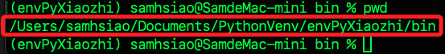

<br>

## 環境變數

1. 編輯系統設定文件，樹莓派預設使用的是 `~/.bashrc`，MacOS 則是 `~/.zshrc`。

    ```bash
    # 樹莓派
    sudo nano ~/.bashrc
    # MacOS
    sudo nano ~/.zshrc
    ```

<br>

2. 在最末行加入環境變數，特別注意，在路徑最後要加上 `/activate`，完成後儲存並退出。

    ```bash
    source <前面步驟複製的路徑使用自己的虛擬環境管理路徑>/activate
    ```

    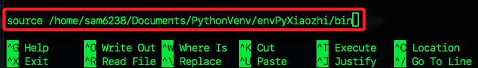

<br>

3. 立即套用以啟動虛擬環境，路徑前綴會顯示虛擬環境名稱。

    ```bash
    # 樹莓派
    source ~/.bashrc
    # MacOS
    source ~/.zshrc
    ```

    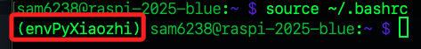

<br>

## 下載專案

1. 進入指定資料夾 `~/Downloads`；可以是任意路徑，這將用於儲存接下來的專案資料夾。

    ```bash
    cd ~/Downloads
    ```

<br>

2. 下載專案，玩成時會自動解壓縮。

    ```bash
    git clone https://github.com/Huang-junsen/py-xiaozhi.git
    ```

<br>

3. 進入專案目錄。

    ```bash
    cd py-xiaozhi
    ```

<br>

## 安裝工具

_樹莓派的 Linux 系統與 MacOS 操作不同_

<br>

1. 樹莓派運行以下安裝指令；這在安裝前先更新系統。

    ```bash
    sudo apt-get update -y && sudo apt-get install python3-pyaudio portaudio19-dev ffmpeg libopus0 libopus-dev
    ```

<br>

2. 使用樹莓派還需運行以下指令安裝音量控制工具；這不是唯一的選擇，但小智 AI 官方推薦這個工具。

    ```bash
    sudo apt-get install pulseaudio-utils
    ```

<br>

3. 至此可對系統做一次全面升級，這包含新版核心及主要依賴；若是新安裝的系統會需要花一點時間。

    ```bash
    sudo apt update && sudo apt upgrade -y && sudo apt full-upgrade -y && sudo apt autoremove -y
    ```

<br>

4. MacOS 運行以下指令進行安裝。

    ```bash
    brew install portaudio opus python-tk ffmpeg gfortran
    ```

<br>

## 安裝 Python 套件

_建議使用 VSCode 編輯設定文件_

<br>

1. 在專案中有兩個設定文件分別是 `requirements.txt` 與 `requirements_mac.txt`，樹莓派使用前者，MacOS 則使用帶有 `_mac` 後綴的文件。

<br>

2. 先開啟對應於使用系統的 `.txt` 文件，確認其中 `vosk` 的版本為 `0.3.44`，若版本不同可能會有相容性問題。

    ```bash
    vosk==0.3.44
    ```

    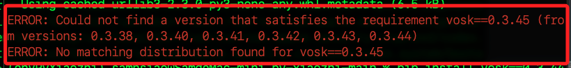

<br>

3. 運行指令進行安裝；特別注意，官方指引指定使用了阿里雲鏡像，使用參數 `-i` 並帶入鏡像網址，但非內地用戶無須使用該鏡像。

    ```bash
    # 樹莓派
    pip install -r requirements.txt

    # MacOS
    pip install -r requirements_mac.txt
    ```

<br>

## 載入動態函式庫

_設定環境變數_

<br>

1. 運行一次性指令載入環境變數，將 `Homebrew` 安裝的動態函式庫 `libopus.dylib` 加入搜尋範圍中，讓 `Python` 模組能找到並載入它。

    ```bash
    export DYLD_LIBRARY_PATH="/opt/homebrew/lib:$DYLD_LIBRARY_PATH"
    export LD_LIBRARY_PATH="/opt/homebrew/lib:$LD_LIBRARY_PATH"
    ```

<br>

2. 可透過編輯 `~/.bashrc` 或 `~/.zshrc` 將環境變數持久性寫入設定文件；編輯的細節不再贅述。

    ```bash
    # 加入環境變數 /opt/homebrew/lib
    export DYLD_LIBRARY_PATH="/opt/homebrew/lib:$DYLD_LIBRARY_PATH"
    export LD_LIBRARY_PATH="/opt/homebrew/lib:$LD_LIBRARY_PATH"
    ```

<br>

3. 套用變更並立即生效。

    ```bash
    # MacOS
    source ~/.zshrc

    # 樹莓派
    source ~/.bashrc
    ```

<br>

## 下載模型

_這部分是官方對於 [喚醒詞模型](https://alphacephei.com/vosk/models) 的指引，但實際操作並無該效果，先記錄如何下載並儲存模型_

<br>

1. 在專案的根目錄內建立新的資料夾 `models`

    ```bash
    mkdir models
    ```

<br>

2. 進入 [載點](https://alphacephei.com/vosk/models#:~:text=vosk%2Dmodel%2Dsmall%2Den%2Din%2D0.4) 下載這個大模型。

    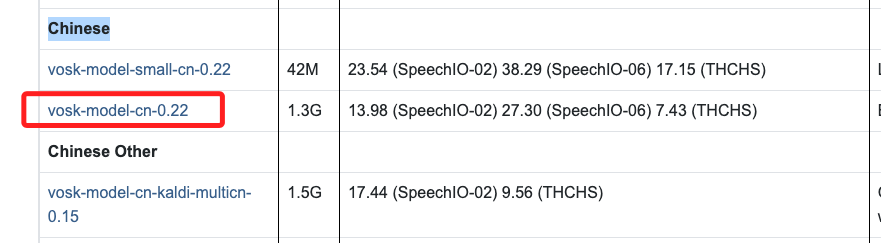

<br>

3. 下載後點擊進行解壓縮。

    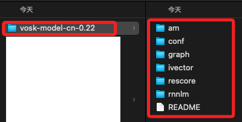

<br>

4. 將解壓縮後的資料夾拖曳到前面步驟建立的 `models` 資料夾中。

    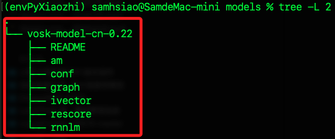

<br>

5. 在樹莓派中可下載小模型 `vosk-model-small-cn-0.22`。

    ```bash
    cd ~/Downloads/py-xiaozhi/models
    wget https://alphacephei.com/vosk/models/vosk-model-small-cn-0.22.zip
    unzip vosk-model-small-cn-0.22.zip
    rm vosk-model-small-cn-0.22.zip
    ```

<br>

6. 若要下載大模型，修改指令如下。

    ```bash
    cd ~/Downloads/py-xiaozhi/models
    wget https://alphacephei.com/vosk/models/vosk-model-cn-0.22.zip
    unzip vosk-model-cn-0.22.zip
    rm  vosk-model-cn-0.22.zip
    ```

<br>

7. 特別注意，在 `config/config.json` 中設定的是 `vosk-model-small-cn-0.22`，實際依據自己下載的模型進行設定；特別注意，喚醒詞建議僅使用一個，例如 `小美小美`。

    ```json
    {
        // 其餘不變...
        "WAKE_WORDS": [
            "你好小美",
            "小美你好",
            "小美小美"
        ],
        "WAKE_WORD_MODEL_PATH": "./models/vosk-model-cn-0.22",
        // 其餘不變...
    }
    ```

<br>

8. 使用喚醒詞 `小美小美`，可在日誌看到偵測事件。

    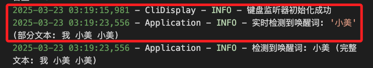

<br>

## 擴充 Swap

_加載模型需要大量記憶體，為了避免瞬間記憶體爆掉造成 `OOM kill`，擴充 swap 避免瞬殺_

<br>

1. 檢查記憶體啟用狀態。

    ```bash
    free -h
    ```

    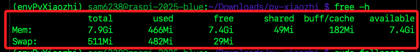

<br>

2. 添加 Swap。

    ```bash
    sudo fallocate -l 2G /swapfile
    sudo chmod 600 /swapfile
    sudo mkswap /swapfile
    sudo swapon /swapfile
    ```

    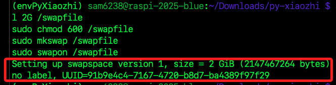

<br>

3. 確認 swap 啟用

    ```bash
    free -h
    ```

    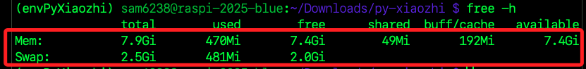

<br>

4. 若要設定開機自動啟用 swap，先查看當前設置。

    ```bash
    cat /etc/fstab
    ```

<br>

5. 加入 /etc/fstab，讓每次開機都自動使用這個 swapfile

    ```bash
    echo '/swapfile none swap sw 0 0' | sudo tee -a /etc/fstab
    ```

<br>

## 啟動服務

_回到專案的根目錄中運行；特別注意，在 MacOS 中無法運行 `python main.py`_

<br>

1. 透過終端機進行戶動。

    ```bash
    python main.py --mode cli
    ```

<br>

2. 透過視窗進行互動。

    ```bash
    python main.py
    ```

<br>

## 關於日誌

1. 在資料夾 `logs` 中會自動生成 `app.log`，每次運行時可清空內容以便觀察變化。

<br>

___

_END_