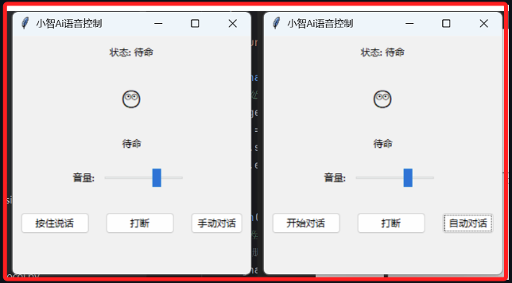
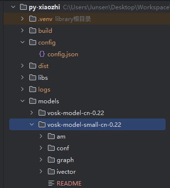
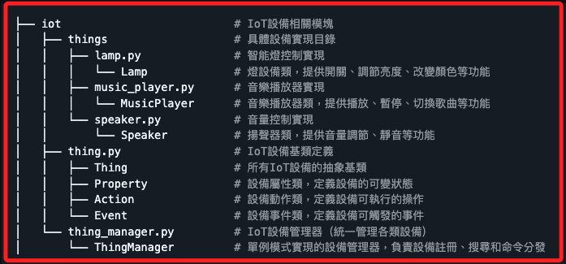
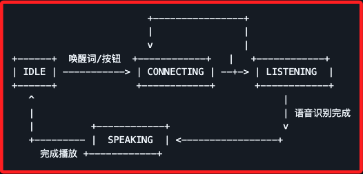

# 使用文檔

<br>

## 使用介紹

1. 語音模式分為 `長按對話` 和 `自動對話` 兩種，右下角按鈕顯示的是目前模式。

    

<br>

2. `長按對話` 就是按住說話、放手發送。

<br>

3. `自動對話` 就是點擊開始對話即可，當介面顯示 `聆聽中` 就表示到你說話了，說完會自行發送。

<br>

4. 在 `gui 模式` 下， `F2 鍵` 長按說話、 `F3 鍵` 打斷對話。

<br>

5. 在 `cli 模式` 下， 按一次 `F2 鍵` 開始自動對話、 `F3 鍵` 打斷對話。

<br>

## 項目結構

```bash
├── .github                          # GitHub 相關配置
│   └── ISSUE_TEMPLATE               # Issue 模板目錄
│       ├── bug_report.md            # Bug 報告模板
│       ├── code_improvement.md      # 代碼改進建議模板
│       ├── documentation_improvement.md  # 文檔改進建議模板
│       └── feature_request.md       # 功能請求模板
├── config                           # 配置文件目錄
│   └── config.json                  # 應用程式配置文件
├── docs                             # 文檔目錄
│   ├── images                       # 文檔圖片資源
│   │   ├── QQ音樂接口配置.png       # QQ音樂接口配置範例圖
│   │   ├── 喚醒詞.png               # 喚醒詞設置範例圖
│   │   └── 群聊.jpg                 # 社區交流群圖片
│   ├── 使用文檔.md                  # 用戶使用指南
│   └── 異常匯總.md                  # 常見錯誤及解決方案
├── libs                             # 依賴庫目錄
│   └── windows                      # Windows 平臺特定庫
│       └── opus.dll                 # Opus 音頻編解碼庫
├── scripts                          # 實用腳本目錄
│   ├── dir_tree.py                  # 生成目錄樹結構腳本
│   └── py_audio_scanner.py          # 音頻設備掃描工具
├── src                              # 原始碼目錄
│   ├── audio_codecs                 # 音頻編解碼模塊
│   │   └── audio_codec.py           # 音頻編解碼器實現
│   ├── audio_processing             # 音頻處理模塊
│   │   ├── vad_detector.py          # 語音活動檢測實現（用於實時打斷）
│   │   └── wake_word_detect.py      # 語音喚醒詞檢測實現
│   ├── constants                    # 常量定義
│   │   └── constants.py             # 應用程式常量（狀態、事件類型等）
│   ├── display                      # 顯示界面模塊
│   │   ├── base_display.py          # 顯示界面基類
│   │   ├── cli_display.py           # 命令行界面實現
│   │   └── gui_display.py           # 圖形用戶界面實現
│   ├── iot                          # IoT設備相關模塊
│   │   ├── things                   # 具體設備實現目錄
│   │   │   ├── CameraVL             # 攝像頭與視覺識別模塊
│   │   │   │   ├── Camera.py        # 攝像頭控制實現
│   │   │   │   └── VL.py            # 視覺識別實現
│   │   │   ├── lamp.py              # 智能燈具控制實現
│   │   │   ├── music_player.py      # 音樂播放器實現
│   │   │   └── speaker.py           # 智能音箱控制實現
│   │   ├── thing.py                 # IoT設備基類定義
│   │   └── thing_manager.py         # IoT設備管理器（統一管理各類設備）
│   ├── protocols                    # 通信協議模塊
│   │   ├── mqtt_protocol.py         # MQTT 協議實現（用於設備通信）
│   │   ├── protocol.py              # 協議基類
│   │   └── websocket_protocol.py    # WebSocket 協議實現
│   ├── utils                        # 工具類模塊
│   │   ├── config_manager.py        # 配置管理器（單例模式）
│   │   ├── logging_config.py        # 日誌配置
│   │   ├── system_info.py           # 系統訊息工具（處理 opus.dll 加載等）
│   │   └── volume_controller.py     # 音量控制工具（跨平臺音量調節）
│   └── application.py               # 應用程式主類（核心業務邏輯）
├── .gitignore                       # Git 忽略文件配置
├── LICENSE                          # 項目許可證
├── README.md                        # 項目說明文檔
├── main.py                          # 程序入口點
├── requirements.txt                 # Python 依賴包列表（通用）
├── requirements_mac.txt             # macOS 特定依賴包列表
└── xiaozhi.spec                     # PyInstaller 打包配置文件
```

<br>

## 配置文件說明

_項目使用兩種配置方式： `初始配置模板` 和 `運行時配置文件`。_

<br>

1. 初始配置模板在 `/src/utils/config_manager.py`，提供預設配置模板，首次運行時會自動生成配置文件，需要重置配置時可修改此文件。

<br>

2. 運行時配置文件在 `/config/config.json`，其中儲存實際運行時的配置訊息，直接編輯可進行設置。

    ```json
    {
        "CLIENT_ID": "自動生成的客戶端ID",
        "DEVICE_ID": "設備MAC地址",
        "NETWORK": {
            "OTA_VERSION_URL": "OTA更新地址",
            "WEBSOCKET_URL": "WebSocket伺服器地址",
            "WEBSOCKET_ACCESS_TOKEN": "訪問令牌"
        },
        "MQTT_INFO": {
            "endpoint": "MQTT伺服器地址",
            "client_id": "MQTT客戶端ID",
            "username": "MQTT用戶名",
            "password": "MQTT密碼",
            "publish_topic": "發布主題",
            "subscribe_topic": "訂閱主題"
        },
        // 是否啟用語音喚醒
        "USE_WAKE_WORD": true,
        // 喚醒詞列表
        "WAKE_WORDS": [
            "小智",
            "你好小明"
        ],
        // 喚醒模型路徑
        "WAKE_WORD_MODEL_PATH": "models/vosk-model-small-cn-0.22",
        // 在線音源配置
        "MUSIC_PLAYER": {
            "API": {
                "BASE_URL": "http://localhost:3200",
                "SEARCH_ENDPOINT": "/getSearchByKey",
                "PLAY_ENDPOINT": "/getMusicPlay",
                "LYRIC_ENDPOINT": "/getLyric"
            },
            "HEADERS": {
                "User-Agent": "Mozilla/5.0 (Windows NT 10.0; Win64; x64) AppleWebKit/537.36 (KHTML, like Gecko) Chrome/91.0.4472.124 Safari/537.36",
                "Accept": "*/*",
                "Accept-Encoding": "identity",
                "Connection": "keep-alive",
                "Referer": "https://y.qq.com/",
                "Cookie": ""
            }
        }
    }
    ```

<br>

## 視覺配置

1. 設定文件，但是目前我找不到這在哪。

    ```json
    {
        //打開第幾個攝像頭
        "camera index": 0,
        //畫面的寬度
        "frame width": 640,
        //畫面的高度
        "frame height": 480,
        //攝像頭幀率，預設不修改
        "fps": 30,
        //你的對於llm模型調用的api地址
        "Loacl VL url": "https://dashscope.aliyuncs.com/compatible-mode/v1",
        //自己的 llm 模型調用的 key
        "VLapi key": "<自己的llm模型的key>"
    }
    ```

<br>

## 配置修改指南

_配置文件使用 UTF-8 編碼，修改配置文件後需要 `重啟程序` 才能生效_

<br>

1. 首次使用時，直接運行程序，系統會自動生成預設配置文件，如需修改預設值，可編輯 `config_manager.py` 中的 `DEFAULT_CONFIG`

<br>

2. 若要更換伺服器配置可編輯 `/config/config.json`，修改 `NETWORK.WEBSOCKET_URL` 為新的伺服器地址。

    ```json
    "NETWORK": {
        "WEBSOCKET_URL": "ws://你的伺服器地址:埠號/"
    }
    ```

<br>

3. 可透過修改 `USE_WAKE_WORD` 為 `true` 啟用語音喚醒，並在 `WAKE_WORDS` 數組中添加或修改喚醒詞。

<br>

4. WebSocket URL 必須以 `ws://` 或 `wss://` 開頭

<br>

5. 首次運行時會自動生成 `CLIENT_ID`，建議不要手動修改

<br>

6. DEVICE_ID 預設使用設備MAC地址，可按需修改

<br>

## 系統設置

_僅說明 `MacOS` 及 `Linux`，`Linux` 包含 `Debian` 或 `Ubuntu`_

<br>

1. `Linux` 系統要安裝以下依賴。

    ```bash
    sudo apt-get update
    sudo apt-get install python3-pyaudio portaudio19-dev ffmpeg libopus0 libopus-dev
    ```

<br>

2. 另外，`Linux` 要安裝以下的音量控制依賴，在三種中任選一個即可。

    ```bash
    # 1. PulseAudio 工具（推薦）
    sudo apt-get install pulseaudio-utils

    # 2. 或者 ALSA 工具
    sudo apt-get install alsa-utils

    # 3. 如果需要使用 alsamixer 方式，還需要安裝 expect
    sudo apt-get install alsa-utils expect
    ```

<br>

3. MacOS 使用 Homebrew 安裝系統依賴。

    ```bash
    brew install portaudio opus python-tk ffmpeg gfortran
    ```

<br>

## 喚醒詞模型

1. [下載喚醒詞模型](https://alphacephei.com/vosk/models)，下載完成後解壓放至根目錄/models，設定文件中預設讀取 `vosk-model-small-cn-0.22`，這是一個小模型。

    

<br>

## IoT功能說明

1. IoT 模塊結構

    ```bash
    ├── iot                          # IoT 設備相關模塊
    │   ├── things                   # 具體設備實現目錄
    │   │   ├── lamp.py              # 智能燈控制實現
    │   │   │   └── Lamp             # 燈設備類，提供開關、調節亮度、改變顏色等功能
    │   │   ├── music_player.py      # 音樂播放器實現
    │   │   │   └── MusicPlayer      # 音樂播放器類，提供播放、暫停、切換歌曲等功能
    │   │   └── speaker.py           # 音量控制實現
    │   │       └── Speaker          # 揚聲器類，提供音量調節、靜音等功能
    │   ├── thing.py                 # IoT 設備基類定義
    │   │   ├── Thing                # 所有 IoT 設備的抽象基類
    │   │   ├── Property             # 設備屬性類，定義設備的可變狀態
    │   │   ├── Action               # 設備動作類，定義設備可執行的操作
    │   │   └── Event                # 設備事件類，定義設備可觸發的事件
    │   └── thing_manager.py         # IoT 設備管理器，統一管理各類設備
    │       └── ThingManager         # 單例模式實現的設備管理器，負責設備註冊、搜尋和命令分發
    ```

    

<br>

2. Iot 狀態流轉

```text
                                  +----------------+
                                  |    用戶語音    |
                                  |     指令      |
                                  +-------+-------+
                                          |
                                          v
                                  +-------+-------+
                                  |   語音識別    |
                                  |   (STT)      |
                                  +-------+-------+
                                          |
                                          v
                                  +-------+-------+
                                  |  LLM處理指令  |
                                  |               |
                                  +-------+-------+
                                          |
                                          v
                                  +-------+-------+
                                  | 生成物聯網命令 |
                                  |               |
                                  +-------+-------+
                                          |
                                          v
                          +---------------+---------------+
                          |     Application接收IoT消息    |
                          |    _handle_iot_message()     |
                          +---------------+---------------+
                                          |
                                          v
                          +---------------+---------------+
                          |    ThingManager.invoke()     |
                          +---------------+---------------+
                                          |
           +------------------+------------------+------------------+
           |                  |                  |                  |
           v                  v                  v                  v
+----------+-------+  +-------+--------+  +------+---------+  +----+-----------+
|     Lamp         |  |    Speaker     |  |   MusicPlayer  |  |    CameraVL    |
| (控制燈設備)      |  | (控制音量設備)  |  | (播放音樂設備)  |  | (攝像頭與視覺) |
+----------+-------+  +-------+--------+  +------+---------+  +----+-----------+
           |                  |                  |                  |
           |                  |                  |                  |
           |                  |                  |                  |
           |                  |                  |                  v
           |                  |                  |           +------+---------+
           |                  |                  |           |   Camera.py    |
           |                  |                  |           | (攝像頭控制)    |
           |                  |                  |           +------+---------+
           |                  |                  |                  |
           |                  |                  |                  v
           |                  |                  |           +------+---------+
           |                  |                  |           |     VL.py      |
           |                  |                  |           | (視覺識別處理)  |
           |                  |                  |           +------+---------+
           |                  |                  |                  |
           +------------------+------------------+------------------+
                                          |
                                          v
                          +---------------+---------------+
                          |        執行設備操作           |
                          +---------------+---------------+
                                          |
                                          v
                          +---------------+---------------+
                          |        更新設備狀態           |
                          |    _update_iot_states()      |
                          +---------------+---------------+
                                          |
                                          v
                          +---------------+---------------+
                          |     發送狀態更新到伺服器      |
                          |   send_iot_states(states)    |
                          +---------------+---------------+
                                          |
                                          v
                          +---------------+---------------+
                          |      伺服器更新設備狀態       |
                          +---------------+---------------+
                                          |
                                          v
                          +---------------+---------------+
                          |       返回執行結果給用戶      |
                          |      (語音或界面反饋)        |
                          +-------------------------------+
```

<br>

## IoT設備管理

1. IoT 模塊採用多協議通信架構，其中 `MQTT` 協議用於與標準物聯網設備通信，如智能燈、空調等；`HTTP` 協議用於與Web服務互動，如取得在線音樂、調用多模態AI模型等。

<br>

2. 可擴展支持其他協議如 `WebSocket、TCP` 等

<br>

3. 支持自動發現和管理IoT設備

<br>

4. 可通過語音命令控制IoT設備，例如 `查看當前物聯網設備`、`打開客廳的燈`、`關閉空調`、`設置溫度為26度`、`打開攝像頭`、`關閉攝像頭`、`識別畫面`、

<br>

## 添加新的IoT設備

1. 在`src/iot/things`目錄下建立新的設備類

<br>

2. 繼承`Thing`基類並實現必要方法

<br>

3. 在`thing_manager.py`中註冊新設備

<br>

## 注意事項

1. 確保相應的伺服器配置正確且可訪問，`MQTT` 伺服器配置用於物聯網設備，`API` 接口地址用於HTTP服務。

<br>

2. 不同協議的設備/服務需實現對應的連接和通信邏輯

<br>

3. 建議為每個新增設備/服務添加基本的錯誤處理和重連機制

<br>

4. 可以通過擴展 Thing 基類來支持新的通信協議

<br>

5. 在添加新設備時，建議先進行通信測試，確保連接穩定

<br>

## 在線音樂配置

1. 倉庫地址：[qq-music-api](https://github.com/Rain120/qq-music-api?tab=readme-ov-file)

<br>

2. 安裝版本號滿足 18 ≤ x < 22 的 Node.js

<br>

3. 拉取項目後，在 `QQ_music_api` 根目錄 `config/user-info.json` 填入 `qq` 和 `cookie`，`cookie` 的取得在QQ音樂官網登錄 `f12` 取得即可。

<br>

4. 然後 `npm install` 安裝，接著執行 `npm run dev` 即可啟動音源。

<br>

## 運行模式說明

1. GUI 模式運行，預設。

    ```bash
    python main.py
    ```

<br>

2. CLI模式運行

    ```bash
    python main.py --mode cli
    ```

<br>

3. 程序打包

    ```bash
    pyinstaller xiaozhi.spec
    ```

<br>

## 注意事項

1. 建議使用 Python 3.9.13+ 版本，推薦 3.12。

<br>

2. macOS 用戶需使用專門的 `requirements_mac.txt`。

<br>

3. 確保系統依賴安裝完成後再安裝 Python 依賴。

<br>

4. 如若使用 `xiaozhi-esp32-server` 作為服務端，該項目只能自動對話才有反應。

<br>

5. `esp32-server` 視頻部署教程 [新版！小智ai服務端本地部署完整教程，支持DeepSeek接入](https://www.bilibili.com/video/BV1GvQWYZEd2/?share_source=copy_web&vd_source=86370b0cff2da3ab6e3d26eb1cab13d3)。

<br>

6. 音量控制功能需要安裝特定依賴，程序會在啟動時自動檢查並提示缺少的依賴。

<br>

## 音量控制功能說明

_本應用支持調整系統音量，根據不同作業系統需要安裝不同的依賴，應用程式會在啟動時自動檢查這些依賴是否已安裝。如果缺少依賴，將會顯示相應的安裝指令。_

<br>

1. macOS 使用 `applescript` 控制系統音量

<br>

2. Linux 根據系統環境使用 `pactl (PulseAudio)`、`amixer (ALSA)` 或 `alsamixer` 控制音量

<br>

## 音量控制使用方法

1. GUI 模式使用界面上的音量滑塊調節音量

<br>

2. CLI 模式使用 `v <音量值>` 命令調節音量，例如 `v 50` 將音量設置為 50%

<br>

3. 狀態流轉圖

    

<br>

___

_END_
