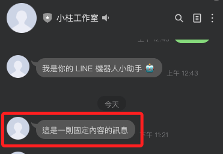

# 控制設備

_在兩個地方可以看到 `Lamp`_

<br>

## application.py

1. 編輯 `_initialize_iot_devices` 函數。

    ```python
    # 導入新設備
    from src.iot.things.NewThing import NewThing
    # 添加設備
    thing_manager.add_thing(NewThing())
    ```

<br>

2. 複製 `iot/things` 資料夾中的 `lamp.py`，並更名為 `NewThing.py`，編輯內容，將 `Lamp` 都改為 `NewThing`。

    

<br>

3. 修改內容如下。

    ```python
    import requests
    from src.iot.thing import Thing


    class NewThing(Thing):
        def __init__(self):
            super().__init__("NewThing", "一個測試用的 Line 通知裝置")
            self.power = False

            print(f"[虛擬設備] Line通知設備初始化完成")

            # 定義屬性
            self.add_property("power", "狀態是否開啟", lambda: self.power)

            # 定義方法（語音指令觸發）
            self.add_method(
                "TurnOn", "發送通知", [],
                lambda params: self._turn_on()
            )
            self.add_method(
                "TurnOff", "關閉通知", [],
                lambda params: self._turn_off()
            )

        def _turn_on(self):
            self.power = True
            message = "語音已觸發：設備開啟（TurnOn）"
            self._send_line_notify(message)
            print(f"[虛擬設備] 已發送 Line Notify 訊息：{message}")
            return {"status": "success", "message": message}

        def _turn_off(self):
            self.power = False
            message = "語音已觸發：設備關閉（TurnOff）"
            self._send_line_notify(message)
            print(f"[虛擬設備] 已發送 Line Notify 訊息：{message}")
            return {"status": "success", "message": message}

        def _send_line_notify(self, message: str):
            token = "WemrA5mtsqcBcvTEG59tXmVGVTDj8wifXH51GzjWXx8"
            url = "https://notify-api.line.me/api/notify"
            headers = {
                "Authorization": f"Bearer {token}"
            }
            data = {
                "message": message
            }
            try:
                response = requests.post(url, headers=headers, data=data)
                if response.status_code != 200:
                    print(f"[錯誤] 發送 Line Notify 失敗: {response.text}")
            except Exception as e:
                print(f"[例外] 發送 Line Notify 發生錯誤: {e}")
    ```

<br>

## 添加新指令

1. 例如說要爬取資料。

    ```python
    # 添加自動功能
    self.add_method(
        "GetUSDQuote", "取得美金報價", [], 
        lambda params: self._get_usd_quote()
    )
    ```

<br>

2. 自定義函數，這裡暫時先不管函數是否能爬取資訊，先正確調用。

    ```python
    def _get_usd_quote(self):
        try:
            response = requests.get("https://tw.rter.info/capi.php")
            if response.status_code == 200:
                data = response.json()
                usd_twd = data["USD"]["Exrate"]
                msg = f"目前美金匯率約為 {usd_twd:.2f} 新台幣"
            else:
                msg = "無法取得美金報價（API錯誤）"
        except Exception as e:
            msg = f"取得匯率時發生錯誤：{e}"

        self._send_line_notify(msg)
        print(f"[虛擬設備] 已發送美金報價 Line 訊息：{msg}")
        return {"status": "success", "message": msg}
    ```

<br>

___

_未完_