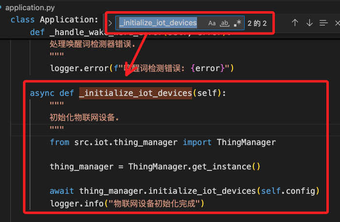

# 控制設備

_在兩個地方可以看到 `Lamp`_

<br>

## application.py

_編輯這份文件如下_

<br>

1. 開啟 `/src` 資料夾，其中有一個腳本 `application.py`，找到函數 `_initialize_iot_devices` 所在區塊。

    

<br>

2. 編輯 `_initialize_iot_devices` 函數，加入以下標註了 `「+」` 的代碼；特別注意，`NewThing` 模組尚未建立，這裡先導入。

    ```python
    # 這是原本的
    from src.iot.thing_manager import ThingManager
    from src.iot.things.lamp import Lamp
    # 「+」導入新模組
    from src.iot.things.NewThing import NewThing

    # 這是原本的
    thing_manager = ThingManager.get_instance()
    thing_manager.add_thing(Lamp())

    # 「+」添加新設備
    thing_manager.add_thing(NewThing())
    ```

<br>

## 建立新模組 `NewThing.py`

1. 進入 `iot/things` 資料夾，添加一個腳本 `NewThing.py`；可參考另外一個模組 `lamp.py`。

<br>

2. 貼上以下內容；以下標註 `「+」` 部分就是新增代碼、`「*」` 就是修改部分。

    ```python
    from src.iot.thing import Thing
    # 「＋」依據新功能加入新模組
    import requests

    class NewThing(Thing):
        def __init__(self):
            # 「*」改為新模組以及新敘述字串
            super().__init__(
                "NewThing",
                "一個測試用的通知裝置"
            )
            # 「＋」自訂屬性值的初始值
            self.count = 0
            # 「＋」加入新的輸出訊息，供調適目的使用
            print(f"【虛擬設備】 通知設備初始化完成")

            # 「＋」註冊屬性 `add_property`

            # 「＋」註冊方法 `add_method`

        # 「＋」自訂函數
    ```

<br>

## 註冊屬性及方法

_在 `py-xiaozhi` 中，所有的 `物聯網設備` 都是從 `src.iot.thing.Thing` 繼承而來，而 `Thing` 類裡提供了兩個最核心的擴展接口；先說明屬性與方法的註冊，後續再提供所註冊的函數_

<br>

1. 註冊屬性。

    ```python
    # 註冊可供外部查詢的屬性
    self.add_property(
        "count",        # 屬性名稱
        "統計數量",       # 描述
        self.get_count   # 非同步 getter
    )
    ```

<br>

2. 註冊函數；第一個參數是給這個函數在 `ThingManager` 中註冊唯一識別名稱，第二個參數是提示詞，第三個參數則是調用自訂函數。

    ```python
    # 註冊函數：將自訂函數加入，並定義 `提示詞`
    self.add_method(
        "GetUSDQuote",  # 方法名
        "取得美金報價",   # 描述
        [],             # 參數列表
        lambda params: self._get_usd_quote()  # 非同步回調函式 async
    )
    ```

<br>

## 解說屬性與函數註冊

1. 【函數解說】`add_property(name: str, description: str, getter: Callable[[], Awaitable])`。

    ```python
    def add_property(
        self,
        name: str,
        description: str,
        getter: Callable[[], Awaitable]):
        """
        註冊一個「屬性」，前端/伺服器可以讀取這個屬性。
        — name:      屬性的機器識別名（比如 "power"）
        — description: 給 LLM 或 UI 顯示的自然語言描述（比如 "燈是否開啟"）
        — getter:    一個 async 函數，無參數，回傳當前值
        """
    ```

<br>

2. 延續上一點，在設備狀態查詢階段，系統會遍歷所有設備的 `properties`，調用這個 `getter` 拿到最新值，然後打包成 JSON 發給伺服器或 UI；注意 `getter` 必須是一個 `async def`，否則會觸發錯誤 `TypeError: Property getter for '…' must be an async function.`。

    ```python
    async def get_power(self):
        return self.power
    ```

<br>

3. 【函數解說】`add_method(name: str, description: str, parameters: List[Parameter], callback: Callable[[dict], Awaitable])`。

    ```python
    def add_method(
        self,
        name: str,
        description: str,
        parameters: List[Parameter],
        callback: Callable[[dict], Awaitable]):
        """
        註冊一個「行為/命令」，當 LLM 或外部呼叫這個方法時，就執行你給的 callback。
        — name:       內部識別用的方法名（比如 "TurnOn"）
        — description: 給 LLM 匹配用的自然語言短語（比如 "打開燈"）
        — parameters: 方法接受的參數列表（目前多用空列表 []）
        — callback:   一個 async 函數，接受一個 dict 參數，回傳執行結果
        """
    ```

<br>

4. 延續上一點， 當伺服器端或 LLM 分析到用戶說了跟 `description` 匹配的指令，就會透過 `ThingManager.invoke()` 去呼叫這個 `callback`；注意，`callback` 也是必須是 `async def`。

    ```python
    async def _turn_on(self, params):
        self.power = True
        return {"status":"success", "message":"燈已開啟"}
    ```

<br>

5. `add_property` 就是指定類（`Lamp`, `NewThing`）去取得設備的某個狀態交給框架去讀；`add_method` 則是告訴框架如果收到這段指令就執行這裡的動作。只要把這兩個介面正確地傳入一個 `async` 函數，就能被 `MCP/ThingManager` 正常識別、調度。

<br>

## 自定義函數

_在類中定義，注意縮排_

<br>

1. 【自定義函數】非同步 `getter`，回傳當前的 `self.count`。

    ```python
    # 自訂函數：計算次數
    async def get_count(self):
        return self.count
    ```

<br>

2. 【自定義函數】取得美元報價。

    ```python
    # 自訂函數：取得報價
    async def _get_usd_quote(self, params):
        print("=============")
        print("在這裡執行代碼（1）")
        print("=============")

        # 調用自訂的其他函數
        await self._send_notify()

        # 必須回傳一個字典，表示方法執行結果
        return {
            "status": "success", "message": "已觸發 GetUSDQuote"
        }
    ```

<br>

3. 【自定義函數】發送 `通知`。

    ```python
    # 自訂函數
    async def _send_notify(self):
        print("=============")
        print("在這裡執行代碼（2）")
        print("=============")
        # 此處可直接 return 或不回傳
    ```

<br>

___

_未完_