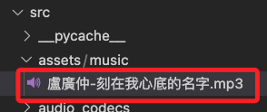

# 播放音樂

<br>

## 步驟

_修改 `music_player.py`_

<br>

1. 修改 `_play()` 函數。

    ```python
    # 其餘不變 ...

    def _play(self, song_name: str) -> Dict[str, Any]:
        """
        播放指定歌曲（優先播放本地音樂）
        
        参数:
            song_name: 歌曲名称
            
        返回:
            Dict[str, Any]: 播放结果
        """
        # 如果已在播放，先暫停並清理
        if self.playing:
            self._pause()
            time.sleep(0.5)

        # 清除舊狀態
        if self.app:
            self.app.schedule(
                lambda: self.app.set_chat_message(
                    "assistant", 
                    f"正在播放: {song_name}"
                )
            )
        
        # 检查应用程序状态，如果正在说话，不等待而是直接播放
        if self.app and self.app.device_state == DeviceState.SPEAKING:
            logger.info(f"應用正在說話，但仍繼續播放歌曲: {song_name}")

        # 重置播放状态
        self.current_song = song_name
        self.playing = True
        self.current_position = 0
        self.position_update_time = time.time()
        # 清空歌词
        self.lyrics = []
        # 重置歌词索引为-1，确保第一句歌词能显示
        self.current_lyric_index = -1
        # 确保停止事件被清除
        self.stop_event.clear()

        try:
            # 嘗試播放本地音樂
            local_path = self._get_local_song_path(song_name)
            if local_path:
                logger.info(f"找到本地音樂: {local_path}")
                self.play_thread = threading.Thread(
                    target=self._process_audio,
                    # 本地檔案路徑
                    args=(local_path,),
                    daemon=True
                )
                self.play_thread.start()
                return {
                    "status": "success",
                    "message": f"正在播放本地音樂: {song_name}",
                    "path": local_path
                }

            # 否則使用線上 API 搜尋並播放
            song_id, url = self._get_song_info(song_name)
            if not song_id or not url:
                return {
                    "status": "error", 
                    "message": f"未找到歌曲 '{song_name}' 或無法取得播放連結"
                }

            logger.info(f"正在播放：{song_name}, URL：{url}")
            self.play_thread = threading.Thread(
                target=self._process_audio,
                args=(url,),
                daemon=True
            )
            self.play_thread.start()
            # 不等待播放线程开始，直接返回成功
            return {
                "status": "success",
                "message": f"正在播放線上音樂: {song_name}",
                "duration": self.total_duration
            }

        except Exception as e:
            logger.error(f"播放歌曲失敗: {e}")
            self.playing = False
            return {"status": "error", "message": f"播放歌曲失敗: {e}"}
    ```

<br>

2. 添加函數。

    ```python
    def _get_local_song_path(self, song_name: str) -> str:
        """
        嘗試從本地資料夾尋找歌曲
        
        傳入關鍵字 '溫柔' 可對應檔名 '五月天 - 溫柔.mp3'
        """
        music_dir = os.path.join(
            os.path.dirname(__file__), 
            "..", "assets", "music"
        )
        if not os.path.exists(music_dir):
            logger.warning(f"本地音樂資料夾不存在: {music_dir}")
            return None

        for file in os.listdir(music_dir):
            if not file.lower().endswith(".mp3"):
                continue
            # 去除語音指令常見修飾詞
            clean_query = song_name.replace("的", "").replace(" ", "").lower()
            clean_file = file.replace(" ", "").lower()
            if clean_query in clean_file:
                return os.path.abspath(os.path.join(music_dir, file))
        return None
    ```

<br>

3. 加入一首歌曲 `盧廣仲-刻在我心底的名字.mp3` 測試；提示詞 `播放盧廣仲的刻在我心底的名字`。

    

<br>

___

_未完_