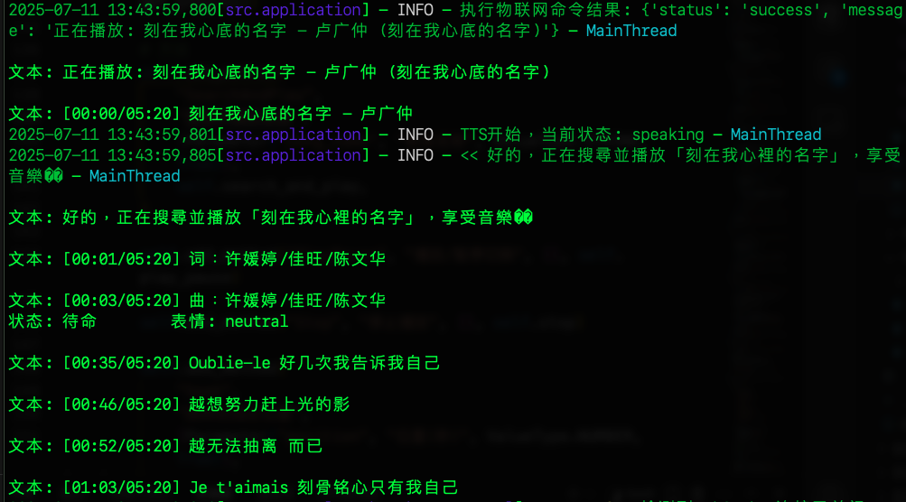
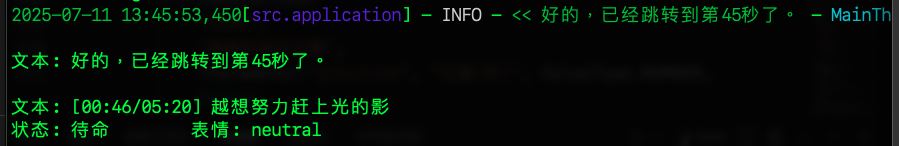

# 播放音樂

_【更新：2025/07/11】_

<br>

## 編輯 `application.py`

_因為這是預設類別，僅需加入物件到 `application.py` 中即可_

<br>

1. 在函數 `_initialize_iot_devices` 中導入管理音樂的類 `MusicPlayer`。

    ```python
    # 「+」
    from src.iot.things.music_player import MusicPlayer
    ```

<br>

2. 透過 `add_thing` 函數將類的物件加入。

    ```python
    # 「+」
    thing_manager.add_thing(MusicPlayer())
    ```

<br>

## 調用

1. 啟動腳本。

    ```bash
    python main.py --mode cli
    ```

<br>

2. 透過指令搜尋並播放歌曲。

    ```bash
    搜尋並播放「刻在我心裡的名字」
    搜尋並播放「青花瓷」
    ```

    

<br>

3. 可指定跳轉。

    ```bash
    跳轉到第 45 秒
    ```

    

<br>

4. 取得歌詞清單。

    ```bash
    取得歌詞清單
    ```

<br>

## 直接調用函數

_可以在對話中直接以 `程式碼` 下達指令_

<br>

1. 顯示歌詞。

    ```
    GetLyrics()
    ```

<br>

2. 暫停。

    ```bash
    PlayPause()
    ```

<br>

3. 繼續播放。

    ```bash
    PlayPause()
    ```

<br>

4. 停止。

    ```bash
    Stop()
    ```

<br>

___

_未完_