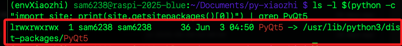
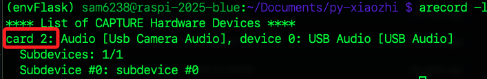
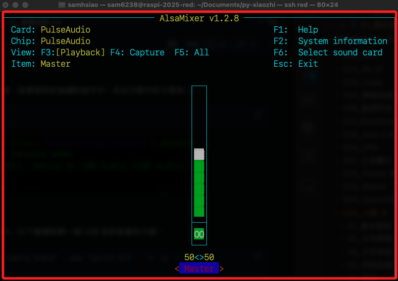
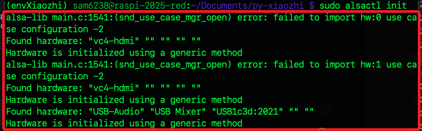
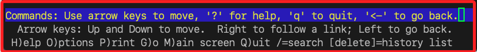
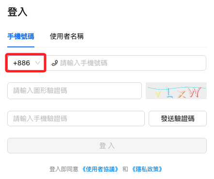

# 樹莓派

_參考 [官方 Hithub](https://github.com/Huang-junsen/py-xiaozhi)，在樹莓派上安裝並運行小智 AI 聊天助理，可以依照以下步驟來設置。_

<br>

## 準備工作

_以下會使用到虛擬環境，這裡不贅述建立過程_

<br>

1. 使用 SSH 連線樹莓派。

    ```bash
    ssh <使用者帳號>@<樹莓派主機名稱.local>
    ```

<br>

2. 先將 VNC 開啟，細節不贅述；因為本專案有兩種互動模式，其一需要進入桌面。

    ```bash
    sudo raspi-config
    ```

<br>

3. 建立並啟動指定的虛擬環境，這裡示範的名稱為 `envXiaozhi`。

    ```bash
    cd ~/Documents
    mkdir -p PythonVenvs
    cd PythonVenvs
    python -m venv envXiaozhi
    echo "source $(pwd)/envXiaozhi/bin/activate" >> ~/.bashrc
    source ~/.bashrc
    ```


<br>

4. 更新系統。

    ```bash
    sudo apt update && sudo apt upgrade -y
    ```

<br>

5. 安裝依賴；因為 `py-xiaozhi` 需要音頻處理，所以安裝相關的 FFmpeg 和 PortAudio 等工具。

    ```bash
    sudo apt install python3-pyaudio portaudio19-dev ffmpeg libopus0 libopus-dev -y
    ```

<br>

6. 下載倉庫 `py-xiaozhi` 到指定資料夾 `~/Documents`。

    ```bash
    cd ~/Documents && git clone https://github.com/Huang-junsen/py-xiaozhi.git && cd py-xiaozhi
    ```

<br>

## 錯誤排除

_【2025/07/10】在接下來的安裝之前，先編輯預設 `requirements.txt`_

<br>

1. 編輯。

    ```bash
    nano requirements.txt
    ```

<br>

2. 註解。

    ```txt
    # PyQt5==5.15.11
    ```

<br>

## 繼續安裝

<br>

7. 安裝預設的依賴；特別注意過程中是否出現衝突。

    ```bash
    pip install -r requirements.txt
    ```

<br>

## 搭建 UI 介面環境

_延續前面步驟；避開預設的安裝模式，手動安裝 `PyQt5`_

<br>

1. 安裝必要套件。

    ```bash
    pip install opencv-python
    ```

<br>

2. 使用 `apt` 安裝 `PyQt5` 的預編譯版本；這是桌面圖形使用者介面 `GUI`，讓使用者可以用視覺化方式與小智互動。

    ```bash
    sudo apt update && sudo apt install python3-pyqt5
    ```

<br>

2. 手動鏈接 `PyQt5` 到虛擬環境；就是在當前虛擬環境的 `site-packages` 中建立 `PyQt5` 的 `符號連結（symlink）`，使得虛擬環境能正確找到 `PyQt5` 模組，預防某些環境無法找到 `PyQt5` 模組的問題。

    ```bash
    ln -s /usr/lib/python3/dist-packages/PyQt5 $(python -c "import site; print(site.getsitepackages()[0])")/PyQt5
    ```

<br>

3. 查看連結是否完成；若沒有錯誤訊息，就代表 `PyQt5` 可正常使用於虛擬環境 `envXiaozhi` 中。

    ```bash
    ls -l $(python -c "import site; print(site.getsitepackages()[0])") | grep PyQt5
    ```

    

<br>

## 設置硬體

_這個專案需要麥克風與喇叭_

<br>

1. 檢查麥克風，會顯示在 `List of CAPTURE Hardware Devices`，卡號為 `2`；務必確認有麥克，並且記住硬體卡號 `card`，在後續的指令中需要用到。

    ```bash
    arecord -l
    ```

    

<br>

2. 補充說明，也可透過篩選將取得的收音裝置卡號存入變數，並在後續指令中直接帶入；以下是將擷取到的第一個卡號存入變數 `card_num`。

    ```bash
    card_num=$(arecord -l | grep "Usb Camera Audio" | awk '{print $2}' | tr -d ':')
    echo $card_num
    ```

    

<br>

3. 列出播放裝置；可看到喇叭也在卡號 `2`；特別注意，`plughw:0,0` 和 `plughw:1,0` 是樹莓派預設的 `HDMI` 音效輸出，即使未連接螢幕或喇叭系統仍會顯示它們，這是因為驅動已載入的緣故。

    ```bash
    aplay -l
    ```

    

<br>

## 測試

_使用以上步驟查詢到的設備進行錄音與播音_

<br>

1. 進行錄音測試；以下第一段指令會帶入前面步驟取得的卡號進行錄音，接著手動使用組合鍵 `control+C` 停止錄音，停止後會運行第二段指令播放錄製的音頻檔案 `test.wav`。

    ```bash
    arecord -D plughw:$card_num,0 -f cd test.wav
    aplay test.wav
    ```

<br>

2. 若輸出音量太小可進行調整，可使用鍵盤或滑鼠控制，完成後按下 `ESC` 退出。

    ```bash
    alsamixer
    ```

    

<br>

3. 調整音量後可再次播放。

    ```bash
    aplay test.wav
    ```

<br>

## 設定 ALSA

_`Advanced Linux Sound Architecture`，這是 `Linux` 系統中負責音訊處理的核心音效架構；依據查詢結果寫入設定文件，藉此作為系統預設使用的硬體裝置_

<br>

1. 編輯配置文件；當前文件應該是空的。

    ```bash
    sudo nano /etc/asound.conf
    ```

<br>

2. 貼上以下內容，並依據所查詢到的卡號填入；這裡麥克風與喇叭設備卡號同樣為 `2`。

    ```ini
    # 設定錄音設備（USB 麥克風 - card 2）
    pcm.mic_in {
        type plug
        slave.pcm "hw:2,0"
    }

    ctl.mic_in {
        type hw
        card 2
    }

    # 設定播放設備（USB 喇叭 - card 2）
    pcm.speaker_out {
        type plug
        slave.pcm "hw:2,0"
    }

    ctl.speaker_out {
        type hw
        card 2
    }

    # 設定預設設備
    pcm.!default {
        type asym
        playback.pcm "speaker_out"
        capture.pcm "mic_in"
    }
    ```

<br>

3. 儲存並重啟 `ALSA`；其中出現 `error: failed to import hw:* use case configuration -2` 是正常的資訊性訊息，通知系統預裝置 `HDMI` 音效卡沒有特定的 `Use Case` 設定檔，但仍會以 `generic method` 通用方法進行初始化。

    ```bash
    sudo alsactl init
    ```

    

<br>

## 再次測試

_使用設定檔案進行測試_

<br>

1. 測試錄音 `3` 秒；完成後會自動播放。

    ```bash
    arecord -f cd -d 3 test.wav
    aplay test.wav
    ```

<br>

2. 或是直接播放系統內建的語音樣本測試播放設備。

    ```bash
    aplay /usr/share/sounds/alsa/Front_Center.wav
    ```

<br>

3. 若輸出音量太小可進行調整。

    ```bash
    alsamixer
    ```

<br>

## 啟動應用

1. 使用 `CLI` 模式啟動應用。

    ```bash
    python main.py --mode cli
    ```

    

<br>

## 初次登入說明

_若設備尚未驗證，會出現上圖顯示的選單；這是 `lynx` 文字模式網頁瀏覽器_

<br>

1. `↑` / `↓`：瀏覽連結或表單項目。

<br>

2. `→`：開啟目前游標所指的超連結，類似點擊。

<br>

3. `←`：返回上一頁。

<br>

4. `H`：開啟 Lynx 的使用說明頁。

<br>

5. `O`：開啟設定選單（Options），可修改 Lynx 的行為與顯示方式。

<br>

6. `P`：列印畫面內容（Print），可選擇儲存為檔案等。

<br>

7. `G`：前往指定網址（Go），輸入 URL 直接導覽。

<br>

8. `M`：返回主畫面。

<br>

9. `Q`：離開 Lynx。

<br>

10. `/`：搜尋文字，輸入關鍵字後搜尋當前頁面。

<br>

11. `Delete`：顯示歷史清單，列出曾經拜訪過的頁面。

<br>

12. `?`：快速查看所有指令說明，同 `H`。

<br>

## 登入主控台

_繼續前步驟_

<br>

1. 輸入 `q` 退出即可，然後輸入 `y` 確認。

    

<br>

2. 會看到一組設備驗證碼。

    

<br>

3. 使用瀏覽器開啟 [主控台](https://xiaozhi.me/)，點擊 `控制台`。

    

<br>

4. 進行登入；可使用國碼 `+886` 的門號進行登入。

    

<br>

## 添加設備

1. 新建智能體。

    

<br>

2. 任意命名如 `阿美`。

    

<br>

3. 點擊新增裝置。

    

<br>

4. 輸入終端機中提示的驗證碼，點擊 `確定`。

    

<br>

5. 當前僅可選擇 `開源版`，點擊 `開始使用`。

    

<br>

## 返回終端機

1. 回到終端機中會看到指令提示。

    

<br>

2. 可直接輸入文字進行對話，AI 助理會使用語音回覆。

    

<br>

3. 輸入 `r` 讓設備進入聆聽狀態，開始語音對話；預設無需 `提示詞`，可直接開始對話。

    

<br>

## 其他選項

1. 打斷當前對話。

    ```bash
    x
    ```

<br>

2. 顯示當前狀態。

    ```bash
    s
    ```

<br>

3. 設定音量，數值 `0~100`。

    ```bash
    v <加上數字>
    ```

<br>

4. 退出程序。

    ```bash
    q
    ```

<br>

5. 顯示幫助。

    ```bash
    h
    ```

<br>

6. 自動對話模式。

    ```bash
    Alt+Shift+A
    ```

<br>

7. 打斷當前對話。

    ```bash
    Alt+Shift+X
    ```

<br>

## GUI 模式

_選擇 GUI 模式進行連線時，必需在樹莓派桌面啟動終端機，否則運行後會自動 `Aborted`_

<br>

1. GUI 模式需要 `tkinter`，先安裝必要套件。

    ```bash
    sudo apt install python3-tk
    ```

<br>

2. 可使用檔案總管進入專案資料夾 `~/Documents/py-xiaozhi`，點擊右鍵在當前路徑開啟終端機。

    

<br>

3. 啟動應用；同樣可以使用文字或語音，操作細節不做贅述。

    ```bash
    python main.py
    ```

    

<br>

___

_END_
