# 樹莓派

_參考 [官方 Hithub](https://github.com/Huang-junsen/py-xiaozhi)，在樹莓派上安裝並運行小智 AI 聊天助理，可以依照以下步驟來設置。_

<br>

## 準備工作

_以下會使用到虛擬環境，這裡不贅述建立過程_

<br>

1. 使用 SSH 連線樹莓派。

    ```bash
    ssh <使用者帳號>@<樹莓派主機名稱.local>
    ```

<br>

2. 建立並啟動指定的虛擬環境，這裡示範的名稱為 `envXiaozhi`。

    ```bash
    cd ~/Documents
    mkdir -p PythonVenvs
    cd PythonVenvs
    python -m venv envXiaozhi
    echo "source $(pwd)/envXiaozhi/bin/activate" >> ~/.bashrc
    source ~/.bashrc
    ```


<br>

3. 更新系統。

    ```bash
    sudo apt update && sudo apt upgrade -y
    ```

<br>

4. 安裝依賴；因為 `py-xiaozhi` 需要音頻處理，所以安裝相關的 FFmpeg 和 PortAudio 等工具。

    ```bash
    sudo apt install python3-pyaudio portaudio19-dev ffmpeg libopus0 libopus-dev -y
    ```

<br>

5. 下載倉庫 `py-xiaozhi` 到指定資料夾 `~/Documents`。

    ```bash
    cd ~/Documents && git clone https://github.com/Huang-junsen/py-xiaozhi.git && cd py-xiaozhi
    ```

<br>

6. 安裝預設的依賴；特別注意過程中是否出現衝突。

    ```bash
    pip install -r requirements.txt
    ```

<br>

## 設置硬體

_這個專案需要麥克風與喇叭_

<br>

1. 檢查麥克風，會顯示在 `List of CAPTURE Hardware Devices`，卡號為 `2`；務必確認有麥克，並且記住硬體卡號 `card`，在後續的指令中需要用到。

    ```bash
    arecord -l
    ```

    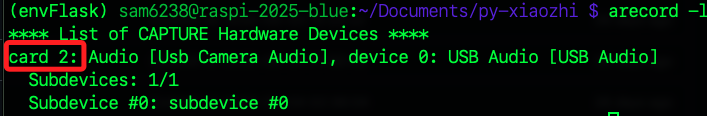

<br>

2. 補充說明，也可透過篩選將取得的收音裝置卡號存入變數，並在後續指令中直接帶入；以下是將擷取到的第一個卡號存入變數 `card_num`。

    ```bash
    card_num=$(arecord -l | grep "Usb Camera Audio" | awk '{print $2}' | tr -d ':')
    echo $card_num
    ```

    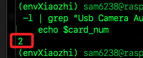

<br>

3. 列出播放裝置；可看到喇叭也在卡號 `2`；特別注意，`plughw:0,0` 和 `plughw:1,0` 是樹莓派預設的 `HDMI` 音效輸出，即使未連接螢幕或喇叭系統仍會顯示它們，這是因為驅動已載入的緣故。

    ```bash
    aplay -l
    ```

    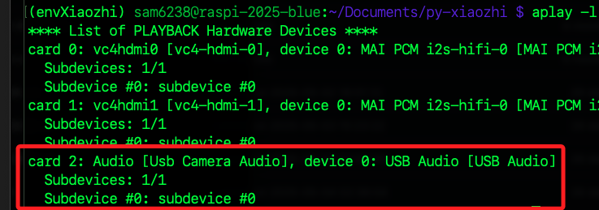

<br>

## 測試

_使用以上步驟查詢到的設備進行錄音與播音_

<br>

1. 進行錄音測試；以下第一段指令會帶入前面步驟取得的卡號進行錄音，接著手動使用組合鍵 `control+C` 停止錄音，停止後會運行第二段指令播放錄製的音頻檔案 `test.wav`。

    ```bash
    arecord -D plughw:$card_num,0 -f cd test.wav
    aplay test.wav
    ```

<br>

2. 若輸出音量太小可進行調整，可使用鍵盤或滑鼠控制，完成後按下 `ESC` 退出。

    ```bash
    alsamixer
    ```

    

<br>

3. 調整音量後可再次播放。

    ```bash
    aplay test.wav
    ```

<br>

## 設定 ALSA

_`Advanced Linux Sound Architecture`，這是 `Linux` 系統中負責音訊處理的核心音效架構；依據查詢結果寫入設定文件，藉此作為系統預設使用的硬體裝置_

<br>

1. 編輯配置文件；當前文件應該是空的。

    ```bash
    sudo nano /etc/asound.conf
    ```

<br>

2. 貼上以下內容，並依據所查詢到的卡號填入；這裡麥克風與喇叭設備卡號同樣為 `2`。

    ```ini
    # 設定錄音設備（USB 麥克風 - card 2）
    pcm.mic_in {
        type plug
        slave.pcm "hw:2,0"
    }

    ctl.mic_in {
        type hw
        card 2
    }

    # 設定播放設備（USB 喇叭 - card 2）
    pcm.speaker_out {
        type plug
        slave.pcm "hw:2,0"
    }

    ctl.speaker_out {
        type hw
        card 2
    }

    # 設定預設設備
    pcm.!default {
        type asym
        playback.pcm "speaker_out"
        capture.pcm "mic_in"
    }
    ```

<br>

3. 儲存並重啟 `ALSA`；其中出現 `error: failed to import hw:* use case configuration -2` 是正常的資訊性訊息，通知系統預裝置 `HDMI` 音效卡沒有特定的 `Use Case` 設定檔，但仍會以 `generic method` 通用方法進行初始化。

    ```bash
    sudo alsactl init
    ```

    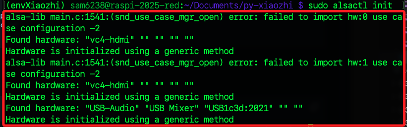

<br>

## 再次測試

_使用設定檔案進行測試_

<br>

1. 測試錄音 `3` 秒；完成後會自動播放。

    ```bash
    arecord -f cd -d 3 test.wav
    aplay test.wav
    ```

<br>

2. 或是直接播放系統內建的語音樣本測試播放設備。

    ```bash
    aplay /usr/share/sounds/alsa/Front_Center.wav
    ```

<br>

3. 若輸出音量太小可進行調整。

    ```bash
    alsamixer
    ```

<br>

## 搭建 UI 介面環境

_進入樹莓派操作；務必確認為在虛擬環境中_

<br>

1. 安裝必要套件。

    ```bash
    pip install opencv-python
    ```

<br>

2. 使用 `apt` 安裝 `PyQt5` 的預編譯版本；這是桌面圖形使用者介面 `GUI`，讓使用者可以用視覺化方式與小智互動。

    ```bash
    sudo apt update && sudo apt install python3-pyqt5
    ```

<br>

2. 手動鏈接 `PyQt5` 到虛擬環境；就是在當前虛擬環境的 `site-packages` 中建立 `PyQt5` 的 `符號連結（symlink）`，使得虛擬環境能正確找到 `PyQt5` 模組，預防某些環境無法找到 `PyQt5` 模組的問題。

    ```bash
    ln -s /usr/lib/python3/dist-packages/PyQt5 $(python -c "import site; print(site.getsitepackages()[0])")/PyQt5
    ```

<br>

3. 查看連結是否完成；若沒有錯誤訊息，就代表 `PyQt5` 可正常使用於虛擬環境 `envXiaozhi` 中。

    ```bash
    ls -l $(python -c "import site; print(site.getsitepackages()[0])") | grep PyQt5
    ```

    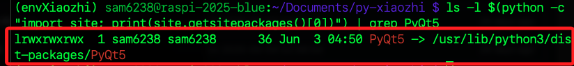

<br>

## 啟動應用

1. 使用 `CLI` 模式啟動應用。

    ```bash
    python main.py --mode cli
    ```

2. 若在本機連線樹莓派運行會出現以下提示，輸入 `q` 退出即可，然後輸入 `y` 確認。

    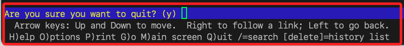

<br>

3. 第一次啟動，依據畫面提示 [連線](https://xiaozhi.me/)。

    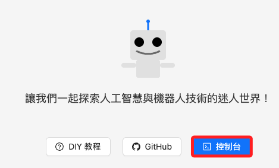

<br>

4. 進行登入。

    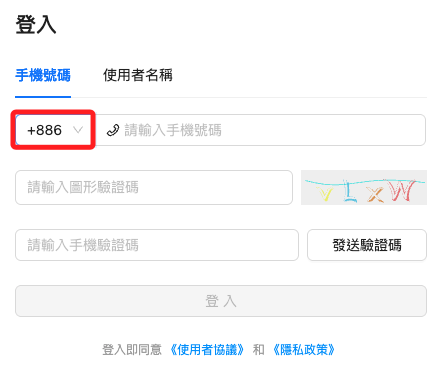

<br>

5. 新建智能體。

    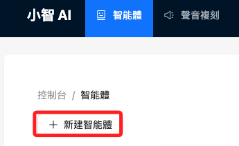

<br>

6. 任意命名如 `阿美`。

    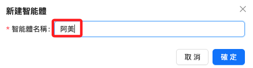

<br>

7. 點擊新增裝置。

    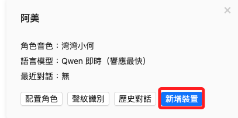

<br>

8. 查看終端機中提示的驗證碼。

    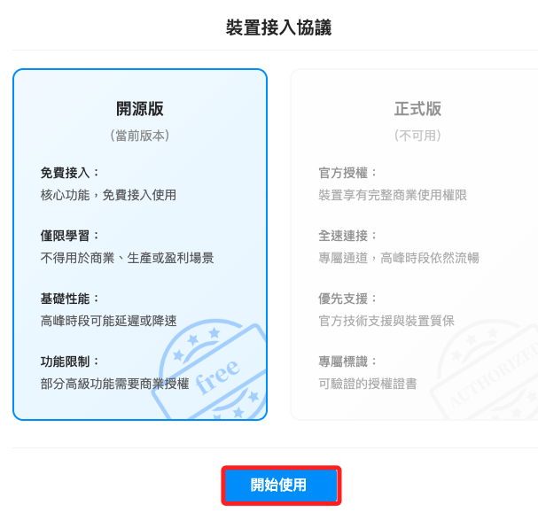

<br>

9. 在網頁中輸入並確認。

    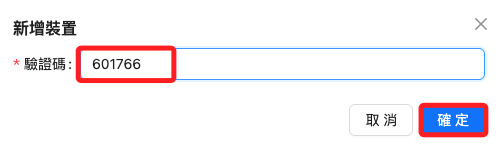

<br>

10. 回到終端機中會看到指令提示。

    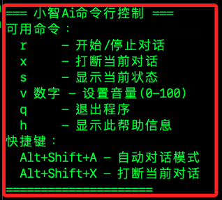

<br>

11. 輸入 `r` 開始對話。

    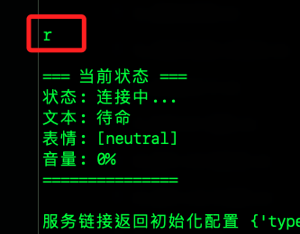

<br>

## GUI 模式

_選擇 GUI 模式進行連線時，需在樹莓派桌面啟動終端機_

<br>

1. GUI 模式需要 `tkinter`，先安裝必要套件。

    ```bash
    sudo apt install python3-tk
    ```

<br>

2. 進入專案資料夾後，運行以下指令。

    ```bash
    python main.py
    ```

    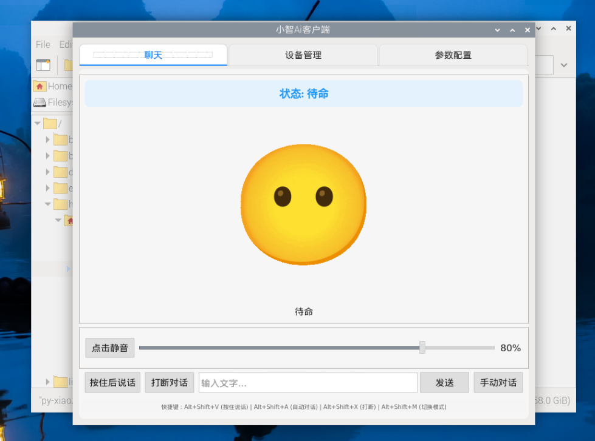

<br>

## 使用 WebSocket 連接自建伺服器

_如果不想使用官方伺服器，也可以自行部署 xiaozhi-esp32-server，然後修改 `main.py` 內的 WebSocket 連接地址。_

<br>

___

_END_
