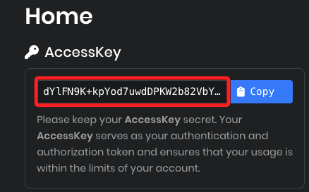

# Picovoice

_建立簡易專案；需具備麥克風_

<br>

## 註冊帳號

1. 前往 [picovoice.ai 官網](https://console.picovoice.ai) 註冊或登入帳號；該步驟很簡單，不做贅述。

<br>

2. 生成並複製 `AccessKey`。

    

<br>

## 開發環境

1. 更新系統與安裝必要工具；以下套件在官方說明中並未提示安裝。

    ```bash
    sudo apt update && sudo apt upgrade
    sudo apt install git portaudio19-dev espeak -y
    ```

<br>

2. 建立虛擬環境並啟用；以下指令建立的虛擬環境命名為 `envPorcupine`。

    ```bash
    cd ~/Documents
    mkdir -p PythonVenvs
    cd PythonVenvs
    python -m venv envPorcupine
    echo "source $(pwd)/envPorcupine/bin/activate" >> ~/.bashrc
    source ~/.bashrc
    ```

<br>

3. 安裝 Porcupine 套件

    ```bash
    pip install pvporcupine pvrecorder
    ```

<br>

## 建立專案

_喚醒詞觸發語音回應_

<br>

1. 建立專案目錄與主程式

    ```bash
    mkdir -p ~/exPicovoice
    cd ~/exPicovoice
    nano porcupine_wakeup.py
    ```

<br>

2. 貼上以下程式碼，並替換其中的 `<ACCESS_KEY>`

    ```python
    import pvporcupine
    from pvrecorder import PvRecorder
    import os

    ACCESS_KEY = "<ACCESS_KEY>"

    def main():
        porcupine = pvporcupine.create(access_key=ACCESS_KEY, keywords=["porcupine"])
        recorder = PvRecorder(device_index=-1, frame_length=porcupine.frame_length)
        recorder.start()

        print("🔊 聆聽喚醒詞 ... (請說 'porcupine')")

        try:
            while True:
                pcm = recorder.read()
                result = porcupine.process(pcm)
                if result >= 0:
                    print("✅ 偵測到喚醒詞")
                    os.system('espeak "Yes, I am here."')
        except KeyboardInterrupt:
            print("🛑 使用者停止")
        finally:
            recorder.stop()
            recorder.delete()
            porcupine.delete()

    if __name__ == "__main__":
        main()
    ```

<br>

3. 執行腳本。

    ```bash
    python porcupine_wakeup.py
    ```

<br>

4. 對著麥克風說 `porcupine`，會聽到系統回應。

    ```bash
    Yes, I am here.
    ```

<br>

___

_END_