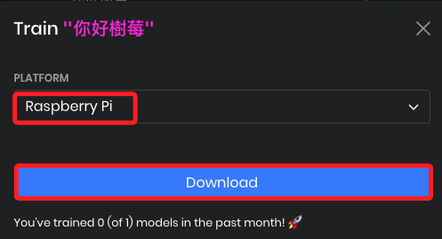
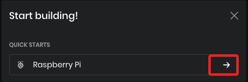
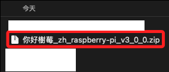
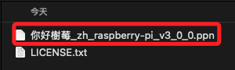

# 中文喚醒詞

_你好樹莓_

<br>

## 建立喚醒詞

_前往 Picovoice Console_

<br>

1. 前往 [picovoice.ai 官網](https://console.picovoice.ai)，點擊左上方左 `Porcupine`。

    

<br>

2. 選擇 `Chinese`，並輸入提示詞，可以輸入四個中文字，這裡示範輸入 `你好樹莓`

    

<br>

3. 點擊 `Click` 會進入測試，確認是否能辨識所設定的提示詞。

    

<br>

4. 接著點擊 `Train`。

    

<br>

5. 選取作業系統為 `RaspberryPi`，然後點擊 `Download`。

    

<br>

6. 下載後，畫面會出現前往 `Quick Starts` 的圖標，可點擊進入。

    

<br>

7. 在本地資料夾中會有一個 .zip 壓縮檔，點擊進行解壓縮。

    

<br>

8. 在解壓縮的資料夾中會有一個 .ppn 文件；可修改檔案名稱如 `你好樹莓.ppn`。

    

<br>

## 下載中文模型檔

_.pv_

<br>

1. 前往 (Picovoice GitHub)[https://github.com/Picovoice/porcupine/tree/master/lib/common]

<br>

2. 下載 `zh` 中文模型。

    

<br>

3. 同樣拖曳到專案路徑中。

<br>

## 修改程式

_使用 VSCode 進入前一個單元建立的專案目錄中_

<br>

1. 將下載的文件拖曳到專案資料夾內。

<br>

2. 編輯程式，如 `porcupine_wakeup.py`，使用 `keyword_paths` 指定檔案路徑，並選擇中文模型。

    ```python
    porcupine = pvporcupine.create(
        access_key=ACCESS_KEY,
        keyword_paths=["你好樹莓.ppn"],
        model_path="porcupine_params_zh.pv"
    )
    ```

<br>

3. 執行程式；當使用者說 `你好樹莓` 時會觸發回應。

    ```bash
    python porcupine_wakeup.py
    ```

<br>

___

_END_
