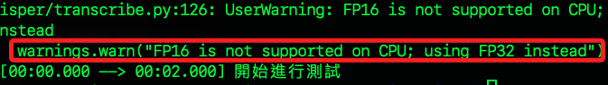
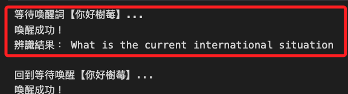

# 語音轉文字

_分 `官方` 與 `非官方` 版本實作_

<br>

## 安裝工具

_語音轉文字工具 `Whisper`_

<br>

1. 採用 OpenAI 的 [Whisper](https://github.com/openai/whisper)，這是一款開源、效果極佳的語音辨識模型；`Whisper` 會使用 `ffmpeg` 處理音訊格式，所以會一起安裝。

    ```bash
    sudo apt install ffmpeg sox libsox-fmt-all -y
    pip install openai-whisper
    ```

<br>

## 測試語音辨識

1. 錄製語音檔，設定為 `5` 秒。

    ```bash
    arecord -D plughw:2,0 -f cd -t wav -d 5 -r 16000 test.wav
    ```

<br>

2. 辨識語音，第一次運行會下載並使用 OpenAI Whisper 模型 tiny，若成功會看到辨識出來的內容顯示在終端機。

    ```bash
    whisper test.wav --model tiny --language Chinese
    ```

<br>

3. 關於警告是 `Whisper` 偵測到使用的是 CPU 而非 GPU，所以無法使用 `FP16`，將自動改用單精度浮點數 `FP32` 執行，這不影響辨識準確度與結果，只是效能略慢。

    

<br>

## 整合 Porcupine

_錄音 → Whisper → 印出語音文字_

<br>

1. 建立新的腳本 `porcupine_wakeup_stt.py`，專案結構如下。

    ```bash
    exPicovoice/
    ├── porcupine_wakeup_stt.py
    ├── 你好樹莓.ppn
    ├── porcupine_params_zh.pv
    ```

<br>

2. 編輯腳本 `porcupine_wakeup_stt.py`。

    ```python
    import pvporcupine
    from pvrecorder import PvRecorder
    import whisper
    import os
    import wave
    import struct
    from datetime import datetime

    ACCESS_KEY     = "<輸入-ACCESS_KEY>"
    KEYWORD_PATH   = "你好樹莓.ppn"
    MODEL_PATH     = "porcupine_params_zh.pv"
    AUDIO_FILENAME = "recorded.wav"

    def record_audio_with_recorder(recorder, filename, duration_sec, sample_rate):
        num_reads = int(duration_sec * sample_rate / recorder.frame_length)
        pcm_buffer = []
        print("🎙️ 開始錄音…")
        for _ in range(num_reads):
            pcm_buffer.extend(recorder.read())
        print("✅ 錄音完成，寫入檔案")
        with wave.open(filename, 'wb') as wf:
            wf.setnchannels(1)
            wf.setsampwidth(2)
            wf.setframerate(sample_rate)
            wf.writeframes(struct.pack('<' + 'h'*len(pcm_buffer), *pcm_buffer))

    def transcribe_audio(filename):
        if not os.path.exists(filename):
            print("❌ 找不到音檔，無法辨識。")
            return
        print("🧠 開始 Whisper 辨識…")
        model = whisper.load_model("tiny")
        result = model.transcribe(filename, language="zh")
        print("📝 辨識結果：", result["text"])

    def main():
        porcupine = pvporcupine.create(
            access_key=ACCESS_KEY,
            keyword_paths=[KEYWORD_PATH],
            model_path=MODEL_PATH
        )
        recorder = PvRecorder(
            device_index=-1,
            frame_length=porcupine.frame_length
        )
        recorder.start()
        print("🎧 等待喚醒詞「你好樹莓」…")

        try:
            while True:
                pcm = recorder.read()
                if porcupine.process(pcm) >= 0:
                    print(f"喚醒成功，請在提示音後開始錄音。")
                    # os.system(
                    #     'espeak "Please speak after the beep"'
                    # )
                    # 提示音 （需先安裝 sox）
                    os.system('play -n synth 0.2 sin 1000')

                    # 錄音並存檔
                    record_audio_with_recorder(
                        recorder,
                        AUDIO_FILENAME,
                        duration_sec=5,
                        sample_rate=porcupine.sample_rate
                    )

                    # 錄音結束提示
                    os.system('play -n synth 0.1 sin 1500')
                    print("錄音結束。")
                    # os.system(
                    #     'espeak "Recording finished."'
                    # )

                    # 轉文字
                    transcribe_audio(AUDIO_FILENAME)

                    print("回到等待喚醒（你好樹莓）...")
        except KeyboardInterrupt:
            print("🛑 使用者中斷，程式結束。")
        finally:
            recorder.stop()
            recorder.delete()
            porcupine.delete()

    if __name__ == "__main__":
        main()
    ```

<br>

3. 執行，對麥克風說 `你好樹莓` 後，系統會錄音 5 秒並自動轉換成文字顯示出來。

    ```bash
    python porcupine_wakeup_stt.py
    ```

<br>

## 官方版本

_Picovoice 也提供了 Cheetah（串流語音轉文字）和 Leopard（批次語音轉文字）兩種 on-device STT 解決方案，不過不支持中文；以下以 `Cheetah Streaming Speech-to-Text` 為例，取代 Whisper 完成 `喚醒 → 語音轉文字`_

<br>

1. 先安裝 Cheetah 的 Python SDK。

    ```bash
    pip install pvcheetah
    ```

<br>

2. 下載 cheetah 模型。

    ```bash
    wget https://raw.githubusercontent.com/Picovoice/cheetah/master/lib/common/cheetah_params.pv \
        -O cheetah_params.pv
    ```

<br>

3. 程式碼。

    ```python
    import pvporcupine
    from pvrecorder import PvRecorder
    import pvcheetah
    import os
    import struct
    from datetime import datetime

    ACCESS_KEY       = "<輸入-ACCESS_KEY>"
    # 下載 .ppn
    KEYWORD_PATH     = "你好樹莓.ppn"
    PORC_MODEL_PATH  = "porcupine_params_zh.pv"
    # 需先下載對應平台的 Cheetah 模型
    CHEETAH_MODEL    = "cheetah_params.pv"
    # 錄音長度（秒）
    AUDIO_DURATION   = 5


    # 從 recorder 讀幀，串流送進 Cheetah，並在 endpoint 間隔後輸出文字
    def stream_transcribe_with_cheetah(
        recorder, cheetah, duration_sec, sample_rate
    ):
        num_frames = int(duration_sec * sample_rate / recorder.frame_length)
        transcription = ""
        for _ in range(num_frames):
            pcm = recorder.read()
            partial, is_endpoint = cheetah.process(pcm)
            if partial:
                transcription += partial

        # 結束後 flush 剩餘文字
        final = cheetah.flush()
        if final:
            transcription += final
        return transcription


    # 主腳本
    def main():
        # 1. 初始化 Porcupine & Cheetah
        porcupine = pvporcupine.create(
            access_key=ACCESS_KEY,
            keyword_paths=[KEYWORD_PATH],
            model_path=PORC_MODEL_PATH
        )
        cheetah = pvcheetah.create(
            access_key=ACCESS_KEY,
            model_path=CHEETAH_MODEL
        )

        # 2. 建立 Recorder，供喚醒與錄音使用
        recorder = PvRecorder(
            device_index=-1, 
            frame_length=porcupine.frame_length
        )
        recorder.start()

        print("等待喚醒詞【你好樹莓】...")
        try:
            while True:
                pcm = recorder.read()
                if porcupine.process(pcm) >= 0:
                    print(f"喚醒成功！")
                    # 直接用同一 recorder 串流錄音送 Cheetah
                    text = stream_transcribe_with_cheetah(
                        recorder,
                        cheetah,
                        duration_sec=AUDIO_DURATION,
                        sample_rate=porcupine.sample_rate
                    )
                    print("辨識結果：", text)
                    print("\n回到等待喚醒【你好樹莓】...")
        except KeyboardInterrupt:
            print("停止程式")
        finally:
            recorder.stop()
            recorder.delete()
            porcupine.delete()
            cheetah.delete()

    if __name__ == "__main__":
        main()
    ```

    

<br>

___

_END_

