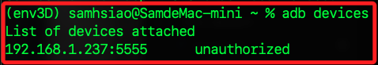
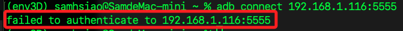
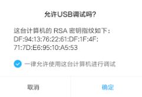
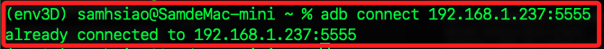

# 小米電視

_分為小米系統與安卓系統_

<br>

## 安卓系統

1. 先檢查本地電腦是否安裝。

    ```bash
    adb version
    ```

    

<br>

2. 若尚未安裝，可透過 Homebrew 安裝相關工具。

    ```bash
    brew install android-platform-tools
    ```

<br>

## 進入電視

_電視開機並檢查 IP_

<br>

1. 開啟電視，進入 `設定` -> `關於`，連續點擊最下方的版本資訊，大約五到七次就會顯示已經成為 `開發者`。

<br>

2. 確認設備是否在線。

    ```bash
    ping 192.168.1.237
    ```

<br>

## 嘗試連線

1. 查詢指令。

    ```bash
    adb devices
    ```

    

<br>

2. 先開啟 `允許安裝未知來源的應用`、`允許 USB 調適`。

<br>

3. 初次嘗試連線電視，運行指令後會顯示 `failed to authenticate to ...`。

    ```bash
    adb connect 192.168.1.237:5555
    ```

    

<br>

4. 電視上會出現彈窗確認是否允許。

    

<br>

5. 確認之後再連線一次，會顯示 `already connected to <設備-IP>:5555`。

    

<br>

## 進入

1. 進入小米電視的終端模式。

    ```bash
    adb shell
    ```

<br>

2. 查看。

    ```bash
    ls /sdcard/
    ```

<br>

3. 檢查系統資訊。

    ```bash
    getprop
    ```

<br>

4. 重啟小米電視。

    ```bash
    reboot
    ```

<br>

5. 檢查已安裝的應用列表。

    ```bash
    pm list packages
    ```

<br>

## 互動

1. 傳送檔案。

    ```bash
    adb push <本地文件> /sdcard/<目標文件>
    ```

<br>

2. 從小米電視下載檔案。

    ```bash
    adb pull /sdcard/<目標文件> <本地文件>
    ```

<br>

3. 安裝 APK 檔。

    ```bash
    adb install <檔案名稱>.apk
    ```

<br>

4. 結束 ADB 連接。

    ```bash
    adb disconnect 192.168.1.237:5555
    ```

<br>

## 多台設備連線

_如果多台設備同時使用 TCP 埠號 5555，ADB 會默認與最後連接的設備互動_

<br>

1. 多台設備分配不同埠號，每台設備啟用不同的 TCP 埠號。

    ```bash
    adb connect 192.168.1.100:5555  # 設備 1
    adb connect 192.168.1.101:5556  # 設備 2
    adb connect 192.168.1.102:5557  # 設備 3
    ```

<br>

2. 列出所有已經連接的設備。

    ```bash
    adb devices
    ```

<br>

3. 如果有多台設備，您需要明確指定目標設備。

    ```bash
    adb -s <設備-IP>:5555 shell
    ```

<br>

4. 可使用迴圈對多台設備執行相同的指令。

    ```bash
    for device in $(adb devices | grep 'device$' | awk '{print $1}'); do
        adb -s $device shell "command_here"
    done
    ```

<br>

## 儲存狀態

_進入 adb shell 模式時，可直接使用 linux 系統指令；若在本機終端運行，則添加前綴 `adb shell`_

<br>

1. 檢查總空間及使用狀況。

    ```bash
    df
    ```

<br>

2. `/system` 分區主要儲存小米電視的作業系統檔案及系統應用程式，主要用於唯讀系統檔案。

<br>

3. `/data` 是使用者數據和應用程序數據的存儲區域。

<br>

4. `/storage/emulated` 是內部存儲的模擬檔案系統，與 `/data` 分區共用空間，用於儲存使用者檔案，如影片、圖片及應用數據。

<br>

5. `/cache` 分區主要用於臨時檔案或更新檔案緩存。

<br>

6. `/persist` 分區通常存儲設備校準數據、Wi-Fi 配置和安全憑證等。這個分區通常很小，但非常重要。

<br>

7. `/param` 用於存儲設備參數和系統啟動相關配置。

<br>

___

_補_
