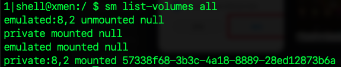
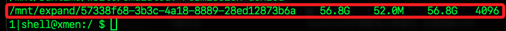

# 使用外部 USB

_在小米電視的 Android TV 系統上無法直接安裝 APK 到指定的外部存儲如 `/storage/7FBD-556C`），但可透過 `Adoptable Storage（合併存儲）` 來使用 USB 磁碟作為應用安裝位置。_

<br>

## 步驟

1. 檢查是否支援 Adoptable Storage，如果顯示類似 /disk:179,64 的磁碟代號，則表示支援；在這磁碟編號為 `disk:8,0`。

    ```bash
    sm list-disks
    ```

<br>

2. 格式化 USB 磁碟為 `Adoptable Storage`，`disk:8,0` 是 USB 磁碟編號，`private` 會將 USB 格式化並合併為內部存儲的一部分，允許應用安裝到此區域；也就是系統自動認為該存儲區是 內部存儲的擴展部分。

    ```bash
    sm partition disk:8,0 private
    ```

<br>

3. 檢查系統中所有可用的 volume。

    ```bash
    sm list-volumes all
    ```

    

<br>

4. 成功格式化並掛載為 Adoptable Storage（內部存儲擴展）。可用空間：56.8 GB，系統只佔用了 52.0 MB，這表示該存儲裝置幾乎是全新的。

    

<br>

## 安裝應用

1. 先透過電視安裝。

<br>

2. 查詢安裝位置。

    ```bash
    pm list packages -f | grep com.changxiang.ktv
    ```

<br>

3. 查詢可否移動。

    ```bash
    pm get-install-location
    ```

<br>

4. 嘗試移動到指定 UUID 的磁區。

    ```bash
    pm move-package com.changxiang.ktv 57338f68-3b3c-4a18-8889-28ed12873b6a
    ```

<br>

5. 確認新安裝位置。

    ```bash
    pm list packages -f | grep com.changxiang.ktv
    ```

<br>

___

_END_


