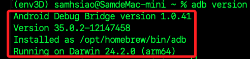
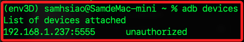
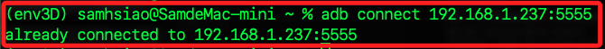

# 小米電視

_分為小米系統與安卓系統_

<br>

## 安卓系統

1. 先檢查本地電腦是否安裝。

    ```bash
    adb version
    ```

    

<br>

2. 若尚未安裝，可透過 Homebrew 安裝相關工具。

    ```bash
    brew install android-platform-tools
    ```

<br>

## 進入電視

_電視開機並檢查 IP_

<br>

1. 開啟電視，進入 `設定` -> `關於`，連續點擊最下方的版本資訊，大約五到七次就會顯示已經成為 `開發者`。

<br>

2. 確認設備是否在線。

    ```bash
    ping 192.168.1.237
    ```

<br>

## 嘗試連線

1. 查詢指令。

    ```bash
    adb devices
    ```

    

<br>

2. 先開啟 `允許安裝未知來源的應用`、`允許 USB 調適`。

<br>

3. 連線電視，接著在電視上會出現彈窗。

    ```bash
    adb connect 192.168.1.237:5555
    ```

    

<br>

## 進入

1. 進入小米電視的終端模式。

    ```bash
    adb shell
    ```

<br>

2. 查看。

    ```bash
    ls /sdcard/
    ```

<br>

3. 檢查系統資訊。

    ```bash
    getprop
    ```

<br>

4. 重啟小米電視。

    ```bash
    reboot
    ```

<br>

5. 檢查已安裝的應用列表。

    ```bash
    pm list packages
    ```

<br>

## 互動

1. 傳送檔案。

    ```bash
    adb push <本地文件> /sdcard/<目標文件>
    ```

<br>

2. 從小米電視下載檔案。

    ```bash
    adb pull /sdcard/<目標文件> <本地文件>
    ```

<br>

3. 安裝 APK 檔。

    ```bash
    adb install <檔案名稱>.apk
    ```

<br>

4. 結束 ADB 連接。

    ```bash
    adb disconnect 192.168.1.237:5555
    ```

<br>

___

_補_
