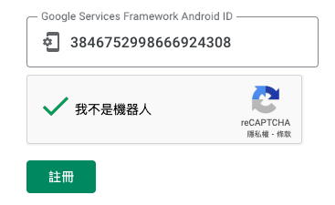

# 直接燒錄

_[參考](https://konstakang.com/devices/rpi5/LineageOS22-ATV/)，將封裝好的系統直接燒錄_

<br>

## 準備軟件

_以下是燒錄前需下載的軟件及其載點_

<br>

1. 完整系統檔 [lineage-22.0-20241217-UNOFFICIAL-KonstaKANG-rpi5-atv.zip](https://app.filen.io/#/d/452cd215-9c5e-4b18-a20f-09d505a251f0%23BvW61m5Jr2LtHMlC9LdBhvlUfmgr0b0R)

<br>

2. 僅更新 [lineage-22.0-20241217-UNOFFICIAL-KonstaKANG-rpi5-atv-ota.zip](https://app.filen.io/#/d/e8759e53-d506-4806-9f8c-44030f8b7687%23egv7z0RhtVxdIwgsz4JgFNYUra3rYEdX)

<br>

3. 系統分區自動調整工具 [KonstaKANG-rpi-resize.zip](https://app.filen.io/#/d/359e14ab-fe03-4fa5-8382-d8bab79de308%23OcYCkizytCC8RXhUGHoeP1c3ejocPZDr)。

<br>

4. Google App 工具 [MindTheGapps-15.0.0-arm64-ATV-xxxxxxxx_xxxxxx.zip](https://github.com/MindTheGapps/15.0.0-arm64-ATV/releases/latest)。

<br>

5. Widevine DRM 的安裝包 [KonstaKANG-rpi-widevine-15.zip](https://app.filen.io/#/d/46c3e9e7-a0d0-4248-aa2e-9a7646e77176%233yBNf8wSfI4HOrrdK8APuC2eF4Mjz3A3)。 

<br>

## 燒錄系統

1. 下載 `lineage-22...zip` 後先解壓縮為 `img`，再直接使樹莓派官方燒錄工具 `Raspberry Pi Imager` 將映像檔刷入 SD。

    

<br>

2. 將另外三個文件存入 USB 並插入樹莓派。

<br>

3. 將 SD 插入樹莓派，同時接上遙控器、滑鼠、鍵盤以及顯示器，然後開機；特別注意，設定過程會需要進行控制，所以周邊控制裝置必須接上。

<br>

## 初次設定

_與電視系統操作相同_

<br>

1. 點擊齒輪前往 `設定`，進入 `系統` → `關於`，滾動到最下方的 `作業系統版本`，連續點擊可能是 7 次，系統會提示 `已啟用開發者選項`，有些系統可能是五次，總之快完成與完成時會跳出提示。

<br>

2. 回到 `系統`，會看到新增了 `開發人員選項`，開啟 `ADB over network`，也可順便將 `Rooted debugging` 也開啟。

<br>

3. 回到 `系統` 中的 `Buttons`，進入後開啟允許進入 `Advanced restart`，這可允許 `Recovery` 模式，繼續下一個步驟便可設定。

<br>

4. 回到 `系統` 中的 `開關和電源`，點擊 `重新啟動`，會看到添加新的選項卡 `Recovery`，點擊進行重啟會進入 `TWRP` 模式。

<br>

## TWRP

_Team Win Recovery Project，這是一個 Android Recovery 環境，可進行刷入自訂 ROM、內核、GApps、Magisk 等 ZIP 檔等操作；特別注意，這裡需使用滑鼠搭配遙控器的回復鍵，因為滑鼠右鍵並無返回功能。_

<br>

1. 重啟後會進入 `TWRP` 中，先點擊 `Mount`，確認已將 `USB` 掛載。

<br>

2. 接著點擊選項卡 `Install`，便會看到 USB 中的文件，依序刷入 `resize`、`GApps`、`Widevine` 的 zip 檔；每次刷入時皆需滑動右下方的按鈕，返回選單時點擊上方的導覽列便可返回。

<br>

3. 三個都完成再 `Reboot`，並改用 `System` 而不是 `Recovery`。

<br>

4. 重啟後會進入安卓電視系統的登入畫面，順利連結網路的話會顯示在畫面中。

<br>

5. 點擊 `登入` 會開始安裝 GApps，這似乎需要一點時間。

<br>

## 連線 ADB

1. 在 `設定` 中的 `網路與網際網路` 中可確認設備 IP。

<br>

2. 使用 ADB 連線指定 IP。

    ```bash
    adb connect 192.168.1.173:5555
    ```

    

<br>

3. 確認連線。

    ```bash
    adb devices
    ```

    

<br>

4. 取得裝置 ID。

    ```bash
    adb root

    adb shell 'sqlite3 /data/*/*/*/gservices.db \
        "select * from main where name = \"android_id\";"'
    ```

<br>

## 註冊設備

_在本機操作即可_

<br>

1. 前往[裝置註冊](https://www.google.com/android/uncertified)驗證；貼上 `ID` 並點擊 `註冊`。

    

<br>

2. 返回電視盒，進入 `Google Play` 完成登入；需要雙重驗證，通過後點擊兩次電視盒上的 `接受`，第二次可以取消勾選。

<br>

## 傳送文件

_說明從本地傳送文件到電視盒系統上_

<br>

1. 查看指定目錄的元數據。

    ```bash
    adb ls /sdcard/
    ```

<br>

2. 僅列出檔案或資料夾名稱。

    ```bash
    adb shell ls /sdcard/
    ```

<br>

3. 從本地電腦 `~/Downloads` 傳輸到設備的 `/sdcard/Download` 路徑。

    ```bash
    adb push <來源文件> /sdcard/
    ```

<br>

## 安裝 App

1. 確認 `*.apk` 是否存在本機指定路徑中。

    ```bash
    ls /Users/samhsiao/Downloads/考拉TV点播.apk
    ```

<br>

2. 從本機安裝 `考拉TV点播.apk`。

    ```bash
    adb install <拖曳-APK-文件至此>
    ```

    

<br>

3. 注意電視畫面會跳出彈窗，展開下方 `更多詳情` 選單，點擊左下方的 `仍要安裝`，切記，不是點擊右下角的 `我知道了`；完成時會顯示 `Success`。

    

<br>

## 查詢

1. 詳細地查詢 App 的完整包名及啟動 Activity。

    ```bash
    adb shell dumpsys package com.kaolatv.app | grep Activity
    ```

<br>

2. 使用以下 ADB 指令來啟動 `考拉TV点播` 應用，在電視盒畫面上也會有彈窗；其中 `com.kaolatv.app` 是應用包名。

    ```bash
    adb shell am start -n com.kaolatv.app/com.e4a.runtime.android.StartActivity
    ```

    

<br>

## 返回鍵

1. 進入 `系統` 中的 `Raspberry Pi settings`，開啟 `Mouse back button`，此時滑鼠右鍵可作為 `返回鍵`。

<br>

___

_END_