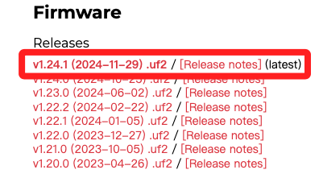
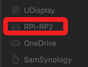
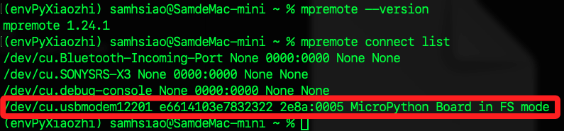

# 第一次燒錄

_使用 `mpremote` 進行第一次 `MicroPython` 韌體燒錄_

<br>

## 步驟

_MacOS_

<br>

1. 到 [官方網站](https://micropython.org/download/rp2-pico-w/) 下載 `MicroPython for Pico W` 韌體，這是一個 `.uf2` 檔。

    

<br>

2. 在斷電狀態下，先按住 `Pico W` 開發板上的 `BOOTSEL` 鍵，同時將開發板插入電腦 USB 接口，插入後放開按鍵，會在 `Finder` 出現一個 USB 磁碟，一般來說名稱是 `RPI-RP2`。

    

<br>

3. 將下載的 `.uf2` 韌體拖曳到該磁碟中，或使用指令將該文件傳送到開發板；韌體會自動寫入並重啟，然後進入 `MicroPython` 模式；特別注意，使用指令複製時，過程不會有任何提示。

    ```bash
    cp ~/Downloads/RPI_PICO_W-20241129-v1.24.1.uf2 /Volumes/RPI-RP2/
    ```

<br>

## 使用 mpremote 連線

1. 安裝 `mpremote`。

    ```bash
    pip install mpremote
    ```

<br>

2. 查看是否安裝成功。

    ```bash
    mpremote --version
    ```

<br>

3. 查看連線狀態。

    ```bash
    mpremote connect list
    ```

    

<br>

4. 紀錄並輸出連接端口。

    ```bash
    serial_port=$(ls /dev/tty.usb*)
    echo $serial_port
    ```

<br>

5. 使用 `screen` 指令進行連線，這是 MicroPython 的 `互動式命令列介面 (REPL, Read-Eval-Print Loop)`。

    ```bash
    screen $serial_port
    ```

<br>

## 簡易範例

1. 查看系統時間。

    ```python
    import time
    time.localtime()
    ```

<br>

2. 閃爍內建 LED。

    ```python
    from machine import Pin
    import time

    led = Pin("LED", Pin.OUT)
    for i in range(5):
        led.toggle()
        time.sleep(0.5)
    ```

<br>

3. 列出檔案。

    ```python
    import os
    os.listdir()
    ```

<br>

4. 退出，先使用組合健 `contril + A`，然後按下 `K`，接著點擊 `y`。

<br>

## 斷線

1. 若顯示佔用，可先進行查看。

    ```bash
    screen -ls
    ```

<br>

2. 紀錄為變數。

    ```bash
    session_name=$(screen -ls | grep -o '[0-9]*\.ttys[0-9]*\.[^[:space:]]*')
    echo $session_name
    ```

<br>

3. 關閉連線。

    ```bash
    screen -X -S $session_name quit
    ```

<br>

## 測試連線

1. 重啟晶片，運行以下指令進行連線，成功後會進入 `MicroPython` 提示符 `>>>`。

    ```bash
    mpremote connect auto repl
    ```

    

<br>

___

_END_