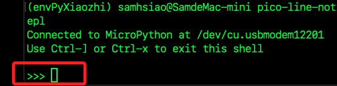

# 第一次燒錄

_使用 `mpremote` 進行第一次 `MicroPython` 韌體燒錄_

<br>

## 步驟

1. 到 [官方網站](https://micropython.org/download/rp2-pico-w/) 下載 `MicroPython for Pico W` 韌體，這是一個 `.uf2` 檔。

<br>

2. 按住 `Pico W` 的 BOOTSEL 鍵，同時將晶片插入電腦 USB，然後放開按鍵，會在 `Finder` 出現一個 USB 磁碟。

<br>

3. 拖曳 `.uf2` 韌體到該磁碟中，韌體會自動寫入，將 `Pico` 會重啟並進入`MicroPython` 模式。

<br>

4. 開啟 VS Code，安裝 `mpremote`。

    ```bash
    pip install mpremote
    ```

<br>

5. 查看連線是否成功。

    ```bash
    mpremote connect list
    ```

<br>

## 測試連線

1. 重啟晶片，運行以下指令進行連線，成功後會進入 `MicroPython` 提示符 `>>>`。

    ```bash
    mpremote connect auto repl
    ```

    

<br>

___

_END_