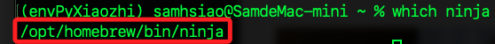
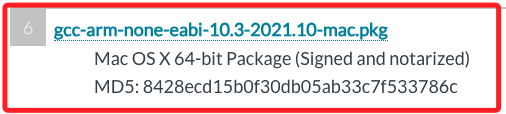
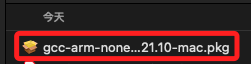
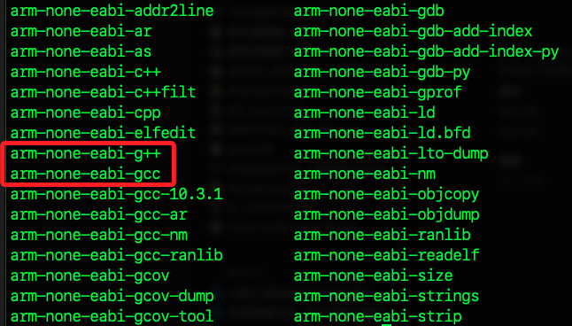
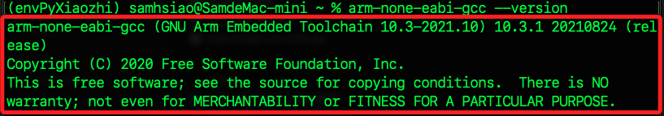
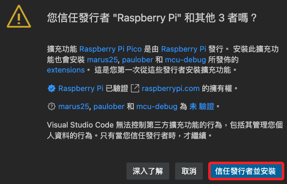
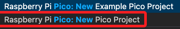
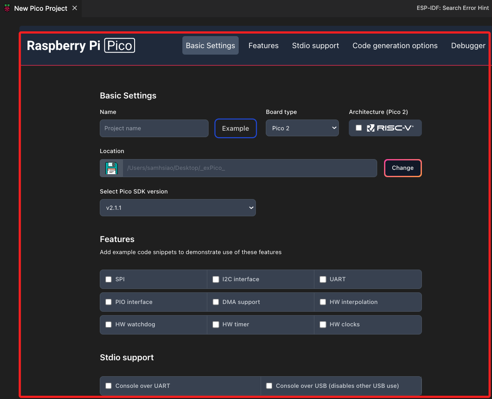
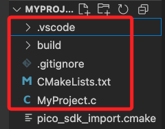

# 使用 C/C++

_使用 VS Code 在 Pico W 上開發 C/C++ 程式，使用 Raspberry Pi 官方提供的 Pico SDK 與 CMake 架構_

## 安裝 ninja

1. 可用於取代 make 執行編譯指令，加速 C/C++ 專案的編譯流程。

```bash
brew install ninja
```

2. 驗證。

```bash
which ninja
```



# 安裝官方 arm-none-eabi-gcc

_安裝 10.3 版本_

1. 先前往 [官方下載頁面]( https://developer.arm.com/downloads/-/gnu-rm)，選擇版本 `10.3-2021.10`，找到對應的系統進行 [下載](https://developer.arm.com/-/media/Files/downloads/gnu-rm/10.3-2021.10/gcc-arm-none-eabi-10.3-2021.10-mac.pkg?rev=b382d51ec8d34c3fa421cf57ce97f146&hash=E3B897C8DA0E3E56C151F397C004104F00AE2EB8)。



2. 若下載的是安裝版，可直接點擊安裝。




3. 若顯示其他透過 Homebrew 安裝的版本，可先移除安裝。

```bash
brew uninstall arm-none-eabi-gcc
```

4. 驗證是否清除乾淨再重新安裝。

```bash
which arm-none-eabi-gcc
```

5. 透過官方 `.pkg` 文件安裝的版本會在以下位置。

```bash
ls /Applications/ARM/bin
```



6. 設定環境變數。

```bash
echo '' >> ~/.zshrc
echo '# 加入 gcc 路徑' >> ~/.zshrc
echo 'export PATH="/Applications/ARM/bin:$PATH"' >> ~/.zshrc
source ~/.zshrc
```

7. 驗證版本。

```bash
arm-none-eabi-gcc --version
```



## 安裝官方 SDK

_含 pico-sdk、pico-extras、mbedtls_

1. 建立 SDK 與開發環境的根目錄。

```bash
mkdir -p ~/pico && cd ~/pico
```

2. 下載 pico-sdk 官方核心 SDK，並進行初始化；指令中加入參數 `-b` 僅僅是以顯式表達分支為 `master`。

```bash
git clone -b master https://github.com/raspberrypi/pico-sdk.git
cd pico-sdk
git submodule update --init
cd ..
```

3. 下載 `pico-extras`，提供 `Wi-Fi`、`cyw43`、`mbedtls` 等支援。

```bash
git clone -b master https://github.com/raspberrypi/pico-extras.git
cd pico-extras
git submodule update --init
cd ..
```

4. 將 pico-sdk 的路徑寫入環境變數，以後就不需要手動指定 `-DPICO_SDK_PATH=`。

```bash
echo 'export PICO_SDK_PATH=$HOME/pico/pico-sdk' >> ~/.zshrc
echo 'export PICO_EXTRAS_PATH=$HOME/pico/pico-extras' >> ~/.zshrc
```

5. 或手動編輯加入 `~/.zshrc`。

```bash
# pico-sd 路徑
export PICO_SDK_PATH=$HOME/pico/pico-sdk
export PICO_EXTRAS_PATH=$HOME/pico/pico-extras
```

6. 立即套用。

```bash
source ~/.zshrc
```

## 擴充套件

1. 在 VSCode 中需安裝 `Raspberry Pi Pico` 擴充套件。

    

2. 信任發行者並安裝，這自動安裝 SDK、Toolchain、環境變數，不用自己設定。

    

## 建立 C/C++ 專案

1. 開啟命令面板（`Cmd+Shift+P`），輸入。

```bash
New Pico Project
```



2. 選擇 `C/C++`。


3. 接著會進入 UI 設定畫面。



4. 命名專案如 `MyProject`

5. 勾選 `Pico W`

6. 設定 `Location`，在指定位置建立空資料夾用來存放專案，例如在桌面建立 `_exPico_`；先點擊 `製作`，然後點擊 `Select`。


7. 選擇要用的 SDK 版本與 Toolchain，可用預設。

8. 其餘暫時不做變動，滑動到下方點擊 `Create`。


9. 自動生成的結構如下。



## 一鍵編譯

_兩種方式_

1. 在 VSCode 點選底部狀態列的 `Build` 按鈕。

2. 或從命令列進入資料夾 `build/`，接著執行以下指令。

```bash
cmake ..
ninja
```

3. 成功後會產生 `.uf2` 檔案 `MyProject.uf2`

## 燒錄到 Pico

1. 按住 BOOTSEL 並將開發板插入 USB，在 Finder 中會出現 `RPI-RP2` 裝置。

2. 將 `blink.uf2` 拖曳進去自動燒錄。

3. Pico 將自動重啟並開始執行程式

## 建立專案

1. 建立專案結構。

```bash
pico-line-notify/
├── CMakeLists.txt
├── main.cpp
├── build/
```

2. `main.cpp`

```cpp
#include <stdio.h>
#include "pico/stdlib.h"
#include "pico/cyw43_arch.h"
#include "lwip/apps/sntp.h"
#include "lwip/dns.h"
#include "lwip/altcp_tls.h"
#include "lwip/altcp.h"
#include "lwip/ip_addr.h"

// 你的 WiFi 與 LINE Notify 資訊
#define WIFI_SSID "SamHome2.4g"
#define WIFI_PASSWORD "sam112233"
#define LINE_TOKEN "WemrA5mtsqcBcvTEG59tXmVGVTDj8wifXH51GzjWXx8"

void send_line_notify() {
    const char* host = "notify-api.line.me";
    const int port = 443;
    const char* message = "message=PicoW+WiFi+Test";
    char request[512];

    snprintf(request, sizeof(request),
        "POST /api/notify HTTP/1.1\r\n"
        "Host: %s\r\n"
        "Authorization: Bearer %s\r\n"
        "Content-Type: application/x-www-form-urlencoded\r\n"
        "Content-Length: %d\r\n"
        "\r\n"
        "%s",
        host, LINE_TOKEN, strlen(message), message
    );

    struct altcp_tls_config *tls_config = altcp_tls_create_config_client(NULL, 0);
    struct altcp_pcb *pcb = altcp_tls_new(tls_config, IPADDR_TYPE_V4);

    struct ip_addr ip;
    if (dns_gethostbyname(host, &ip, NULL, NULL) != ERR_OK) {
        printf("DNS 查詢失敗\n");
        return;
    }

    if (altcp_connect(pcb, &ip, port, NULL) != ERR_OK) {
        printf("連線失敗\n");
        return;
    }

    altcp_write(pcb, request, strlen(request), TCP_WRITE_FLAG_COPY);
    altcp_output(pcb);
    printf("✅ 已送出 LINE 通知\n");
}

int main() {
    stdio_init_all();
    sleep_ms(3000); // 等待 USB 初始化

    if (cyw43_arch_init()) {
        printf("Wi-Fi 模組初始化失敗\n");
        return 1;
    }

    cyw43_arch_enable_sta_mode();

    printf("正在連接 Wi-Fi...\n");
    if (cyw43_arch_wifi_connect_timeout_ms(WIFI_SSID, WIFI_PASSWORD, CYW43_AUTH_WPA2_AES_PSK, 10000)) {
        printf("❌ Wi-Fi 連線失敗\n");
        return 1;
    }

    printf("✅ 已連接 Wi-Fi\n");

    // 發送 LINE 通知
    send_line_notify();

    while (1) {
        sleep_ms(1000);
    }
}
```

2. 編輯 CMakeLists.txt

```bash
cmake_minimum_required(VERSION 3.13)

# ✅ 建議在 shell 中先設好 export PICO_SDK_PATH 與 PICO_EXTRAS_PATH

# 匯入 SDK（此行必須在 project() 之前）
include($ENV{PICO_SDK_PATH}/external/pico_sdk_import.cmake)
include($ENV{PICO_EXTRAS_PATH}/pico_extras_import.cmake)

project(pico_line_notify C CXX ASM)

set(CMAKE_C_STANDARD 11)
set(CMAKE_CXX_STANDARD 17)

# ✅ 啟用 extras（必須在 pico_sdk_init() 之前）
set(PICO_EXTRAS_ENABLE 1)

# 初始化 SDK
pico_sdk_init()

pico_extras_import()

# 加入可執行檔與原始檔
add_executable(pico_line_notify
    main.cpp
)

# 加入 Pico stdlib 與 Wi-Fi 支援（thread-safe 模式）
target_link_libraries(pico_line_notify
    pico_stdlib
    pico_cyw43_arch_lwip_threadsafe_background
)

# 啟用 USB 輸出（選擇性）
pico_enable_stdio_usb(pico_line_notify 1)
pico_enable_stdio_uart(pico_line_notify 0)

# 將 .elf → .uf2
pico_add_extra_outputs(pico_line_notify)
```

3. 重新建置時可先刪除

```bash
rm -rf build
mkdir build && cd build
```

4. 使用 CMake 生成 Ninja 架構

```bash
cmake .. \
    -G Ninja \
    -DPICO_SDK_PATH=$HOME/pico/pico-sdk \
    -DPICO_EXTRAS_PATH=$HOME/pico/pico-extras \
    -DPICO_EXTRAS_ENABLE=ON \
    -DBUILD_TESTING=OFF
```

5. 編譯

```bash
ninja
```

## 燒錄到 Pico W

1. 直接拖曳文件

## 觀察

_使用 VSCode_

1. 安裝插件 Serial Monitor