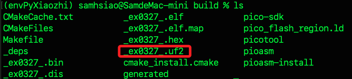

# 教程

_(參考)(https://www.youtube.com/watch?v=fqgeUPL7Z6M)_

<br>

## 步驟

1. 安裝建構工具 CMake。

    ```bash
    brew install cmake
    ```

<br>

2. 安裝 ARM 的交叉編譯器工具鏈，使用參數 `--cask` 是因為 `gcc-arm-embedded` 提供的是 `.pkg` 的安裝包形式，不是單純的 CLI 套件。

    ```bash
    brew install --cask gcc-arm-embedded
    ```

<br>

3. 在桌面建立專案資料夾 `_ex0327_` 並立即進入；可在任意指定位置建立。

    ```bash
    mkdir -p ~/Desktop/_ex0327_ && cd ~/Desktop/_ex0327_
    ```

<br>

4. 新增專案文件；其中 `CMakeLists.txt` 是使用 cmake 指令產生 Makefile 或 Ninja 構建流程的核心檔案。

    ```bash
    touch CMakeLists.txt main.cpp
    ``` 

<br>

## 編輯腳本

1. `.txt`；如未使用 `UART`，可將 `pico_enable_stdio_uart` 設為 `0`，此設定適合使用 `USB 序列埠` 輸出訊息。

    ```bash
    # 指定 CMake 最低版本要求為 3.13
    cmake_minimum_required(VERSION 3.13)

    # 匯入 Pico SDK 初始化腳本，需事先設定環境變數 PICO_SDK_PATH
    include($ENV{PICO_SDK_PATH}/pico_sdk_init.cmake)

    # 設定專案名稱為 _ex0327_
    project(_ex0327_)

    # 初始化 Pico SDK，包含標準函式庫與底層硬體支援
    pico_sdk_init()

    # 建立可執行檔，並指定原始碼檔案
    add_executable(_ex0327_
        main.cpp
    )

    # 啟用 USB 作為標準輸出（例如 printf）
    pico_enable_stdio_usb(_ex0327_ 1)
    # 停用 UART 輸出
    pico_enable_stdio_uart(_ex0327_ 0)

    # 將 Pico 標準函式庫連結至本專案
    # 例如 stdio、sleep、gpio 等功能
    target_link_libraries(_ex0327_ pico_stdlib)

    # 建立額外輸出檔案，例如 .elf、.bin、.hex、.uf2，可用於燒錄
    pico_add_extra_outputs(_ex0327_)
    ```

<br>

2. main.cpp；這是主腳本，其中 stdio_init_all()：這個函式會初始化所有可用的輸出裝置，通常包括 USB 和 UART。使用此函式後，就可以用 printf() 輸出訊息到主機的序列監控工具（如 screen 或 VSCode 的 Serial Monitor）。

    ```cpp
    // 匯入 Pico SDK 的標準函式庫，提供 GPIO、時間控制、輸出入等功能
    #include "pico/stdlib.h"

    // 匯入標準 C++ 的輸出入功能（例如 printf）
    #include <cstdio>

    // 主程式進入點
    int main() {
        // 初始化標準輸出（如 USB 或 UART）功能
        stdio_init_all();

        while (true) {
            // 在序列埠印出字串
            printf("Hello, World!\n");
            // 延遲 1000 毫秒（1 秒）
            sleep_ms(1000);
        }
    }
    ```

<br>

3. 產生編譯所需的 `Makefile` 或 `build.ninja` 等構建腳本。

    ```bash
    cmake ..
    ```

<br>

4. 延續上題，過程中會出險警告，但這不影響後續 build 作業，僅提示系統找不到版本為 `2.1.1` 的已安裝 `picotool`，因此 CMake 自動選擇 `從原始碼建置`；picotool 是一個官方提供的命令列工具，用來與已連接的 Pico 互動，若想使用 picotool 查看設備狀態或燒錄檔案，建議手動安裝它，完成後就可以使用像 picotool info 或 picotool load 等指令與 Pico 互動。

    ```bash
    git clone https://github.com/raspberrypi/picotool.git
    cd picotool
    mkdir build && cd build
    cmake ..
    make -j4
    # 或手動將 picotool 複製到 PATH 中
    sudo make install
    ```

<br>

5. 根據 cmake 產生的檔案，實際執行編譯、連結動作產生 `.elf`、`.uf2` 等檔案。

    ```bash
    make
    ```

<br>

6. 可查看到有一個 `.uf2` 文件。

    

<br>

7. 環境變數。

    ```bash
    export TERM=vt100
    ```

<br>

## 監看

1. 查詢。

    ```bash
    serial_port=$(ls /dev/tty.usb*)
    ```

<br>

2. 輸出。

    ```bash
    echo $serial_port
    ```

<br>

3. 監看。

    ```bash
    screen $serial_port
    ```

<br>

___

_END_