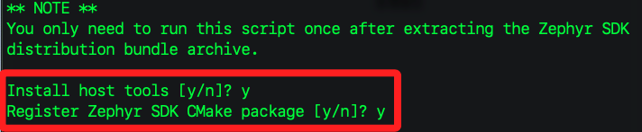

_尚未成功_

<br>

# Zephyr OS

_參考[倉庫](https://github.com/beechwoods-software/zephyr-cyw43-driver)_

<br>

## 建立 Zephyr 開發環境

_按照 Zephyr [官方 Getting Started Guide](https://docs.zephyrproject.org/latest/develop/getting_started/index.html) 安裝 toolchain、Python 環境與 `west` 工具。_

<br>

1. 安裝 west 工具（Zephyr 的管理工具）

    ```bash
    pip install west
    ```

<br>

2. 確認安裝

    ```bash
    west --version
    ```

<br>

## 安裝 Zephyr SDK

1. 前往 [Zephyr SDK Releases](https://github.com/zephyrproject-rtos/sdk-ng/releases) 進行下載官方穩定的 `v0.16.4`；依據對應作業系統，這裡選擇 `GNU / AArch64`，AArch64 是 ARM 64-bit 架構的正式名稱。

    ```bash
    cd ~/Downloads
    wget https://github.com/zephyrproject-rtos/sdk-ng/releases/download/v0.16.4/zephyr-sdk-0.16.4_macos-aarch64.tar.xz
    ```

<br>

2. 建立目標資料夾

    ```bash
    mkdir -p ~/zephyr-sdk
    ```

<br>

3. 解壓縮至目標資料夾

    ```bash
    tar xvf zephyr-sdk-0.16.4_macos-aarch64.tar.xz -C ~/zephyr-sdk
    ```

<br>

4. 進入解壓後的 SDK 目錄執行安裝腳本

    ```bash
    cd ~/zephyr-sdk/zephyr-sdk-0.16.4
    ./setup.sh
    ```

<br>

5. 然後會詢問是否安裝 Zephyr 用來支援開發的工具集、將 Zephyr SDK 註冊到你的本機 CMake 系統中，方便 Zephyr 找到 SDK 路徑；皆回答 `Y`。

    

<br>

## 設定環境變數

1. 運行

    ```bash
    export ZEPHYR_TOOLCHAIN_VARIANT=zephyr
    export ZEPHYR_SDK_INSTALL_DIR=$HOME/zephyr-sdk/zephyr-sdk-0.16.4
    ```

<br>

2. 或編輯 `.zshrc` 或 `.bashrc`。

    ```bash
    code ~/.zshrc
    ```

<br>

3. 添加到其中。

    ```bash
    export ZEPHYR_TOOLCHAIN_VARIANT=zephyr
    export ZEPHYR_SDK_INSTALL_DIR=$HOME/zephyr-sdk/zephyr-sdk-0.16.4
    ```

<br>

4. 套用變更

    ```bash
    source ~/.zshrc
    ```

<br>

## 註冊開發板

_Zephyr 的 boards 目錄中沒有 `rpi_pico_w/` 這塊板子的支援資料夾_

<br>

1. 初始化 `west` 專案，這會讓 `zephyr-cyw43-driver` 成為主專案。

    ```bash
    cd ~/Desktop/_ex0328_/my-workspace
    west init -l zephyr-cyw43-driver
    ```

<br>

2. 下載子模組，含 Zephyr 原始碼 + boards，這會把 Zephyr 以及 `rpi_pico_w` 板子的資料補齊。

    ```bash
    west update
    ```

<br>

3. 確認 `rpi_pico_w` 是否已加入

    ```bash
    ls zephyr/boards/raspberrypi/rpi_pico_w/
    ```

<br>

## 設定 rpi_pico_w 板的描述檔案

1. 建立資料夾並下載

    ```bash
    mkdir -p boards/raspberrypi
    cd boards/raspberrypi
    git clone https://github.com/makerdiary/zephyr-board-rpi-pico-w.git rpi_pico_w
    ```

<br>

## 測試是否成功

1. 回到專案資料夾

    ```bash
    cd ~/Desktop/_ex0328_
    ```

<br>

2. 使用 `west init` 指令建立 `.west/` 和 `.git/` 結構，這是讓 Zephyr 正常運作所需。

    ```bash
    west init -m https://github.com/beechwoods-software/zephyr-cyw43-driver --mr main my-workspace
    cd my-workspace
    west update
    ```

<br>

3. 進入專案進行編譯

    ```bash
    cd zephyr-cyw43-driver
    west build -b rpi_pico_w app --pristine -DEXTRA_BOARD_ROOT=boards
    ```

<br>

## 建立專案

1. 建立工作目錄。

    ```bash
    cd <自訂的工作目錄>
    ```

<br>

2. 初始化 Zephyr 專案並進行下載 `zephyr-cyw43-driver` 倉庫，這是由 Beechwoods 整合的 Pico W WiFi 驅動。

    ```bash
    west init -m https://github.com/beechwoods-software/zephyr-cyw43-driver --mr main my-workspace
    cd my-workspace
    ```

<br>

3. 進入專案目錄，初始化並更新其內部的 Git submodules

    ```bash
    (cd zephyr-cyw43-driver; git submodule init; git submodule update)
    west update
    ```

<br>

4. 編譯，完成後會得到 `.uf2` 韌體，這可用來燒錄到 Pico W。

    ```bash
    cd zephyr-cyw43-driver
    west build -b rpi_pico/rp2040/w app
    ```

<br>

## 操作 WiFi

1. 上傳後，輸入以下指令連線 WiFi

    ```bash
    wifi connect -s <你的SSID> -p <你的密碼> -k 1
    ```

<br>

2. 修改並取消註解 `app/local.conf` 裡的以下行

    ```conf
    CONFIG_WIFI_SSID="your-ssid"
    CONFIG_WIFI_PSK="your-password"
    ```

<br>

## 支援其他開發板

1. 編寫設備樹覆蓋設定檔 `DTS overlay` 如下

    ```dts
    # cyw43-driver/zephyr_build/app/boards/rpi_pico_w.overlay
    ```

<br>

## 補充

1. 這套流程完全繞過 Raspberry Pi Pico SDK 與 CMake 結構的痛點

<br>

2. 只要 Wi-Fi 而不在意 SDK 結構細節，改用 Zephyr 是更穩定簡潔的路徑

<br>

3. 建構後可直接在終端下指令操作 Wi-Fi，或進一步整合到你自己的 Zephyr 應用中。

<br>

___

_END_