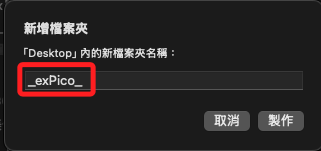

# 使用 C/C++

_使用 VS Code 在 Pico W 上開發 C/C++ 程式，使用 Raspberry Pi 官方提供的 Pico SDK 與 CMake 架構_

## 準備事項

1. 若使用 MacOS 需安裝相關工具。

```bash
brew install arm-none-eabi-gcc ninja
```

2. 查詢

```bash
which arm-none-eabi-gcc
```


## 擴充套件

1. 在 VSCode 中需安裝 `Raspberry Pi Pico` 擴充套件。

    

2. 信任發行者並安裝，這自動安裝 SDK、Toolchain、環境變數，不用自己設定。

    

## 建立 C/C++ 專案

1. 開啟命令面板（`Cmd+Shift+P`），輸入。

```bash
New Pico Project
```


2. 選擇 `C/C++`。


3. 接著會進入 UI 設定畫面。


4. 命名專案如 `MyProject`

5. 勾選 `Pico W`

6. 設定 `Location`，在指定位置建立空資料夾用來存放專案，例如在桌面建立 `_exPico_`；先點擊 `製作`，然後點擊 `Select`。



7. 選擇要用的 SDK 版本與 Toolchain，可用預設。

8. 其餘暫時不做變動，滑動到下方點擊 `Create`。


9. 自動生成的結構如下。


## 一鍵編譯

_兩種方式_

1. 在 VSCode 點選底部狀態列的 `Build` 按鈕。

2. 或從命令列進入資料夾 `build/`，接著執行以下指令。

```bash
cmake ..
ninja
```

3. 成功後會產生 `.uf2` 檔案 `MyProject.uf2`

## 燒錄到 Pico

1. 按住 BOOTSEL 並將開發板插入 USB，在 Finder 中會出現 `RPI-RP2` 裝置。

2. 將 `blink.uf2` 拖曳進去自動燒錄。

3. Pico 將自動重啟並開始執行程式

## 編輯腳本

_與之前範例相同_

1. `MyProject.c`

```c
#include <stdio.h>
#include "pico/stdlib.h"
#include "pico/cyw43_arch.h"
#include "lwip/apps/sntp.h"
#include "lwip/dns.h"
#include "lwip/altcp_tls.h"
#include "lwip/altcp.h"
#include "lwip/ip_addr.h"

// 你的 WiFi 與 LINE Notify 資訊
#define WIFI_SSID "SamHome2.4g"
#define WIFI_PASSWORD "sam112233"
#define LINE_TOKEN "WemrA5mtsqcBcvTEG59tXmVGVTDj8wifXH51GzjWXx8"

void send_line_notify() {
    const char* host = "notify-api.line.me";
    const int port = 443;
    const char* message = "message=PicoW+WiFi+Test";
    char request[512];

    snprintf(request, sizeof(request),
        "POST /api/notify HTTP/1.1\r\n"
        "Host: %s\r\n"
        "Authorization: Bearer %s\r\n"
        "Content-Type: application/x-www-form-urlencoded\r\n"
        "Content-Length: %d\r\n"
        "\r\n"
        "%s",
        host, LINE_TOKEN, strlen(message), message
    );

    struct altcp_tls_config *tls_config = altcp_tls_create_config_client(NULL, 0);
    struct altcp_pcb *pcb = altcp_tls_new(tls_config, IPADDR_TYPE_V4);

    struct ip_addr ip;
    if (dns_gethostbyname(host, &ip, NULL, NULL) != ERR_OK) {
        printf("DNS 查詢失敗\n");
        return;
    }

    if (altcp_connect(pcb, &ip, port, NULL) != ERR_OK) {
        printf("連線失敗\n");
        return;
    }

    altcp_write(pcb, request, strlen(request), TCP_WRITE_FLAG_COPY);
    altcp_output(pcb);
    printf("✅ 已送出 LINE 通知\n");
}

int main() {
    stdio_init_all();
    sleep_ms(3000); // 等待 USB 初始化

    if (cyw43_arch_init()) {
        printf("Wi-Fi 模組初始化失敗\n");
        return 1;
    }

    cyw43_arch_enable_sta_mode();

    printf("正在連接 Wi-Fi...\n");
    if (cyw43_arch_wifi_connect_timeout_ms(WIFI_SSID, WIFI_PASSWORD, CYW43_AUTH_WPA2_AES_PSK, 10000)) {
        printf("❌ Wi-Fi 連線失敗\n");
        return 1;
    }

    printf("✅ 已連接 Wi-Fi\n");

    // 發送 LINE 通知
    send_line_notify();

    while (1) {
        sleep_ms(1000);
    }
}
```

2. 編輯 CMakeLists.txt

```bash
# 指定 pico-extras 路徑
set(PICO_EXTRAS_PATH "/Users/samhsiao/pico/pico-extras")

# === VS Code Extension 標準區塊（勿動） ===
cmake_minimum_required(VERSION 3.13)

project(MyProject C CXX ASM)
set(CMAKE_C_STANDARD 11)
set(CMAKE_CXX_STANDARD 17)
set(CMAKE_EXPORT_COMPILE_COMMANDS ON)

if(WIN32)
    set(USERHOME $ENV{USERPROFILE})
else()
    set(USERHOME $ENV{HOME})
endif()
set(sdkVersion 2.1.1)
set(toolchainVersion 14_2_Rel1)
set(picotoolVersion 2.1.1)
set(picoVscode ${USERHOME}/.pico-sdk/cmake/pico-vscode.cmake)
if (EXISTS ${picoVscode})
    include(${picoVscode})
endif()
# ===========================================

set(PICO_BOARD pico_w CACHE STRING "Board type")

# ✅ 啟用 extras（Wi-Fi / TLS / mbedtls）
set(PICO_EXTRAS_ENABLE true)

# ✅ 初始化 SDK（此處會自動整合 pico-extras）
include(pico_sdk_import.cmake)
pico_sdk_init()

# ✅ 編譯你的程式
add_executable(MyProject MyProject.c)

pico_set_program_name(MyProject "MyProject")
pico_set_program_version(MyProject "0.1")

# ✅ 關閉預設的 USB / UART 輸出（可選）
pico_enable_stdio_uart(MyProject 0)
pico_enable_stdio_usb(MyProject 0)

# ✅ 連結必要函式庫（含 Wi-Fi 支援）
target_link_libraries(MyProject
    pico_stdlib
    pico_cyw43_arch_lwip_threadsafe_background
)

# ✅ 加入 include 路徑
target_include_directories(MyProject PRIVATE
    ${CMAKE_CURRENT_LIST_DIR}
)

# ✅ 加入必要輸出（.uf2、.bin 等）
pico_add_extra_outputs(MyProject)
```

3. 重新建置時可先刪除

```bash
cd ..
rm -rf build
mkdir build && cd build
```

4. 編譯

```bash

```

## 安裝工具

_含 pico-sdk、pico-extras、mbedtls_

1. 建立 SDK 與開發環境的根目錄。

```bash
mkdir -p ~/pico && cd ~/pico
```

2. 下載 pico-sdk 官方核心 SDK，並進行初始化。

```bash
git clone -b master https://github.com/raspberrypi/pico-sdk.git
cd pico-sdk
git submodule update --init
cd ..
```

3. 下載 pico-extras，提供 Wi-Fi、cyw43、mbedtls 等支援

```bash
git clone -b master https://github.com/raspberrypi/pico-extras.git
cd pico-extras
git submodule update --init
cd ..
```

