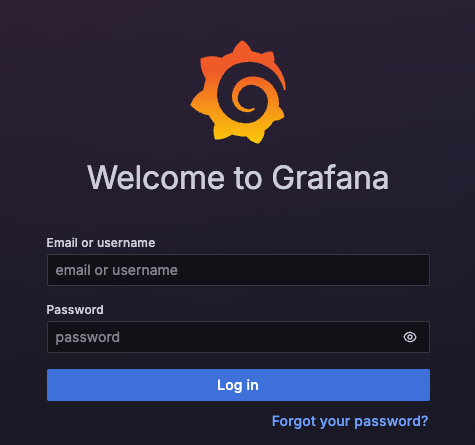

# Metamask 與 Grafana 連接

<br>

## Metamask 自訂 RPC 設定

_供本機開發或區網內其他裝置連接 Geth_

<br>

1. 查詢樹莓派 IP

    ```bash
    hostname -I
    ```

<br>

2. 確認 HTTP API 埠號 `8545` 正在 Listen

    ```bash
    sudo lsof -i :8545
    ```

<br>

## 設定 Metamask 自訂 RPC

1. 在 Metamask 中，在左上角找到 `Ethereum Mainnet`，點選尾部的 `編輯`。

<br>

2. 把 RPC URL 改為：http://192.168.1.133:8545。

<br>

# 加入 Grafana + Prometheus 監控 Lighthouse

1. 安裝 Prometheus

    ```bash
    sudo apt install -y prometheus
    ```

<br>

2. 修改 Prometheus 設定檔

    ```bash
    sudo nano /etc/prometheus/prometheus.yml
    ```

<br>

3. 設定 Prometheus 抓取 Lighthouse 資料；預設 Lighthouse metrics 開在 `localhost:5054`，若有自訂 `--metrics-port`，調整成對應數字。

    ```yaml
    scrape_configs:
      - job_name: 'lighthouse'
        static_configs:
          - targets: ['localhost:5054']
    ```

<br>

4. 儲存後重新啟動 Prometheus

    ```bash
    sudo systemctl restart prometheus
    ```

<br>

5. 安裝並啟動 Grafana

    ```bash
    sudo apt install -y grafana
    sudo systemctl enable grafana-server
    sudo systemctl start grafana-server
    ```

<br>

6. 瀏覽器開啟 Grafana

    ```bash
    http://<樹莓派-IP>:3000
    ```

    

<br>

7. 登入預設帳密

    ```bash
    使用者名稱：admin
    密碼：admin
    ```

<br>

8. 在 Grafana 中連接 Prometheus 並匯入 Dashboard，在左側點擊 `Data Sources`

<br>

9. 選擇 `Prometheus` 輸入 URL，儲存並測試連線

    ```
    http://localhost:9090
    ```

<br>

## Dashboard

1. 點選左側「+」→「Import」

<br>

2. 輸入 ID：`13157`（或其他 Lighthouse 社群 Dashboard）

<br>

___

_未完_
