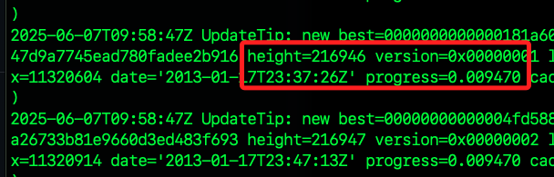

# 架設 Bitcoin 輕節點

_使用 `Bitcoin Core` 的 prune 模式_

<br>

## 用途

_輕節點是最小成本參與 Bitcoin 生態系統的方式_

<br>

1. 學習區塊鏈底層運作。

2. 自主掌控交易與驗證。

3. 測試應用或自動化腳本。

4. 未來延伸成主網節點或 Lightning 節點的基礎。

<br>

## 硬體與系統檢查

1. 檢查系統架構，應為 `aarch64`。

```bash
uname -m
```


<br>

2. 檢查記憶體分配；因為 `Bitcoin 輕節點` 屬於 `CPU 密集型` 應用，不需大量 GPU，但需要足夠的 `系統記憶體（ARM）` 來處理同步與交易驗證。

```bash
vcgencmd get_mem arm && vcgencmd get_mem gpu
```

<br>

3. 查看磁碟裝置；microSD 64GB 足夠運行 Bitcoin Testnet 輕節點。

```bash
lsblk
```

<br>

4. 檢查空間；特別說明，df -h 顯示掛載點的實際磁碟使用情況與剩餘空間，而 lsblk 顯示的是裝置與分割架構。

```bash
df -h
```

<br>

## 安裝必要套件

1. 系統更新。

```bash
sudo apt update && sudo apt upgrade -y
```

2. 安裝開發工具。

```bash
sudo apt install git build-essential libtool autotools-dev automake pkg-config bsdmainutils python3 libevent-dev libboost-system-dev libboost-filesystem-dev libboost-test-dev libboost-thread-dev libminiupnpc-dev libzmq3-dev libsqlite3-dev libqrencode-dev -y
```

<br>

3. 安裝 `Berkeley DB`；`Berkeley DB` 是 `Bitcoin Core` 儲存 `錢包資料（wallet.dat）` 所依賴的資料庫引擎，雖然新版 `Bitcoin Core` 已可選用 `SQLite`，但許多功能仍仰賴 `Berkeley DB`，特別是在編譯或使用具備錢包功能的節點時，為確保錢包能正常建立與運作仍建議安裝。

```bash
sudo apt install libdb-dev libdb++-dev -y
```

## Bitcoin Core

1. 進入 `~/Documents` 下載並解壓縮官方預編譯版本；完成時進入解壓縮後的資料夾。

```bash
cd ~/Documents
wget https://bitcoincore.org/bin/bitcoin-core-26.0/bitcoin-26.0-aarch64-linux-gnu.tar.gz
tar -xvf bitcoin-26.0-aarch64-linux-gnu.tar.gz
cd bitcoin-26.0/bin
```

2. 將程式加入系統路徑 `/usr/local/bin/` 便於後續運行。

```bash
sudo cp bitcoind bitcoin-cli bitcoin-tx /usr/local/bin/
```

3. 確認設定完成；輸出中表示成功安裝 `Bitcoin Core v26.0`，並顯示版本資訊、開發者聲明、開源授權與相關網址。

```bash
cd ~
bitcoind --version
```


## 設定 Bitcoin 節點

_輕節點模式_

1. 建立設定文件。

```bash
mkdir ~/.bitcoin
nano ~/.bitcoin/bitcoin.conf
```

2. 編輯設定檔 `bitcoin.conf`；啟用輕節點，只保留最近約 550MB 區塊。

```ini
server=1
daemon=1
txindex=0
prune=550
rpcuser=piuser
rpcpassword=securepass123
```

## 啟動節點服務

1. 第一次啟動會建立區塊資料夾並開始同步。

```bash
bitcoind
```


## 建立錢包

1. 建立一個本地錢包，用來產生地址、管理金鑰、接收與發送比特幣。

```bash
bitcoin-cli createwallet "mywallet"
```

2. 取得錢包地址；記錄一下 `tb1qnqcq803v9xmjd7qe8ztrg07t3v2ghyjkcyzwmf`。

```bash
bitcoin-cli getnewaddress
```

3. 查詢地址餘額。

```bash
bitcoin-cli getbalance
```

4. 查詢節點上有哪些錢包存在，即使未載入。

```bash
ls ~/.bitcoin/testnet3/wallets/
```

5. 載入現有錢包。

```bash
bitcoin-cli loadwallet <錢包名稱>
```

6. 若有多個錢包，可透過參數 `-rpcwallet=` 指定錢包。

```bash
bitcoin-cli -rpcwallet=mywallet getnewaddress
bitcoin-cli -rpcwallet=mywallet getbalance
```

## 關於同步

_`同步` 是指 Bitcoin 節點正在與整個 Bitcoin 區塊鏈網路對齊，也就是下載並驗證所有歷史區塊頭與區塊資料，使本機節點達到與其他節點相同的最新狀態。_

1. 下載區塊頭（block headers）：先取得區塊的基本資訊（如高度、時間戳、雜湊值）。

2. 下載實際區塊（blocks）：包含交易資料，視是否為完整節點或輕節點而有所不同。

3. 驗證區塊：檢查每筆交易是否合法（例如簽章、UTXO、PoW 難度）。

4. 建立區塊鏈狀態：建立與維護 UTXO 集合，確保錢包與交易正確運作。

5. 當節點同步完成，代表它已具備完整的鏈上資訊，就能查詢正確的交易與餘額、發送合法的交易、與其他節點互相轉發區塊與交易。

## 各項查詢

1. 開啟同步日誌查看；輸出表示 Bitcoin 節點正在順利同步區 `塊頭（block headers）`，百分比為目前進度，這是節點啟動時的前期同步階段，一切運作正常。

```bash
tail -f ~/.bitcoin/debug.log
```



2. 查詢區塊資訊，其中包含了高度等資訊。

```bash
bitcoin-cli getblockchaininfo
```

3. 其中 `verificationprogress` 顯示的資訊就是同步百分比。


4. 查詢當前使用的網路，預設使用的是 `main`。


5. 查詢目前已載入的錢包。

```bash
bitcoin-cli listwallets
```

## 改用 Bitcoin Testnet

1. 編輯 bitcoin.conf。

```bash
nano ~/.bitcoin/bitcoin.conf
```

2. 加入這一行設定啟用 Testnet。

```bash
testnet=1
```

## 加速

_注意，Testnet 的 P2P 埠號是 18333，RPC 埠號為 18332，可在防火牆或路由器開啟它們來加速同步。在路由器設定中將以下埠口轉發至樹莓派的內部 IP 位址。_

1. P2P `18333`：讓其他節點能連進來與您同步區塊，提高互連效率。

2. RPC `18332`：僅在需要遠端控制節點時開啟，一般可關閉以增安全性。

```bash
TCP 18333 → 192.168.1.123:18333
TCP 18332 → 192.168.1.123:18332（可選）
```

3. 加快同步。

```bash
bitcoin-cli addnode 185.64.116.15 add
```

## 重啟

1. 重新啟動 Bitcoin 節點。

```bash
bitcoin-cli stop
bitcoind
```

2. 再次查詢區塊資訊。

```bash
bitcoin-cli getblockchaininfo
```

3. 確認 chain 是 test。


## 取得測試幣

1. 訪問 [Bitcoin Testnet Faucet](https://bitcoinfaucet.uo1.net/)。

2. 在輸入框貼上地址。


3. 檢查是否已入帳。

```bash
bitcoin-cli getbalance
```

## 檢查

1. 確認地址是否有請求測試幣 [網址](https://blockstream.info/testnet/)

## 查詢到帳

1. 查詢所有地址資訊，顯示所有已產生地址的接收紀錄與餘額含未使用地址；特別說明，Bitcoin Core 是 HD 錢包，建立後會產生一組 `主金鑰種子`，這組種子可以衍生出無限個接收地址，每次執行 getnewaddress，就會從這個錢包衍生出一個新地址，這些地址雖然不同，但全都屬於同一個錢包，資金皆可由該錢包控制。

```bash
bitcoin-cli listreceivedbyaddress 0 true
```

3. 查詢高度。

```bash
bitcoin-cli getblockcount
```

4. 可用網頁查該地址是否已入帳，若該處顯示已入帳，只是節點未同步到那高度，那就稍後一定會看到幣。

```bash
https://blockstream.info/testnet/address/<錢包地址>
```


## 其他測試幣

1. [coinfaucet](https://coinfaucet.eu/en/btc-testnet/)

tb1q3dd84hu647dudce2j75at4upy8g9gm4cuasvag

## 讓他人連線到節點

_開放埠口 `8333`（mainnet）或 `18333`（testnet）於防火牆或路由器上。_

## 結束與重啟服務

1. 安全關閉節點。

```bash
bitcoin-cli stop
```

2. 重新啟動。

```bash
bitcoind
```

3. 節點重啟後需手動載入錢包

```bash
bitcoin-cli loadwallet "mywallet"
```

## 其他

1. 若已架設好 Bitcoin Testnet 節點且同步完成，可使用指令直接送幣

```bash
bitcoin-cli sendtoaddress tb1qxxxxxxxxxxxxxxxxxxxxxxxxxxxxxx 0.001
```

2. 檢查樹莓派溫度

```bash
vcgencmd measure_temp
```

## 轉帳

_需測試網路 + 測試幣_

```bash
bitcoin-cli sendtoaddress <對方地址> <金額>
```
