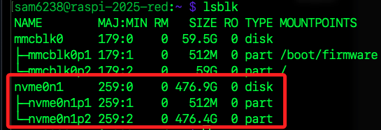
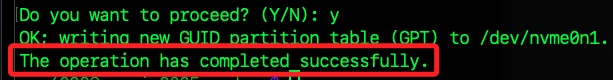

# 掛載 SSD

<br>

## 步驟

1. 確認 SSD 裝置代號；`nvme0n1` 為整顆硬碟，其下的 `p1`、`p2` 則為分割區。

    ```bash
    lsblk
    ```

    

<br>

2. 檢查當前已掛載的磁碟與其掛載點。

    ```bsh
    df -h
    ```

<br>

3. 假如已經掛載，可卸載所有分割區；因為掛載中的分割區無法格式化。

    ```bash
    sudo umount /dev/nvme0n1p1
    sudo umount /dev/nvme0n1p2
    ```

<br>

## 刪除分區

_另外也可使用 `fdisk`_

<br>

1. 使用 `gdisk` 進行刪除分區；在 Linux 系統中，磁碟與磁區的使用路徑格式是 `/dev/<磁區名稱>`，假如要刪除指定分區，則使用 `/dev/<分區名稱>`。

    ```bash
    sudo gdisk /dev/nvme0n1
    ```

<br>

2. 進入後輸入 `3` 選擇 `3 - Create blank GPT` 建立全新的空白 GPT，適合格式化整顆 SSD 的情境。

<br>

3. 接著在 `Command` 提示後方輸入 `n` 新增分割區；`Partition number`、`First sector`、`Last sector`、`Hex code or GUID` 都按 Enter 使用預設值即可。

<br>

4. 再次出現 `Command` 提示，先輸入 `w` 寫入變更，再輸入 `y` 確認。

    

<br>

## 格式化

_使用 ext4 格式_

<br>

1. 建立的新分割區為 `/dev/nvme0n1p1`。

    ```bash
    sudo mkfs.ext4 /dev/nvme0n1p1
    ```

<br>

2. 建立掛載點並掛載。

    ```bash
    sudo mkdir -p /mnt/ssd
    sudo mount /dev/nvme0n1p1 /mnt/ssd
    ```

<br>

## 設定開機自動掛載

1. 查詢 UUID。

    ```bash
    sudo blkid /dev/nvme0n1p1
    ```

<br>

2. 編輯 `/etc/fstab`。

    ```bash
    sudo nano /etc/fstab
    ```

<br>

3. 加入一行，依據查詢結果更改 UUID。

    ```bash
    UUID=<更換正確的-UUID> /mnt/ssd ext4 defaults 0 0
    ```

<br>

4. 確認是否掛載成功。

    ```bash
    df -h | grep /mnt/ssd
    ```

<br>

5. 可重啟測試。

    ```bash
    sudo reboot now
    ```

<br>

6. 進入分區。

    ```bash
    cd /mnt/ssd
    ```

<br>

___

_END_