# 架設比特幣輕節點

_使用 `Bitcoin Core` 的 prune 模式；該模式會自動刪除舊區塊資料，只保留最近區塊以節省硬碟空間_

<br>

## 硬體與系統檢查

1. 檢查系統架構，應為 `aarch64`。

    ```bash
    uname -m
    ```

    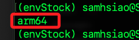

<br>

2. 檢查記憶體分配；因為 `Bitcoin 輕節點` 屬於 `CPU 密集型` 應用，不需大量 GPU，但需要足夠的 `系統記憶體（ARM）` 來處理同步與交易驗證。

    ```bash
    vcgencmd get_mem arm && vcgencmd get_mem gpu
    ```

<br>

3. 查看磁碟裝置；microSD 64GB 足夠運行 Bitcoin Testnet 輕節點。

    ```bash
    lsblk
    ```

<br>

4. 檢查空間；特別說明，df -h 顯示掛載點的實際磁碟使用情況與剩餘空間，而 lsblk 顯示的是裝置與分割架構。

    ```bash
    df -h
    ```

<br>

5. 檢查溫度；特別注意，輕節點容易造成樹莓派溫度過高。

    ```bash
    vcgencmd measure_temp
    ```

<br>

## 安裝必要套件

1. 系統更新。

    ```bash
    sudo apt update && sudo apt upgrade -y
    ```

2. 安裝開發工具。

    ```bash
    sudo apt install git build-essential libtool autotools-dev automake pkg-config bsdmainutils python3 libevent-dev libboost-system-dev libboost-filesystem-dev libboost-test-dev libboost-thread-dev libminiupnpc-dev libzmq3-dev libsqlite3-dev libqrencode-dev -y
    ```

<br>

3. 安裝 `Berkeley DB`；`Berkeley DB` 是 `Bitcoin Core` 儲存 `錢包資料（wallet.dat）` 所依賴的資料庫引擎，雖然新版 `Bitcoin Core` 已可選用 `SQLite`，但許多功能仍仰賴 `Berkeley DB`，特別是在編譯或使用具備錢包功能的節點時，為確保錢包能正常建立與運作仍建議安裝。

    ```bash
    sudo apt install libdb-dev libdb++-dev -y
    ```

<br>

## 建立 Bitcoin Core

1. 進入 `~/Documents`，下載並解壓縮官方預編譯版本；完成時進入解壓縮後的資料夾。

    ```bash
    cd ~/Documents
    wget https://bitcoincore.org/bin/bitcoin-core-26.0/bitcoin-26.0-aarch64-linux-gnu.tar.gz
    tar -xvf bitcoin-26.0-aarch64-linux-gnu.tar.gz
    cd bitcoin-26.0/bin
    ```

<br>

2. 將程式加入系統路徑 `/usr/local/bin/` 便於後續運行。

    ```bash
    sudo cp bitcoind bitcoin-cli bitcoin-tx /usr/local/bin/
    ```

<br>

3. 確認設定完成；輸出中表示成功安裝 `Bitcoin Core v26.0`，並顯示版本資訊、開發者聲明、開源授權與相關網址。

    ```bash
    bitcoind --version
    ```

    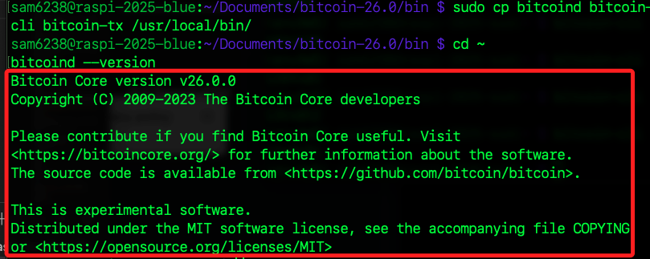

<br>

## 設定 Bitcoin 節點

_輕節點模式_

<br>

1. 建立設定文件。

    ```bash
    mkdir ~/.bitcoin
    nano ~/.bitcoin/bitcoin.conf
    ```

<br>

2. 編輯設定檔 `bitcoin.conf`；啟用輕節點，只保留最近約 550MB 區塊。

    ```ini
    server=1
    daemon=1
    txindex=0
    prune=550
    rpcuser=piuser
    rpcpassword=securepass123
    ```

<br>

## 啟動節點服務

1. 第一次啟動會建立區塊資料夾並開始同步。

    ```bash
    bitcoind
    ```

    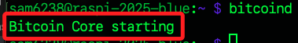

<br>

2. 啟動後便可查看狀態；關於各項訊息另作說明。

    ```bash
    bitcoin-cli getblockchaininfo
    ```

<br>

## 建立錢包

1. 建立一個本地錢包，用來產生地址、管理金鑰、接收與發送比特幣；這裡示範命名為 `mywallet`，可自訂義名稱。

    ```bash
    bitcoin-cli createwallet "mywallet"
    ```

    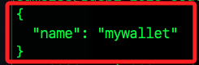

<br>

2. 取得錢包地址。

    ```bash
    bitcoin-cli getnewaddress
    ```

    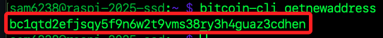

<br>

3. 查詢地址餘額。

    ```bash
    bitcoin-cli getbalance
    ```

    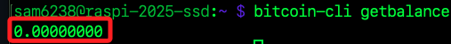

<br>

4. 查詢節點的預設資料夾 `~/.bitcoin/wallets` 中上有哪些錢包目錄存在，即使未載入。

    ```bash
    ls ~/.bitcoin/wallets
    ```

<br>

5. 特別注意，主鏈與測試鏈的錢包路徑並不相同；若建立了測試鏈，可在 `testnet3` 資料夾中查看有哪些錢包目錄。

    ```bash
    ls ~/.bitcoin/testnet3/wallets/
    ```

<br>

5. 載入指定錢包；在指令中，錢包名稱是否使用引號包覆皆可。

    ```bash
    bitcoin-cli loadwallet mywallet
    ```

<br>

6. 運行相關指令時，若有多個錢包，可透過參數 `-rpcwallet=` 指定錢包。

    ```bash
    # 取得錢包地址
    bitcoin-cli -rpcwallet=mywallet getnewaddress

    # 取得錢包餘額
    bitcoin-cli -rpcwallet=mywallet getbalance
    ```

<br>

7. 查詢目前已載入的錢包。

    ```bash
    bitcoin-cli listwallets
    ```

    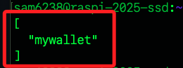

<br>

## 各項查詢

1. 開啟日誌已同步方式查看；其中 `height` 與 `progress` 是後續會關注的重要資訊。

    ```bash
    tail -f ~/.bitcoin/debug.log
    ```

    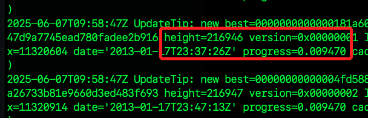

<br>

2. 查詢區塊資訊。

    ```bash
    bitcoin-cli getblockchaininfo
    ```

<br>

3. `verificationprogress` 顯示 `同步` 的百分比進度。

    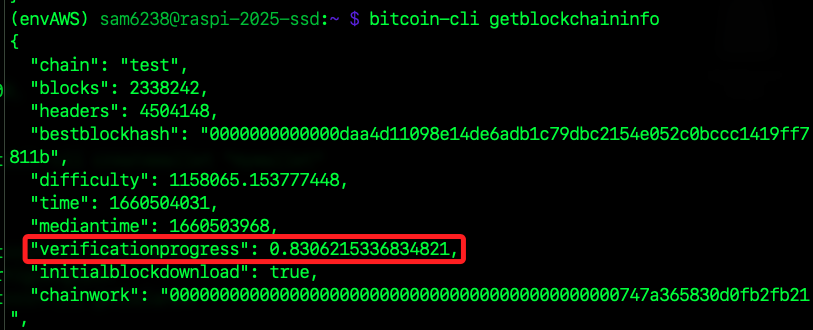

<br>

4. `chain` 是當前使用的網路，預設使用的是 `main`。

    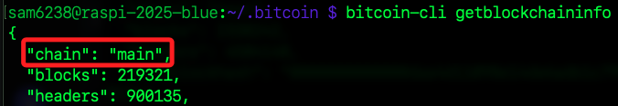

<br>

## 改用測試鏈

_Testnet_

<br>

1. 編輯 `bitcoin.conf`。

    ```bash
    nano ~/.bitcoin/bitcoin.conf
    ```

<br>

2. 加入這一行可指定使用測試鏈 `Testnet`，任意行即可；由於目前。

    ```bash
    testnet=1
    ```

<br>

3. 重新建立錢包。

    ```bash
    bitcoin-cli createwallet "mywallet"
    ```

<br>

## 手動刪除錢包

1. 特別注意，刪除錢包必須在 bitcoind 啟動完成，若未啟動或是正在進行初始同步時無法刪除。

    ```bash
    bitcoin-cli unloadwallet mywallet
    ```

<br>

2. 重新啟動 Bitcoin 節點。

    ```bash
    bitcoin-cli stop
    bitcoind
    ```

<br>

3. 再次查詢區塊資訊。

    ```bash
    bitcoin-cli getblockchaininfo
    ```

<br>

4. 確認 chain 是 test。

    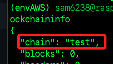

<br>

## 軟體加速

1. 手動加入已知可連線的 `節點（peer）`，能夠幫助加速區塊同步。

    ```bash
    bitcoin-cli addnode 185.64.116.15 add
    ```

<br>

2. 建議加入的 Testnet 節點。

    ```bash
    bitcoin-cli addnode 159.69.32.90 add
    bitcoin-cli addnode 173.212.225.176 add
    bitcoin-cli addnode 144.76.224.212 add
    bitcoin-cli addnode 213.239.213.110 add
    bitcoin-cli addnode 88.99.213.203 add
    bitcoin-cli addnode 5.9.82.112 add
    bitcoin-cli addnode 185.169.252.55 add
    ```

<br>

3. 查詢當前已連線節點。

    ```bash
    bitcoin-cli getpeerinfo
    ```

<br>

## 取得測試幣

1. 訪問 [Bitcoin Testnet Faucet](https://bitcoinfaucet.uo1.net/)。

<br>

2. 在輸入框貼上錢包地址。

    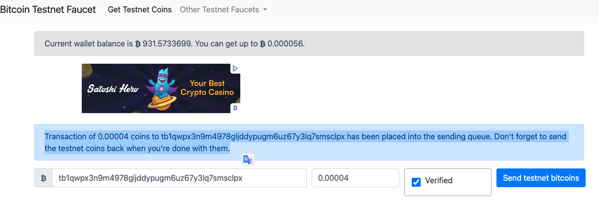

<br>

3. 檢查是否已入帳；需等同步完成才會入帳。

    ```bash
    bitcoin-cli getbalance
    ```

<br>

4. 確認地址是否有請求測試幣 [網址](https://blockstream.info/testnet/)，若該處顯示已入帳，只是節點未同步到那高度，那就稍後一定會看到幣。

    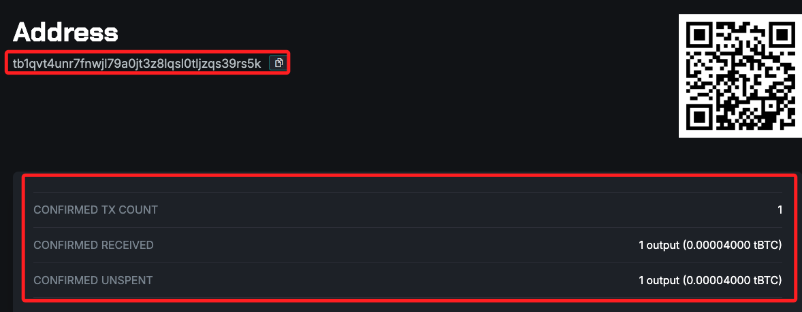

<br>

## 查詢到帳

1. 查詢所有地址資訊，顯示所有已產生地址的接收紀錄與餘額含未使用地址；特別說明，Bitcoin Core 是 HD 錢包，建立後會產生一組 `主金鑰種子`，這組種子可以衍生出無限個接收地址，每次執行 getnewaddress，就會從這個錢包衍生出一個新地址，這些地址雖然不同，但全都屬於同一個錢包，資金皆可由該錢包控制。

    ```bash
    bitcoin-cli listreceivedbyaddress 0 true
    ```

<br>

2. 查詢目前區塊鏈上已經同步的高度。

    ```bash
    bitcoin-cli getblockcount
    ```

<br>

3. 觀察進度。

    ```bash
    tail -f ~/.bitcoin/testnet3/debug.log
    ```

<br>

## 其他測試幣

1. [coinfaucet](https://coinfaucet.eu/en/btc-testnet/)

    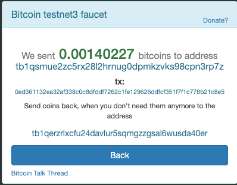

<br>

## 讓他人連線到節點

_開放埠口 `8333`（mainnet）或 `18333`（testnet）於防火牆或路由器上。_

<br>

## 結束與重啟服務

1. 安全關閉節點。

    ```bash
    bitcoin-cli stop
    ```

<br>

2. 重新啟動。

    ```bash
    bitcoind
    ```

<br>

3. 節點重啟後需手動載入錢包。

    ```bash
    bitcoin-cli loadwallet "mywallet"
    ```

<br>

## 其他

1. 若已架設好 Bitcoin Testnet 節點且同步完成，可使用指令直接送幣

    ```bash
    bitcoin-cli sendtoaddress tb1qxxxxxxxxxxxxxxxxxxxxxxxxxxxxxx 0.001
    ```

<br>

2. 檢查樹莓派溫度

    ```bash
    vcgencmd measure_temp
    ```

<br>

## 轉帳

1. 使用測試網路轉帳測試幣。

    ```bash
    bitcoin-cli sendtoaddress <對方地址> <金額>
    ```

<br>

___

_END_