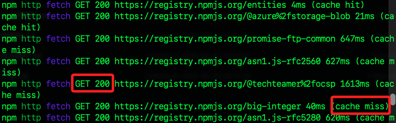
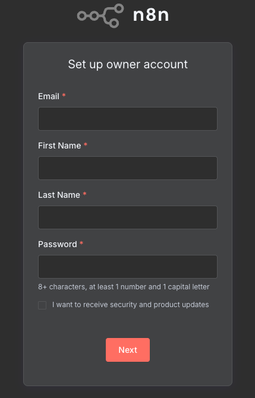
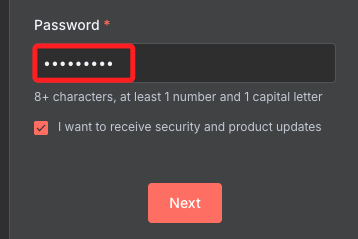
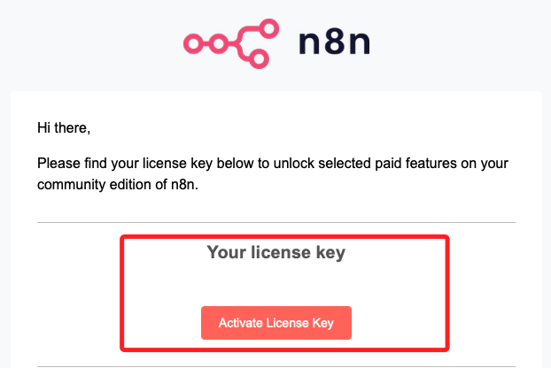
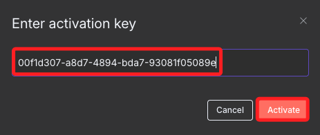

# n8n

_基於 `Node.js`、輕量且跨平台的可視化、低代碼自動化平台，非常適合在樹莓派上自架與應用_

<br>

## 簡介

1. n8n 是一個開源的自動化工作流平台，可用視覺化的拖拉介面串接各種服務如 Email、Slack、Google Sheets、HTTP API、資料庫、AI 服務等，並自動化資料流與任務，例如自動下載郵件附件、同步表單資料、監控網頁更新、串接 ChatGPT 等。

<br>

2. 無需寫程式碼即可自動化多種服務，也支援自訂腳本 Node.js、Webhooks、排程等進階功能。

<br>

## NVM

_Node Version Manager，這是用來管理 `Node.js` 版本的工具，可參考 [官方說明](https://github.com/nvm-sh/nvm#installing-and-updating)_

<br>

1. 安裝 nvm；可依據官方最新版本修正版本號進行安裝，透過 `--lst` 斬釘安裝長期支援版本並切換到該版本。

    ```bash
    curl -o- https://raw.githubusercontent.com/nvm-sh/nvm/v0.40.3/install.sh | bash
    source ~/.bashrc
    nvm install --lts
    nvm use --lts
    ```

    

<br>

2. 使用 nvm 安裝 Node.js 22 並指定切換到該版本；如果已裝過就跳過，安裝完成會自動切換到該版本。

    ```bash
    nvm install 22
    ```

<br>

3. 將當前 Shell session 手動切換到指定版本。

    ```bash
    nvm use 22
    ```

<br>

4. 檢查版本，n8n 必須安裝 Node.js 20+。

    ```bash
    node -v
    ```

<br>

## 使用 SSD

_若要提升效能，可使用 SSD；這裡示範使用 SSD，並把 npm 的全域資料夾指到 SSD；若無該硬體設備則略過_

<br>

1. 建立。

    ```bash
    sudo mkdir -p /mnt/ssd/npm-global
    npm config set prefix /mnt/ssd/npm-global
    export PATH=/mnt/ssd/npm-global/bin:$PATH
    ```

<br>

2. 確認 `/mnt/ssd/npm-global` 目錄擁有你的帳號寫入權限。

    ```bash
    sudo chown -R $USER:$USER /mnt/ssd/npm-global
    ```

<br>

3. 設定 `npm` 全域安裝路徑。

    ```bash
    npm config set prefix /mnt/ssd/npm-global
    ```

<br>

4. 將 `npm-global/bin` 加入 `PATH`。

    ```bash
    export PATH=/mnt/ssd/npm-global/bin:$PATH
    ```

<br>

5. 每次登入自動生效。

    ```bash
    echo 'export PATH=/mnt/ssd/npm-global/bin:$PATH' >> ~/.bashrc
    source ~/.bashrc
    ```

<br>

## 安裝 n8n

1. 進行安裝，因為過程漫長易讓人誤以為當機，可透過參數 `--verbose` 列出詳細的過程。

    ```bash
    npm install n8n -g --verbose
    ```

<br>

2. 若不顯示則取消參數即可。

    ```bash
    npm install n8n -g
    ```

<br>

3. 訊息顯示 npm 正在下載套件，也因為沒有本地沒快取，所以顯示 `cache miss`，另外，`GET 200` 表示連線成功、過程正常，繼續等待完成即可。

    

<br>

## 設定

1. 編輯設定檔案。

    ```bash
    nano ~/.bashrc
    ```

<br>

2. 在末行加入以上設定；`N8N_SECURE_COOKIE=false` 表示允許用 `HTTP` 連線，如此設定不強制瀏覽器用 `HTTPS`，避免 `Secure Cookie` 限制造成無法登入；另外，設定為 `0.0.0.0` 表示服務將允許所有來源的連線。

    ```bash
    export N8N_SECURE_COOKIE=false
    export N8N_HOST=0.0.0.0
    ```

<br>

3. 立即生效。

    ```bash
    source ~/.bashrc
    ```

<br>

## 啟動服務

1. 啟動 n8n。

    ```bash
    n8n
    ```

<br>

2. 訪問 [http://樹莓派IP:5678/](http://樹莓派IP:5678/)。

    

<br>

3. 密碼至少需有一個大寫字母。

    

<br>

4. 點擊。

    

<br>

5. 接著會顯示寄出一封信件。

    

<br>

6. 前往收信會看到。

    

<br>

7. 前往 Activate。

    

<br>

___

_END_