# 建立開發環境

_n8n 是用 Node.js 編寫的，必須安裝 Node.js 20+，以下從安裝 nvm 開始_

<br>

## 安裝 NVM

_Node Version Manager，這是用來管理 `Node.js` 版本的工具，可參考 [官方說明](https://github.com/nvm-sh/nvm#installing-and-updating)_

<br>

1. 安裝 nvm；可依據官方最新版本修正版本號進行安裝，透過 `--lst` 斬釘安裝長期支援版本並切換到該版本。

    ```bash
    curl -o- https://raw.githubusercontent.com/nvm-sh/nvm/v0.40.3/install.sh | bash
    source ~/.bashrc
    nvm install --lts
    nvm use --lts
    ```

    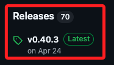

<br>

2. 查看所有已管理的 Node.js 版本；結果顯示目前只安裝了 `v22.16.0`，並預設為當前版本，其它版本則皆未安裝。

    ```bash
    nvm ls
    ```

    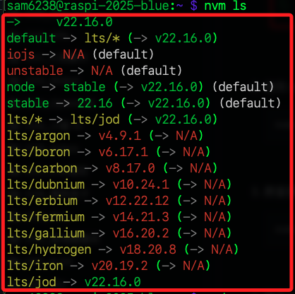

<br>

3. 使用 nvm 安裝 `Node.js 21`，完成後會自動切換使用該版本；如果已裝過就跳過。

    ```bash
    nvm install 21
    ```

    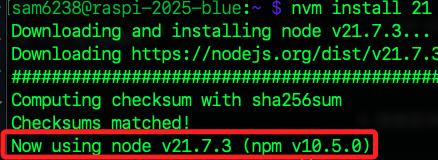

<br>

4. 手動切換當前 Shell session 到指定版本。

    ```bash
    nvm use 22
    ```

    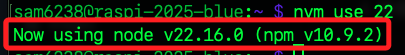

<br>

5. 檢查版本，可確認版本已經切換。

    ```bash
    node -v
    ```

    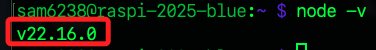

<br>

## 安裝 n8n

1. 使用以下指令進行安裝；可透過參數 `--verbose` 列出詳細過程進行觀察，也可避免因過程漫長讓人誤以為已經當機。

    ```bash
    npm install n8n -g --verbose
    ```

<br>

2. 若不顯示則取消參數即可。

    ```bash
    npm install n8n -g
    ```

<br>

3. 訊息顯示 npm 正在下載套件，因為沒有本地沒快取所以顯示 `cache miss`，而 `GET 200` 則表示連線成功、過程正常，繼續等待完成即可。

    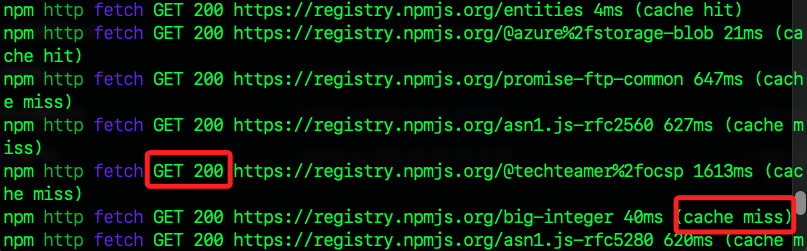

<br>

## npm

_以上步驟會自動安裝 npm_

<br>

1. 更新 npm 到最新版本。

    ```bash
    npm install -g npm
    ```

<br>

2. 也可指定安裝版本號如 `11.4.2`

    ```bash
    npm install -g npm@11.4.2
    ```

<br>

## 設定環境變數

_滿足使用 n8n 的需求_

<br>

1. 編輯設定檔案。

    ```bash
    nano ~/.bashrc
    ```

<br>

2. 在末行加入以上設定；`N8N_SECURE_COOKIE=false` 表示允許用 `HTTP` 連線，如此設定不強制瀏覽器用 `HTTPS`，避免 `Secure Cookie` 限制造成無法登入；另外，設定為 `0.0.0.0` 表示服務將允許所有來源的連線。

    ```bash
    export N8N_SECURE_COOKIE=false
    export N8N_HOST=0.0.0.0
    ```

<br>

3. 立即生效。

    ```bash
    source ~/.bashrc
    ```

<br>

## 啟動服務

_完成以上設定後，可啟動服務進行確認_

<br>

1. 啟動 n8n；這會自動完成所有資料庫結構遷移，確保內部資料表結構與新版 n8n 相容。

    ```bash
    n8n
    ```

<br>

2. 從本機訪問 [http://樹莓派IP:5678/](http://樹莓派IP:5678/)。

    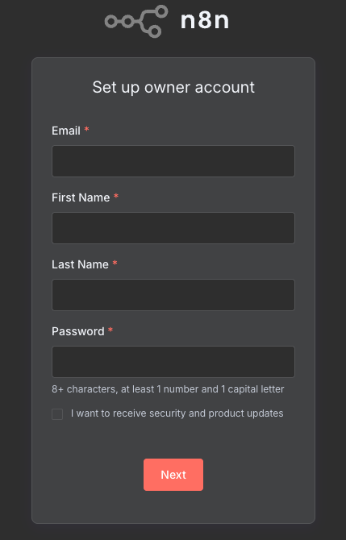

<br>

3. 密碼至少需有一個大寫字母。

    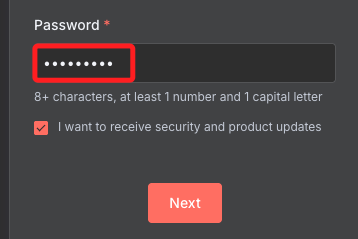

<br>

4. 輸入密碼、勾選 `I want to...` 之後點擊 `Next`。

    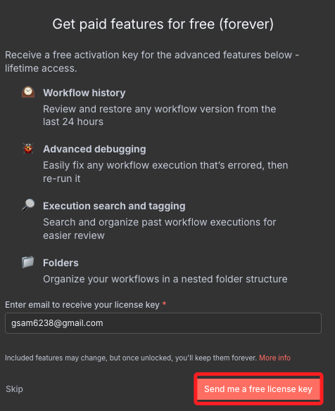

<br>

5. 直接點擊 `Get started` 即可。

    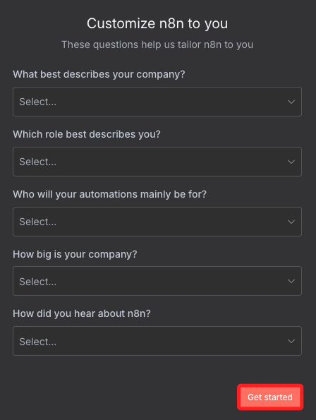

<br>

6. 接著點擊 `Send me...` 接收 lincese key 信件。

    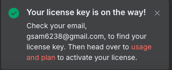

<br>

7. 前往信箱收信。

    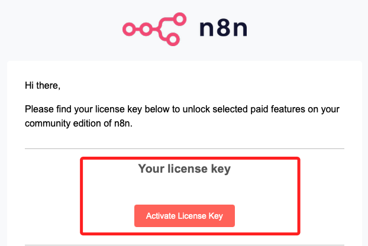

<br>

7. 前往 Activate。

    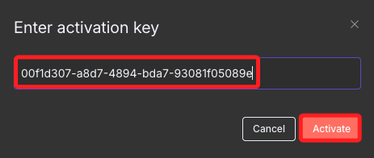

<br>

## 關於文件權限

1. n8n 偵測到 `~/.n8n/config` 檔案的權限 `0644` 太寬鬆，未來服務可能會強制設定更嚴格的權限如 `0600`，用以保護敏感設定與金鑰資料。

    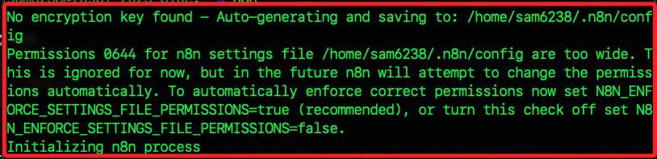

<br>

2. 可執行指令修正權限。

    ```bash
    chmod 600 ~/.n8n/config
    ```

<br>

___

_END_