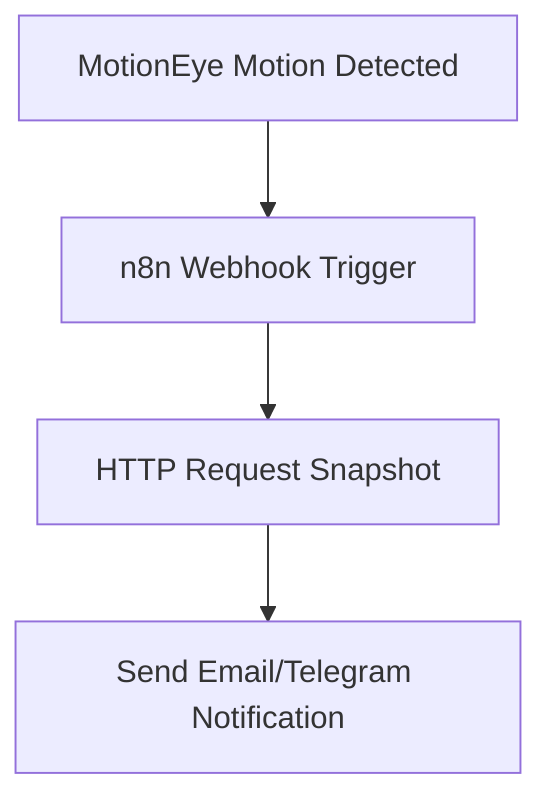

# 進階專案

_樹莓派 + n8n 自動化攝影機偵測＋即時通知_

## 說明

1. 樹莓派偵測攝影機畫面中有人活動，自動觸發 n8n 發送通知。

2. 不需外接感測器，利用原本的 USB 攝影機即可


## 準備工作

1. 安裝好 n8n

2. MotionEye

3. USB 攝影機

## motionEye

1. 安裝套件

```bash
sudo apt update
sudo apt --no-install-recommends install ca-certificates curl gcc libjpeg62-turbo-dev libcurl4-openssl-dev libssl-dev -y
```

2. 設定 pip.conf，允許全域安裝 Python 套件，Bookworm 必做

```bash
grep -q '\[global\]' /etc/pip.conf 2> /dev/null || printf '%b' '[global]\n' | sudo tee -a /etc/pip.conf > /dev/null
sudo sed -i '/^\[global\]/a\break-system-packages=true' /etc/pip.conf
```

4. 安裝 motionEye

```bash
sudo python -m pip install --pre motioneye
```

5. 初始化 motionEye，建立 config 與 systemd 服務

```bash
sudo motioneye_init
```

6. 啟動 motionEye

```bash
sudo systemctl enable --now motioneye
```

7. 開啟瀏覽器進入管理介面 `http://<你的樹莓派IP>:8765`，預設帳號 admin，密碼留空

8. 升級 motionEye

    ```bash
    sudo systemctl stop motioneye
    sudo python3 -m pip install --upgrade --pre motioneye
    sudo systemctl start motioneye
    ```

9. 可自訂 `config`，參考：[官方 extra config/service 檔](https://github.com/motioneye-project/motioneye/tree/dev/motioneye/extra)

## 設定偵測事件通知

1. 登入 MotionEye [http://<樹莓派-IP>:8765）]

2. 在 `Motion Detection` 中可透過 `Frame Change Threshold` 設定靈敏度。

3. 啟用「Run a command」功能，指令為：

```bash
curl -X POST http://<樹莓派-IP>:5678/webhook/motion-detected
```

## 建立 n8n Workflow

* Node 1：Webhook Trigger

  * HTTP Method：POST
  * Path：`motion-detected`

* Node 2：HTTP Request (可選抓快照)

  * Method：GET
  * URL：`http://<pi-ip>:8765/<camera_path>/current.jpg`

* Node 3：Send Email 或 Send Telegram

  * 有 HTTP輸入附帶快照圖片


## 完整畫面流程




### 📌 原理重點

* MotionEye 當偵測到動作時，會呼叫 n8n Webhook
* n8n 接收到後再抓快照 + 寄信或通知給你


