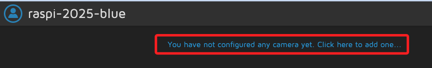

# 進階專案

_樹莓派 + n8n 自動化攝影機偵測＋即時通知_

## 專案簡介

1. 樹莓派偵測攝影機畫面中有人活動，自動觸發 n8n 發送通知。

2. 不需外接感測器，利用原本的 USB 攝影機即可


## 準備工作

1. 安裝好 n8n

2. MotionEye

3. USB 攝影機

## motionEye

1. 安裝套件。

```bash
sudo apt update
sudo apt --no-install-recommends install ca-certificates curl gcc libjpeg62-turbo-dev libcurl4-openssl-dev libssl-dev -y
```

2. 設定 pip.conf，允許全域安裝 Python 套件，Bookworm 必做。

```bash
grep -q '\[global\]' /etc/pip.conf 2> /dev/null || printf '%b' '[global]\n' | sudo tee -a /etc/pip.conf > /dev/null
sudo sed -i '/^\[global\]/a\break-system-packages=true' /etc/pip.conf
```

4. 安裝 motionEye；當前系統 Python 直接安裝 motionEye 最新預發行版本，
其中 `--pre` 指定安裝 `預覽版`，可取得最新功能或修正。

```bash
sudo python -m pip install --pre motioneye
```

5. 初始化 motionEye，建立 config 與 systemd 服務。

```bash
sudo motioneye_init
```

6. 設定為開機啟動。

```bash
sudo systemctl enable --now motioneye
```

7. 先升級 motionEye。

```bash
sudo systemctl stop motioneye
sudo python -m pip install --upgrade --pre motioneye
sudo systemctl start motioneye
```

8. 開啟瀏覽器進入管理介面 `http://<你的樹莓派IP>:8765`，預設帳號 `admin`，密碼留空。


9. 可自訂 `config`，參考：[官方 extra config/service 檔](https://github.com/motioneye-project/motioneye/tree/dev/motioneye/extra)

## HTTP 網址

_可先進行複製備用_

1. 進入 motionEye，在影像上點擊右鍵，複製圖片網址


2. 網址解析。

```bash
http://<樹莓派-IP>:8765/picture/1/current/?_=<防止快取的隨機參數>&_username=admin&_signature=<驗證身份的安全簽章>
```

## 設定偵測事件通知

1. 登入 MotionEye [http://<樹莓派-IP>:8765）]，點擊添加攝影機。



2. 接著在彈窗下拉選取正確的攝影機，然後點擊 `OK`。


3. 在 `Motion Detection` 中可透過 `Frame Change Threshold` 設定靈敏度。

## 設定

1. 啟用 `Run a command` 功能。

```bash
curl -X POST http://<樹莓派-IP>:5678/webhook/motion-detected
curl -X POST http://192.168.1.125:5678/webhook/motion-detected
```

## 建立 n8n Workflow

1. 節點 1：Webhook

HTTP Method：POST
Path：`motion-detected`

2. 節點 2：HTTP Request

Method：GET
URL：`http://<樹莓派-IP>:8765/<camera_path>/current.jpg`

```bash
http://<樹莓派-IP>:8765/<camera_path>/current.jpg
```

1. 節點 3：Send Email 或 Send Telegram

有 HTTP輸入附帶快照圖片


## 完整畫面流程


### 📌 原理重點

MotionEye 當偵測到動作時，會呼叫 n8n Webhook
n8n 接收到後再抓快照 + 寄信或通知給你


