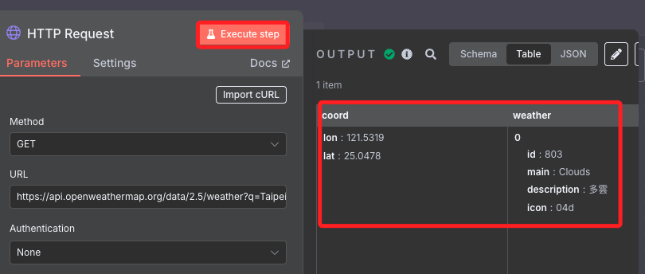
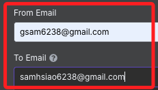

# 自動化通知

_取得氣候資訊，並建立自動化通知服務，定時透過 Email 發送郵件給指定用戶_

<br>

## 氣候資訊

_詳細步驟後補_

<br>

1. 前往 [OpenWeather 官網](https://openweathermap.org/) 註冊並申請 `API Key`。

    

<br>

## Gmail 應用程式密碼

_詳細步驟後補_

<br>

1. 申請 [應用程式密碼](https://myaccount.google.com/apppasswords)

    

<br>

2. 複製備用。

    

<br>

## 建立 n8n Workflow

1. 登入 n8n 後台 `樹莓派-IP:5678`，點選右上角 `Create Workflows`

    

<br>

2. 可點擊左上方的預設名稱 `My workflow` 進行重新命名，如 `天氣通知`。

    

<br>

## 新增觸發節點

1. 點擊 `+` 會出現彈窗。

    

<br>

2. 點擊選單裝的 `On a schedule`。

    

<br>

3. 設定排程細節，下拉 `Trigger at Hour` 選單並選取指定時間如 `7am`，完成後點擊 `Execute step`

    

<br>

4. 點擊 `back  to canvas` 回到主畫面中。

    

<br>

5. 點擊 `+` 可新增節點。

    

<b4>

6. 在輸入框中填入 `HTTP Request` 並選擇節點。

    

<br>

7. 設定參數，Method 選 `GET`，`URL` 填入以下網址；其中 `Taipei` 可替換為任意城市名，`appid` 部分也要填入自己註冊得到的 `API Key`。

    ```bash
    https://api.openweathermap.org/data/2.5/weather?q=Taipei&appid=<填入-API_KEY>&units=metric&lang=zh_tw
    ```

    

<br>

8. 可點擊上方 `Excute step` 進行測試；若正確，右方可顯示 API 回傳結果。

    

<br>

9. 點擊 `Back to canvas` 回到主畫面。

    

<br>

## 新增 Email 節點

1. 點節點下方的 `+` 搜尋 `Send Email`

    

<br>

2. 點擊 `Create new credential`。

    

<br>

3. User 填入要使用的 Gmail，Password 則填寫 `應用程式密碼`；Host 填入 `smtp.gmail.com`，接著點擊右上方 `Save`。

    

<br>

## 回到 Send Email

_繼續設定節點_

<br>

1. 設定寄送與收件信箱。

    

<br>

2. `Subject` 可自訂如 `今日天氣預報`，格式可選 `TExt`。

    

<br>

3. `Text` 設定如下；這是使用 `{{$json["欄位"]}}` 語法提取節點 HTTP Response 的內容，下方會顯示最終結果。

    ```bash
    今日天氣：{{$json["weather"][0]["description"]}}
    溫度：{{$json["main"]["temp"]}}°C
    體感溫度：{{$json["main"]["feels_like"]}}°C
    濕度：{{$json["main"]["humidity"]}}%
    ```

    

<br>

## 測試並啟用

1. 每個節點可點擊旁邊 `▶` 單獨進行測試。

<br>

2. 順利收到信件後，點畫面上方「Inactive」開關，切到 `Active` 狀態

    

<br>

3. 會彈窗提示。

    

<br>

___

_END_
