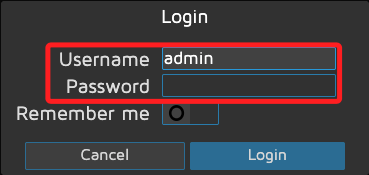
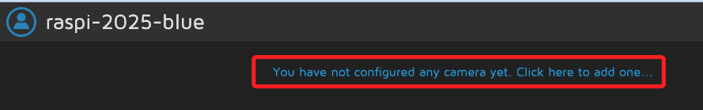
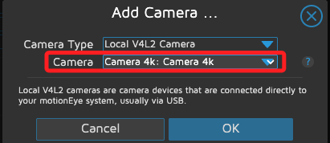
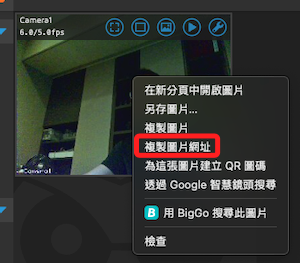
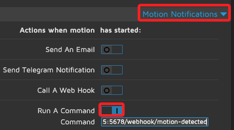
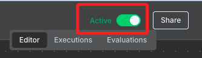

# 進階專案

_樹莓派 + n8n 自動化攝影機偵測＋即時通知；當 MotionEye 當偵測到動作時，會呼叫 n8n Webhook，n8n 接收到後再抓快照 + 寄信或通知_

<br>

## 專案簡介

1. 樹莓派偵測攝影機畫面中有人活動，自動觸發 n8n 發送通知，不需外接感測器，利用原本的 USB 攝影機即可。

<br>

2. 完整畫面流程。

    ```mermaid
    graph TD
    A[MotionEye Motion Detected] --> B[n8n Webhook Trigger]
    B --> C[HTTP Request Snapshot]
    C --> D[Send Email/Telegram Notification]
    ```

<br>

## 準備工作

1. 安裝好 n8n。

<br>

2. 安裝好 MotionEye。

<br>

3. 確實接上 USB 攝影機。

<br>

## motionEye

1. 安裝套件。

    ```bash
    sudo apt update
    sudo apt --no-install-recommends install ca-certificates curl gcc libjpeg62-turbo-dev libcurl4-openssl-dev libssl-dev -y
    ```

<br>

2. 設定 pip.conf，允許全域安裝 Python 套件，Bookworm 必做。

    ```bash
    grep -q '\[global\]' /etc/pip.conf 2> /dev/null || printf '%b' '[global]\n' | sudo tee -a /etc/pip.conf > /dev/null
    sudo sed -i '/^\[global\]/a\break-system-packages=true' /etc/pip.conf
    ```

<br>

3. 安裝 motionEye；當前系統 Python 直接安裝 motionEye 最新預發行版本，
其中 `--pre` 指定安裝 `預覽版`，可取得最新功能或修正。

    ```bash
    sudo python -m pip install --pre motioneye
    ```

<br>

4. 初始化 motionEye，建立 config 與 systemd 服務。

    ```bash
    sudo motioneye_init
    ```

<br>

5. 設定為開機啟動。

    ```bash
    sudo systemctl enable --now motioneye
    ```

<br>

6. 若要升級 motionEye，先停止 `stop` 服務，升級後再啟動 `start`。

    ```bash
    sudo systemctl stop motioneye
    sudo python -m pip install --upgrade --pre motioneye
    sudo systemctl start motioneye
    ```

<br>

## 進入服務

1. 開啟瀏覽器進入管理介面 `http://<你的樹莓派IP>:8765`，預設帳號 `admin`，密碼留空。

    

<br>

2. 初次登入會提示尚未設置攝影機，點擊後會彈窗提示。

    

<br>

3. 接著在彈窗下拉選取正確的攝影機，然後點擊 `OK`。

    

<br>

## 關於影像網址

1. 顯示影像後，在影像上點擊右鍵複製圖片網址。

    

<br>

2. 網址解析。

    ```bash
    http://<樹莓派-IP>:8765/picture/1/current/?_=<防止快取的隨機參數>&_username=admin&_signature=<驗證身份的安全簽章>
    ```

<br>

## 各項設定

1. Motion Detection，可透過 `Frame Change Threshold` 設定靈敏度。

<br>

2. Motion Notifications，啟用 `Run a command` 功能，並在 `Command` 中輸入以下指令，每當 MotionEye 偵測到畫面有變化，就會自動執行這個 curl 指令，即時通知 n8n 的 Webhook，達到自動化效果。

    ```bash
    curl -X POST http://<樹莓派-IP>:5678/webhook/motion-detected
    ```

    

<br>

3. 其他設定可參考：[官方 extra config/service 檔](https://github.com/motioneye-project/motioneye/tree/dev/motioneye/extra)。

<br>

## 建立 n8n Workflow

1. 啟動服務，並透過網址訪問主控台。

    ```bash
    n8n
    ```

<br>

2. 建立工作流；略。

<br>

3. 建立節點 `1`：Webhook。

    ```bash
    HTTP Method：POST
    Path：motion-detected
    ```

<br>

2. 節點 2：HTTP Request

    ```bash
    Method：GET
    URL：http://<樹莓派-IP>:8765/<camera_path>
    ```

<br>

3. 節點 3：Send Email

    ```bash
    User：<填入-EMAIL-帳號>
    Password：<從-Google-複製>
    Host：smtp.gmail.com
    Port：465
    ```

<br>

4. 文本設定。

    ```html
    <h2>攝影機移動偵測通知</h2>
    <p>偵測到畫面異動，請確認下方即時快照：</p>
    
    ```

<br>

5. 開啟。

    

<br>

___

_END_