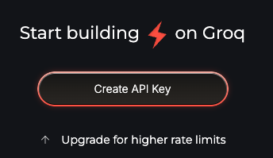
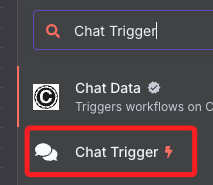

# 進階專案

_n8n 的 LLM AI Agent 專案，打造 ChatGPT 聊天機器人 + Wikipedia 即時查詢自動化工作流。_

## 準備工作

1. 安裝 n8n v1.45 以上，建議 Docker 部署。

2. 取得 Groq API Key。

3. 會註冊 Wikipedia plugin 不需額外 Key。

## 建立 Groq API Key

1. [Groq.com](https://console.groq.com/)。

## 第一個節點

_開始建立 Workflow_

1. 新增觸發節點 `Chat Trigger`

2. When chat message received，用於觸發 AI 機器人回應，可用 Telegram/Line/Slack 等 chat 觸發，也可直接在 n8n Cloud 試玩

## AI Agent（Tools Agent）

1. 新增 AI Agent 節點（需 n8n v1.45+）

2. 選擇「Tools Agent」模式

3. Chat Model：接 Groq Chat Model 節點

4. Memory：接 Window Buffer Memory 節點

5. Tool：加 Wikipedia 節點

#### 3）Groq Chat Model 節點設定

* 新增「Groq」憑證，填入 API Key
* 選擇 `llama3-8b-8192` 或 `llama3-70b-8192` （推薦 70b 品質最佳）

#### 4）Window Buffer Memory

* 保持預設即可（即保留上下文 3-5 輪）

#### 5）Wikipedia 節點

* 不需 API Key，直接用即可

### 4. 流程連接（照你的圖）

* chat trigger → AI Agent
* Groq → AI Agent（Chat Model）
* Window Buffer Memory → AI Agent（Memory）
* Wikipedia → AI Agent（Tool）

### 5. 測試 Workflow

1. 點選 `When chat message received`，手動執行或串接 chat App 測試
2. 輸入：「誰是馬斯克？」or「Explain what is Quantum Computing」
3. 觀察 AI Agent 是否自動串聯 Wikipedia 搜尋結果一起回覆

## 🟢 測試完成/常見問題

* 若無法調用 Groq，請檢查 API Key
* AI Agent 必須用新版 n8n（v1.45+），老版沒有這種節點與 UI

## 📝 延伸用法

* 可用 `Webhook` 觸發，連接 LINE、Telegram 或網站 Chatbot
* Wikipedia 只是範例，你可接 Google Search、Wolfram Alpha、n8n Database 等任何工具
* 支援多輪對話，記憶上下文

## 官方參考資源（2024 最新）

* [n8n AI Agent 官方教學](https://docs.n8n.io/ai/ai-agents/)
* [Groq 官方 LLM API 文件](https://console.groq.com/docs)
* [n8n 社群討論與案例](https://community.n8n.io/)

如要實際建置、Groq API Key 申請教學、或串 LINE/Telegram 對接方式，請回覆，我可給你更詳細範例與步驟！
