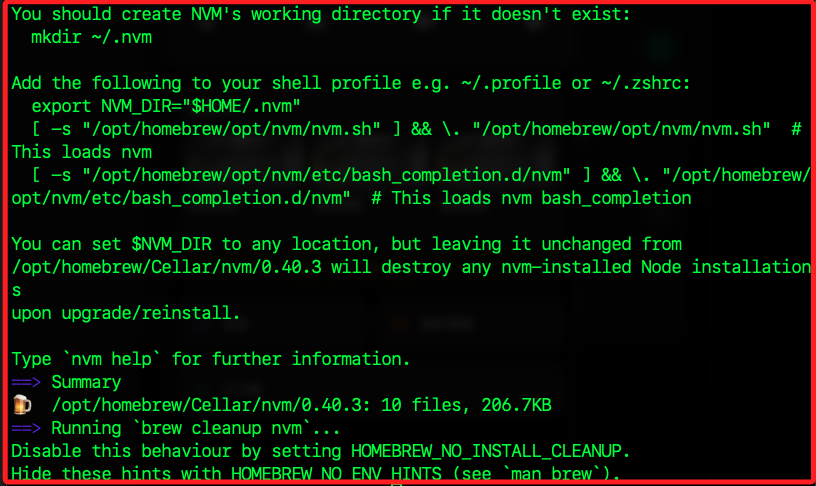

# 建立 n8n 開發環境

*在 MacOS 上*

## 安裝 nvm

*`管理 Node.js`*

1. 進行安裝之前，先確認是否已經安裝，並檢查是否存在相關路徑。

```bash
nvm -v
ls ~/.nvm
```

2. 在終端機中執行安裝指令；特別注意，Homebrew 本身設計為使用者層級安裝，所以相關指令皆無需 `sudo`。

```bash
brew install nvm
```

3. 安裝到最後會提示接下來該怎麼做，依據說明照做即可。

    

4. 建立工作目錄；因為 `Homebrew` 預設會在升級或移除時清空 `/opt/homebrew/Cellar/nvm`，避免 `$NVM_DIR` 因此被刪除，所有已安裝的 Node.js 版本也會被刪除，所以另外建立目錄管理。

```bash
mkdir ~/.nvm
```

5. 編輯 shell 設定檔。

```bash
code ~/.zshrc
```

6. 將以下內容加入 `~/.zshrc`，此段會載入 nvm 指令並啟用補全功能，建議加在最下方即可；特別注意，若使用 bash 管理則寫入 `~/.bashrc`。

```bash
export NVM_DIR="$HOME/.nvm"
[ -s "/opt/homebrew/opt/nvm/nvm.sh" ] && \. "/opt/homebrew/opt/nvm/nvm.sh"
[ -s "/opt/homebrew/opt/nvm/etc/bash_completion.d/nvm" ] && \. "/opt/homebrew/opt/nvm/etc/bash_completion.d/nvm"
```

7. 重新載入設定。

```bash
source ~/.zshrc
```

8. 安裝 Node.js，建議 v20，官方目前支援最穩定版本

```bash
nvm install 20
nvm use 20
nvm alias default 20
```

9. 查詢版本。

```bash
npm -v
node -v
```

## 升級 npm

*`解決 workspace 錯誤並支援 monorepo`*

1. 查詢權限；目前 ~/.npm 目錄中的檔案屬於 root 擁有者，這會導致後續執行 `npm install` 或 `pnpm install` 出現權限錯誤。

```bash
ls -l ~/.npm
```

2. 修正權限錯誤，如果曾用 sudo 安裝過套件

```bash
sudo chown -R $(id -u):$(id -g) ~/.npm
```

3. 升級至最新 npm

```bash
sudo npm install -g npm@latest
```

## 檔案監聽數量限制

1. 查看當前限制

```bash
launchctl limit maxfiles
```

2. 建立設定檔以提升限制

```bash
sudo nano /Library/LaunchDaemons/limit.maxfiles.plist
```

3. 填入以下內容，提升 macOS 可監控的檔案數量限制；設定完成必須重啟系統

```xml
<?xml version="1.0" encoding="UTF-8"?>
<!DOCTYPE plist PUBLIC "-//Apple//DTD PLIST 1.0//EN" 
  "http://www.apple.com/DTDs/PropertyList-1.0.dtd">
<plist version="1.0">
<dict>
  <key>Label</key>
  <string>limit.maxfiles</string>
  <key>ProgramArguments</key>
  <array>
    <string>launchctl</string>
    <string>limit</string>
    <string>maxfiles</string>
    <string>65536</string>
    <string>200000</string>
  </array>
  <key>RunAtLoad</key>
  <true/>
</dict>
</plist>
```


## 安裝 n8n

*`使用 pnpm + Corepack 環境`*

1. 注意，如果曾執行過錯誤安裝，請清理舊的依賴與鎖檔

```bash
rm -rf node_modules
rm -f package-lock.json yarn.lock pnpm-lock.yaml
```

2. 正式進入安裝程序，先下載並進入 n8n 專案目錄。

```bash
cd ~/Downloads
git clone https://github.com/n8n-io/n8n.git
cd n8n
```

3. 啟用 Corepack，管理 Yarn 與 pnpm 的工具

```bash
corepack enable
```

4. 讓 Corepack 安裝正確版本的 Yarn 與 pnpm，符合專案指定

```bash
corepack prepare pnpm@10.12.1 --activate
```

5. 安裝所有套件；強制重新安裝並重建工作區連結

```bash
rm -rf node_modules
pnpm install
```

6. 安裝 turbo 到 workspace root

```bash
pnpm add -D turbo -w
```

7. 啟動 n8n 本地端開發模式

```bash
pnpm dev
```

7. 若成功啟動會看到

```bash
• Packages in scope: ...
• Running dev in 3 packages
n8n ready on http://localhost:5678
```


# 第二部：開發自訂節點與測試流程

*在 n8n 開發環境中撰寫與測試自訂 Node*


## 目標

* 建立一個自訂的節點（Node）並讓它顯示在 n8n UI 中
* 理解節點的結構與註冊方式
* 在本地環境中實際測試自訂節點運作


## 節點放置位置

n8n 採用 monorepo 架構，自訂節點應放在：

```
packages/nodes-base/nodes/<YourNodeName>
```

例如要建立一個 `HelloWorld` 節點，目錄路徑為：

```
packages/nodes-base/nodes/HelloWorld/
```


## 建立節點檔案

### 1️⃣ 建立主檔案 `HelloWorld.node.ts`

```ts
import { INodeType, INodeTypeDescription, IExecuteFunctions } from 'n8n-workflow';

export class HelloWorld implements INodeType {
  description: INodeTypeDescription = {
    displayName: 'Hello World',
    name: 'helloWorld',
    group: ['transform'],
    version: 1,
    description: 'A simple test node',
    defaults: {
      name: 'Hello World',
    },
    inputs: ['main'],
    outputs: ['main'],
    properties: [],
  };

  async execute(this: IExecuteFunctions) {
    return this.prepareOutputData([{ greeting: 'Hello from your custom node!' }]);
  }
}
```

### 2️⃣ 註冊節點

編輯：

```
packages/nodes-base/nodes/index.ts
```

加入一行匯入與註冊：

```ts
export * from './HelloWorld/HelloWorld.node';
```


## 編譯節點（可跳過，pnpm dev 會自動執行）

```bash
pnpm build
```

或使用 hot reload 開發模式：

```bash
pnpm dev
```


## 啟動 n8n 並測試節點

1. 開啟瀏覽器：

```
http://localhost:5678
```

2. 在 UI 中新增節點，搜尋 `Hello World`

3. 執行流程，應該會看到回傳的 JSON：

```json
{
  "greeting": "Hello from your custom node!"
}
```


## 補充說明

* 若節點沒有顯示，請確認您已儲存檔案，並重新啟動 `pnpm dev`
* 若 TypeScript 編譯失敗，請先確認格式與匯出方式
* 建議每個節點一個獨立資料夾（可加入 icon、描述等）


如需撰寫 API 互動、OAuth 驗證、自訂表單輸入等，請進入第三部。
