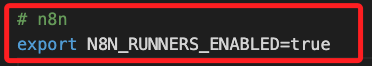
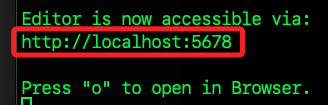
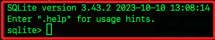
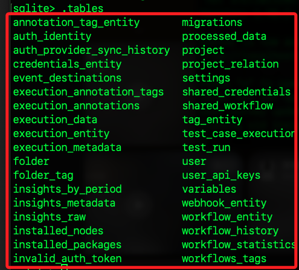

# 快速運行 n8n

_在本機上操作，可使用以下三種方式中的一種_

<br>

## 使用 npx

_這個方式會即時從網路抓最新版本執行，不會在全域安裝任何檔案，每次關閉後都只剩下指定的資料目錄；適用於臨時試用、快速驗證_

<br>

1. 直接拉最新版本並啟動

    ```bash
    npx n8n
    ```

<br>

2. 啟動後編輯器會跑在 [http://localhost:5678](http://localhost:5678)，資料（設定、工作流等）會儲存在 `~/.n8n`。

<br>

3. 這個方式啟動服務後，預設會把 `SQLite` 資料庫、憑證等放在 `~/.n8n` 資料夾。關機或停止服務後，資料會保留在磁碟上，若要徹底清除需手動刪除資料夾 `~/.n8n`。

    ```bash
    rm -rf ~/.n8n
    ```

<br>

4. 若要一次性的實例，可在啟動時指定資料目錄到暫存路徑如下；如此在系統關機後，`/tmp/n8n-data` 的內容會隨系統清理而移除。

    ```bash
    npx n8n start --data-dir /tmp/n8n-data
    ```

<br>

## 全域安裝

_這方式會下載完整套件在全局 `node_modules` 目錄，完成後可直接執行 n8n 指令，離線也能使用；適合長期本機使用_

<br>

1. 安裝。

    ```bash
    npm install -g n8n
    ```

<br>

2. 重設檔案權限，需使用 sudo

    ```bash
    sudo chmod 600 ~/.n8n/config
    ```

<br>

3. 修正 ~/.n8n 及 ~/.cache/n8n 的擁有權與權限

    ```bash
    sudo chown -R $(id -u):$(id -g) ~/.n8n
    find ~/.n8n -type d -exec chmod 700 {} \;
    find ~/.n8n -type f -exec chmod 600 {} \;

    sudo chown -R $(id -u):$(id -g) ~/.cache/n8n
    find ~/.cache/n8n -type d -exec chmod 700 {} \;
    find ~/.cache/n8n -type f -exec chmod 600 {} \;
    ```

<br>

4. 在 ~/.zshrc 中加入以下語句，可消除不影響運作的警告。

    ```bash
    export N8N_RUNNERS_ENABLED=true
    ```

    

<br>

5. 啟動

    ```bash
    n8n
    ```

<br>

6. 依據畫面提示進行訪問。

    

<br>

## Docker 部署

_適合伺服器、容器化環境_

<br>

1. 確認本機 Docker 狀態

    ```bash
    docker -v
    ```

<br>

2. 透過終端機啟動 Docker Desktop；參數 `--background` 會讓應用在背景運行。

    ```bash
    open --background -a Docker
    ```

<br>

3. 啟動後可查看詳細資訊。

    ```bash
    docker info
    ```

<br>

4. 查看容器運行。

    ```bash
    docker ps -a
    ```

<br>

5. 在 Docker 中建立一個儲存空間並命名 `n8n_data`，可用於永久保存 n8n 的資料。

    ```bash
    docker volume create n8n_data
    ```

<br>

6. 以互動模式啟動容器

    ```bash
    docker run -it --rm \
        --name n8n \
        -p 5678:5678 \
        -v n8n_data:/home/node/.n8n \
        docker.n8n.io/n8nio/n8n
    ```

<br>

7. 編輯器在 `5678` 端口運行，所有資料都存在 `n8n_data` volume 中

<br>

## 設定環境變數

_在以上任一方式前，可設定環境變數以控制資料庫、埠號、時區等_

<br>

1. `n8n` 在第一次啟動時會自動在資料庫 `~/.n8n/database.sqlite` 裡建立必要的資料表，並寫入一筆預設的系統設定，之後再啟動時就會直接讀取這些資料庫裡的設定。

<br>

2. 進入資料庫。

    ```bash
    sqlite3 ~/.n8n/database.sqlite
    ```

    

<br>

3. 列出所有資料表，這些都是 n8n 預設啟動時自動建立的資料表，由 Core migrations 管理。

    ```bash
    .tables
    ```

    

<br>

4. 查詢表 `settings` 的前十筆資料

    ```bash
    SELECT * FROM settings LIMIT 10;
    ```

<br>

5. 依欄位對齊、帶標頭地顯示；這不是全局設定，只會影響當前連線；若要每次啟動都套用，可寫入 `~/.sqliterc`。

    ```bash
    .headers on
    .mode column
    SELECT key, value FROM settings LIMIT 10;
    ```

<br>

6. 將設定寫入 ~/.sqliterc；放在 `~/.sqliterc` 的設定會在每次啟動 SQLite CLI 時自動讀取，因而永久生效。

    ```bash
    printf ".headers on\n.mode column\n" > ~/.sqliterc
    ```

<br>

7. 另外也可以在 `shell（bash/zsh）` 中用 `export` 語法設定 `環境變數`，接下來啟動 `n8n` 時便會讀取這些值；它不是 SQL，而是告訴作業系統接下來執行的程式都帶著這些參數；要永久生效必須寫入 `~/.zshrc` 或 `~/.bashrc`。

    ```bash
    export DB_TYPE="sqlite"
    export GENERIC_TIMEZONE="Asia/Taipei"
    export N8N_PORT=5678
    export N8N_HOST="0.0.0.0"
    ```

<br>

## 寫入資料庫

_直接修改 `n8n` 資料庫 `SQLite` 的 `settings` 表，這會影響 `n8n` 的運行行為；相較於 `~/.sqliterc` 是寫入 `SQLite CLI` 客戶端的啟動設定檔，只控制在終端用 sqlite3 互動時的顯示，不會改動資料庫裡的任何資料。_

<br>

1. 進入 SQLite shell5

    ```bash
    sqlite3 ~/.n8n/database.sqlite
    ```

<br>

2. 如果已經有對應的 key，就用 UPDATE

    ```bash
    UPDATE settings
    SET value = '"sqlite"'
    WHERE key = 'db.type';

    UPDATE settings
    SET value = '"Asia/Taipei"'
    WHERE key = 'generic.timezone';
    ```

<br>

3. 如果是第一次寫入，則用 INSERT OR REPLACE，這樣可確保不存在時也會新增

    ```bash
    INSERT OR REPLACE INTO settings(key, value, loadOrder)
    VALUES
        ('db.type', '"sqlite"', 1),
        ('generic.timezone', '"Asia/Taipei"', 1);
    ```

<br>

4. 確認結果

    ```bash
    SELECT * FROM settings
    WHERE key IN ('db.type','generic.timezone');
    ```

<br>

___

_END_
